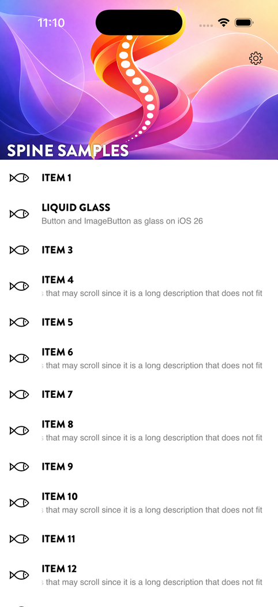
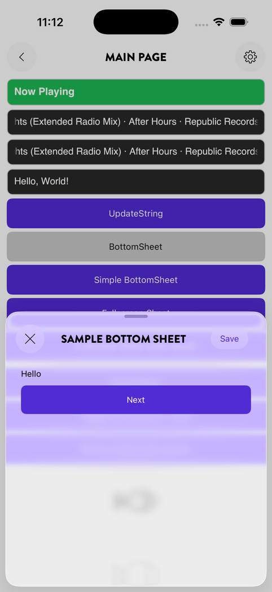
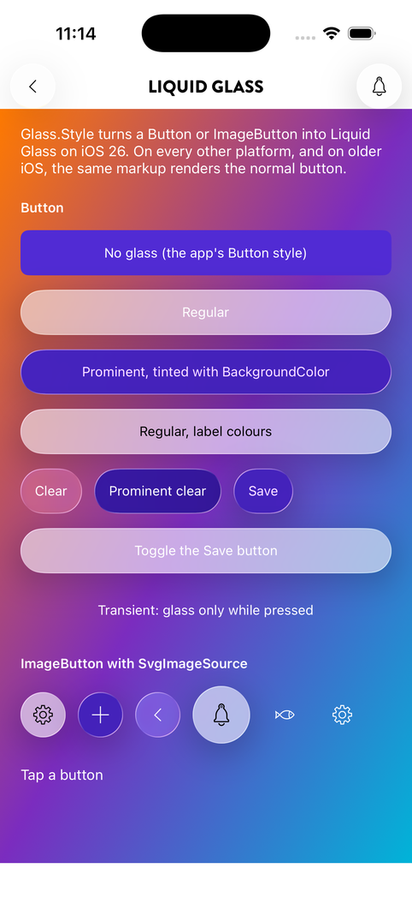
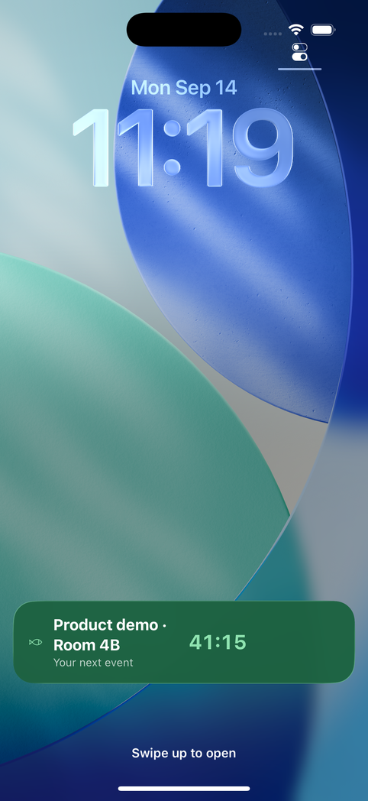
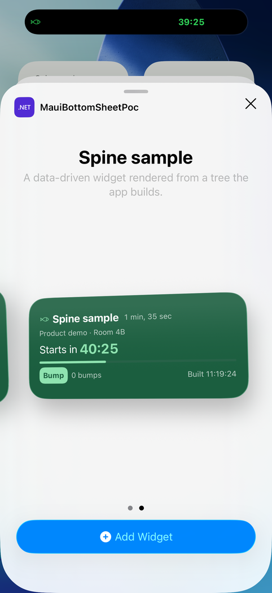

<p align="center"></p>

# Plugin.Maui.Spine

**Plugin.Maui.Spine** is a navigation framework for .NET MAUI that replaces Shell with a clean, code-first model built around stack-based region navigation and native bottom sheets. Pages are auto-discovered via attribute scanning — no route tables, no manual DI registration — and every navigation call is a single, strongly-typed async method.

---

## Why Spine?

| Problem with Shell | Spine's answer |
|---|---|
| Route strings are stringly-typed and easy to break | Generic `NavigateToAsync<TPage>()` — compile-time safety |
| Passing parameters requires URI encoding | `NavigateToAsync<TPage, TParam>(param)` — typed, no boxing |
| Returning data from a page is not supported natively | `NavigateToWithResultAsync<TPage, TResult>()` — awaitable result pattern |
| Shell navigation style is fixed | Pluggable `ISpineTransitions` — swap animations without touching pages |
| Bottom sheets require platform code | Declarative `[NavigableSheet]` attribute with detents, overlays, and dismiss guards |
| No shortcut / tray icon integration | Built-in shortcut pipeline for dock, jump list, and system tray |

---

## Key features

- **Region navigation** — push/pop full-screen pages with animated transitions and an interactive back-swipe gesture on mobile
- **Bottom sheets** — modal sheets with configurable snap points (detents), background overlays, nested navigation stacks, and dismiss guards
- **Typed navigation parameters** — pass strongly-typed data to any page before it appears
- **Typed navigation results** — await a page and receive a typed result when it closes
- **Header bar & page actions** — built-in header bar with back button, title, and pluggable action buttons (text or SVG icon)
- **Liquid Glass buttons** — `Glass.Style` turns any `Button` or `ImageButton` into glass on iOS 26; the header bar's own buttons are glass by default
- **Haptics** — success, warning, error, selection and impacts from the platform's own generators, on a tap, a header action, a tab switch or a sheet detent
- **App shortcuts** — the app-icon menu on iOS and Android, the jump list and the tray menu, with icons from SVG, through a single handler interface
- **Windows desktop support** — window size, position persistence, tray icon, single-instance enforcement, and custom title bar
- **Platform-aware defaults** — mobile defaults differ from desktop defaults out of the box; override per-page or globally
- **Zero route registration** — Spine scans your assembly for `[NavigableRegion]` and `[NavigableSheet]` attributes at startup

---

## In pictures

<p align="center">
  
  
  
  
  
</p>
<p align="center"><sub>The sample apps on iOS: a hero header, a sheet, Liquid Glass, a Live Activity and a widget. More on each wiki page.</sub></p>

---

## Platforms

| Platform | Status |
|---|---|
| Android | ✅ Supported |
| iOS | ✅ Supported |
| Mac Catalyst | ✅ Supported, exercised less than iOS |
| Windows (WinUI 3) | ✅ Supported |

---

## Packages

One version, eighteen packages, all on [nuget.org](https://www.nuget.org/packages?q=Plugin.Maui.Spine). Install what the app needs; see [Packages](docs/wiki/packages.md) for the dependency graph and [Releasing](docs/wiki/releasing.md) for how a version is published.

| Group | Package | What it is |
|---|---|---|
| Core | `Plugin.Maui.Spine` | Navigation, sheets, tab host, header bar, glass buttons, shortcuts, Windows windowing |
| Core | `Plugin.Maui.Spine.Svg` | Embedded SVG image sources and icon services (a dependency of the core) |
| Core | `Plugin.Maui.Spine.Svg.Icons` | 224 ready-made SVG icons, resolved by file name once referenced |
| Outside the window | `Plugin.Maui.Spine.Widgets` | Home-screen widgets and Live Activities from C# |
| Outside the window | `Plugin.Maui.Spine.PushNotifications` | Push and local notifications |
| Outside the window | `Plugin.Maui.Spine.BackgroundTasks` | `[BackgroundTask]` classes run by BGTaskScheduler and JobScheduler while the app is closed |
| Controls | `Plugin.Maui.Spine.Controls.HeroCollectionView` | `CollectionView` with a collapsing hero header |
| Controls | `Plugin.Maui.Spine.Controls.AnimatedLabel` | Marquee and fade label on SkiaSharp |
| Controls | `Plugin.Maui.Spine.Controls.Calendar` | Month calendar with swipe navigation, year and decade pickers, week numbers and days marked from your own source |
| Controls | `Plugin.Maui.Spine.Controls.DataGrid` | Responsive row grid: named layouts, sorting, grouping, swipe actions, load more |
| Controls | `Plugin.Maui.Spine.Controls.Shimmer` | Skeleton loading: a shimmer over placeholders, `Skeleton.IsActive` on real layouts |
| Controls | `Plugin.Maui.Spine.Controls.MeshBackground` | `MeshBackground`: mesh gradients (accent, Aurora, Sunset or your own colours) that drift slowly behind glass |
| Controls | `Plugin.Maui.Spine.Controls.Rows` | `SpineRow`: settings and key/value rows with icon, detail, value, accessory and chevron |
| Controls | `Plugin.Maui.Spine.Barcodes` | QR, Data Matrix, Aztec, PDF417 and linear codes as a matrix, SVG or `BarcodeView`, with fixed sizes such as 12 × 12 |
| Controls | `Plugin.Maui.Spine.Scanner` | Camera barcode scanning: a scanner view and a scan sheet, including codes shown by a grid of lamps |
| Controls | `Plugin.Maui.Spine.Images` | Remote images that keep a list light: memory and disk cache, decoding at the view's size off the main thread, prefetching, BlurHash placeholders |
| Server | `Plugin.Maui.Spine.Common` | Contracts shared by app and server, and the string store; no MAUI |
| Server | `Plugin.Maui.Spine.Server` | The push backend for ASP.NET Core and Azure Functions |

---

## Quick start

### 1. Install

```bash
dotnet add package Plugin.Maui.Spine
```

### 2. Register in `MauiProgram.cs`

```csharp
using Plugin.Maui.Spine.Extensions;

builder
    .UseMauiApp<App>()
    .UseSpine(options =>
    {
        options.AddAssembly(typeof(MauiProgram).Assembly);
        options.AppTitle = "My App";
    });
```

### 3. Wire up the application

```xml
<!-- App.xaml -->
<SpineApplication
    xmlns="http://schemas.microsoft.com/dotnet/maui/global"
    xmlns:x="http://schemas.microsoft.com/winfx/2009/xaml"
    x:TypeArguments="MainPage"
    x:Class="MyApp.App" />
```

### 4. Create a page (three-file pattern)

```csharp
// Pages/MainPage.cs
[NavigableRegion(Title = "Home")]
public partial class MainPage { public MainPage() => InitializeComponent(); }
```

```xml
<!-- Pages/MainPage.View.xaml -->
<SpinePage
    xmlns="http://schemas.microsoft.com/dotnet/maui/global"
    xmlns:x="http://schemas.microsoft.com/winfx/2009/xaml"
    x:Class="MyApp.Pages.MainPage"
    x:TypeArguments="MainPageViewModel"
    x:DataType="MainPageViewModel">

    <VerticalStackLayout Padding="16">
        <Button Text="Open Settings" Command="{Binding OpenSettingsCommand}" />
        <Button Text="Show Sheet"    Command="{Binding ShowSheetCommand}" />
    </VerticalStackLayout>

</SpinePage>
```

```csharp
// Pages/MainPage.ViewModel.cs
public partial class MainPageViewModel(INavigationService _navigation) : ViewModelBase
{
    [RelayCommand] private async Task OpenSettings() => await _navigation.NavigateToAsync<SettingsPage>();
    [RelayCommand] private async Task ShowSheet()    => await _navigation.NavigateToAsync<MySheetPage>();
}
```

### 5. Declare a bottom sheet

```csharp
[NavigableSheet(
    Title = "Options",
    BackgroundPageOverlay = BackgroundPageOverlay.Dimmed,
    AllowedDetents = [SheetDetent.Medium, SheetDetent.FullScreen])]
public partial class MySheetPage { public MySheetPage() => InitializeComponent(); }
```

---

## Core concepts

| Concept | Description | Guide |
|---|---|---|
| **Navigable** | Interface/attribute that marks a page as discoverable by Spine | [Page Pattern](docs/wiki/page-pattern.md) |
| **Region** | Full-screen stack-navigation page (`[NavigableRegion]`) | [Regions](docs/wiki/regions.md) |
| **Sheet** | Bottom-sheet modal page (`[NavigableSheet]`) | [Sheets](docs/wiki/sheets.md) |
| **Navigation parameters** | Pass typed data into a page | [Navigation Parameters](docs/wiki/navigation-parameters.md) |
| **Navigation results** | Await a typed result from a page | [Navigation Results](docs/wiki/navigation-results.md) |
| **Page actions** | Header bar buttons driven by the ViewModel | [Page Actions](docs/wiki/page-actions.md) |
| **Search** | `[PageSearch]` on a string property: a search field with the header bar, in a row below it or at its trailing end on iPad and Mac, kept in step with the property | [Search](docs/wiki/search.md) |
| **Shortcuts** | OS dock/jump-list/tray menu integration | [Shortcuts](docs/wiki/shortcuts.md) |
| **Searchable items** | The app's content in Spotlight (and as shortcuts on Android); a tapped result opens its page with a typed parameter, also from a cold start | [Searchable items](docs/wiki/searchable-items.md) |
| **Menu buttons** | A button or header action that opens the platform's own menu: sections, pickers, submenus, toggles, destructive rows | [Menu buttons](docs/wiki/menus.md) |
| **Context menus** | A long press or right click on any view opens the system's context menu, lifted with its shape on iOS; one shared menu for every row of a list | [Context menus](docs/wiki/menus.md#context-menus) |
| **Segmented control and top tabs** | The platform's own segmented control with text or SVG icons, and `TopTabs` that build each tab's content when it is first picked and keep it | [Segmented control](docs/wiki/segmented-control.md) |
| **Action sheets** | `ShowActionsAsync` from a view model: the platform's action sheet with icons and destructive rows, the picked row as the result, a popover at the button on iPad | [Action sheets](docs/wiki/menus.md#action-sheets) |
| **Windows options** | Window chrome, tray, single-instance | [Windows Options](docs/wiki/windows-options.md) |
| **Custom transitions** | Replace the built-in slide animation | [Custom Transitions](docs/wiki/custom-transitions.md) |
| **Shared elements and zoom** | One `Transition.Tag` on each page: a view flies from one page to the next and back, or the page grows out of the view it opens from and shrinks back into it under the finger | [Shared Elements and Zoom](docs/wiki/transitions.md) |
| **Lightbox** | `[NavigableLightbox]` and a `Lightbox`: photos full screen on black that open out of their thumbnail, page sideways, pinch and double-tap zoom, drag down to close into the thumbnail, Share and Save | [Lightbox](docs/wiki/lightbox.md) |
| **Widgets** | Home-screen widgets, Live Activities, Control Center controls and Quick Settings tiles built from C# | [Widgets](docs/wiki/widgets.md) |
| **Widgets** | Home-screen widgets and Live Activities built from C# | [Widgets](docs/wiki/widgets.md) |
| **Background tasks** | `[BackgroundTask]` classes the system runs while the app is closed, with their status, a run on request or from a push, and the widgets rebuilt after them | [Background tasks](docs/wiki/background-tasks.md) |
| **Glass buttons** | `Button`/`ImageButton` as Liquid Glass on iOS 26, normal buttons elsewhere | [Glass buttons](docs/wiki/glass-buttons.md) |
| **Materials** | Glass, blur, tinted and solid surfaces for any `Border`: system materials on iOS, a real blur on Android 12+, acrylic on Windows | [Materials](docs/wiki/materials.md) |
| **Motion** | `Motion.Depth` moves a view as the device tilts: layers at different depths give parallax, and a light inside a material panel sweeps over it | [Motion](docs/wiki/motion.md) |
| **Haptics** | Success, warning, error, selection and impacts from the platform's own generators, on a tap, a header action, a tab switch or a sheet detent | [Haptics](docs/wiki/haptics.md) |
| **Reorder** | Drag the items of any `CollectionView` to a new place: a long-press or a grip handle, with haptics and screen-reader actions | [Reorder](docs/wiki/reorder.md) |

---

## Documentation

| Guide | Description |
|---|---|
| [Getting Started](docs/wiki/getting-started.md) | Full setup walkthrough from scratch |
| [Three-File Page Pattern](docs/wiki/page-pattern.md) | Code-behind, XAML, and ViewModel explained |
| [Regions](docs/wiki/regions.md) | Stack navigation, lifecycle hooks, back-swipe gesture |
| [Sheets](docs/wiki/sheets.md) | Bottom sheets, detents, overlays, dismiss guards |
| [Navigation Parameters](docs/wiki/navigation-parameters.md) | Pass typed data to a page |
| [Navigation Results](docs/wiki/navigation-results.md) | Await a typed result from a page |
| [Page Actions](docs/wiki/page-actions.md) | Header bar buttons (text and SVG icons) |
| [Search](docs/wiki/search.md) | `[PageSearch]` and `PageSearch`: the field with the header bar, its placement per platform, `IsActive` and `IsVisible` from code, the search key's command |
| [Shortcuts](docs/wiki/shortcuts.md) | App shortcuts and tray menu |
| [Searchable items](docs/wiki/searchable-items.md) | Spotlight and searchable items that open a page |
| [Windows Platform Options](docs/wiki/windows-options.md) | Window size, tray, single-instance, title bar |
| [Custom Transitions](docs/wiki/custom-transitions.md) | Replace the default slide animation |
| [Shared Elements and Zoom](docs/wiki/transitions.md) | `Transition.Tag` on a view on each page for a shared element, on the page itself for a zoom; a focus view inside the zooming page; the back-swipe zoom |
| [Lightbox](docs/wiki/lightbox.md) | A full-screen photo viewer page: opening from the thumbnail, paging, zoom, drag down to close, Share, Save and the page's own actions |
| [Widgets and Live Activities](docs/wiki/widgets.md) | Home-screen widgets, Dynamic Island, Control Center and Quick Settings, built from C# |
| [Segmented control and top tabs](docs/wiki/segmented-control.md) | `SegmentedControl` on `UISegmentedControl`, Material segmented buttons and `SelectorBar`; `TopTabs` with lazy, kept tab content that the header bar follows |
| [Widgets and Live Activities](docs/wiki/widgets.md) | Home-screen widgets and Dynamic Island, built from C# |
| [Background tasks](docs/wiki/background-tasks.md) | `[BackgroundTask]` on BGTaskScheduler and JobScheduler: what runs when on each platform, status, requests, `spine.task` from a push, and the widgets' refresh as a task |
| [Push (client)](docs/wiki/push-notifications.md) | Permission, tokens, tags, and the handler that sees every message |
| [Push (server)](docs/wiki/push-notifications-server.md) | The backend half: register, tag expressions, APNs and FCM |
| [HeroCollectionView](docs/wiki/hero-collection-view.md) | Collapsing sticky header, adaptive overlay |
| [AnimatedLabel](docs/wiki/animated-label.md) | SkiaSharp marquee label with scroll and fade |
| [Calendar](docs/wiki/calendar.md) | Month calendar: swipe between months, year and decade pickers, ISO week numbers, marked days, theme and culture aware |
| [DataGrid](docs/wiki/data-grid.md) | Row grid on `CollectionView`: Wide/Narrow layouts, sorting, grouping, swipe actions, a row context menu, load more, pull-to-refresh |
| [Loading states](docs/wiki/loading-states.md) | `TaskState` and `StateView`: loading, error with retry, empty and content from one load that lives with the page |
| [Shimmer and Skeleton](docs/wiki/shimmer.md) | Skeleton loading that follows the theme and Reduce Motion; `Skeleton.IsActive` turns a real layout into its own skeleton |
| [MeshBackground](docs/wiki/mesh-background.md) | Mesh gradients on SkiaSharp: points from the accent, a preset or your own list, a slow drift at a capped frame rate, still under Reduce Motion; a background for materials |
| [Rows and taps](docs/wiki/rows.md) | `SpineRow` settings and key/value rows; `Tap.Command` with native press feedback on any view; `Semantic.Merge` for one screen-reader element |
| [Remote images](docs/wiki/images.md) | Every `UriImageSource` through a memory and disk cache, decoded at the view's size off the main thread; `IImageCache` to prefetch and clear; `ImageOptions.BlurHash` placeholders; a copy for a widget |
| [Barcodes and scanning](docs/wiki/barcodes.md) | `Barcode.Encode` and `BarcodeView` for QR, Data Matrix and more; `BarcodeScannerView` and a scan sheet; reading a code shown on a word clock |
| [SVG](docs/wiki/svg.md) | SVG-to-bitmap rendering with theme-aware tinting, and SVG-to-icon files for tray and window icons |
| [Glass buttons](docs/wiki/glass-buttons.md) | `Glass.Style` on `Button` and `ImageButton`: Liquid Glass on iOS 26, no-op elsewhere |
| [Materials](docs/wiki/materials.md) | `Material.Kind` on a `Border`, `ContentView` or layout: glass, blur, tinted, solid; `MaterialContainer` for glass that merges |
| [Motion](docs/wiki/motion.md) | `Motion.Depth` on any view: parallax from the device's tilt with the system's motion effects on iOS and the rotation sensor on Android; a highlight that sweeps over a material |
| [Haptics](docs/wiki/haptics.md) | `Haptics.Success()` … `Impact()`, `Haptics.OnTap` on buttons and rows, `PageAction.Haptic`, opt-in haptics for tab switches and sheet detents |
| [Reorder](docs/wiki/reorder.md) | `Reorder.Mode` on any `CollectionView`: long-press or handle, `Reorder.IsEnabled` for an Edit button, the list moved for you, `Reorder.Command` after the drop, Move up/down for screen readers |
| [Theming](docs/wiki/theming.md) | `IThemeService`: a stored light/dark choice, token dictionaries, tab bar colours from keys, a repaint hook for code-drawn views |
| [Strings](docs/wiki/strings.md) | `ISpineStrings`: embedded XML per culture, `{String}` with arguments and plurals, a runtime language switch, overridable control text |
| [Typography](docs/wiki/typography.md) | `Text.FontFeatures` (tabular digits and other OpenType features) and `Text.TrimToCapHeight` on `Label` |
| [Packages](docs/wiki/packages.md) | The eighteen packages, what depends on what, which to install |
| [Releasing](docs/wiki/releasing.md) | Tag-driven releases to nuget.org from GitHub Actions |
| [Agent skills](docs/wiki/agent-skills.md) | Skills for AI coding agents: set up and use Spine from NuGet the way the samples do |

---

## Sample apps

The `samples/MauiSpineSampleApp` project demonstrates all of the above features:

| Demo | Page |
|---|---|
| Region navigation | `MainPage` → any sample page |
| Bottom sheet with multiple detents | `MainPage` → `SamplePage` (medium + 75% + fullscreen) |
| Singleton sheet with blur overlay | `MainPage` → `SimpleBottomSheetPage` |
| Fullscreen sheet | `MainPage` → `FullscreenSheetPage` |
| Compact (small) sheet | `MainPage` → `SmallSheetPage` |
| Navigation parameter | `MainPage` → `PersonDetailPage` |
| Navigation result | `MainPage` → `FullscreenSheetPage` (awaits `FullscreenSheetResult`) |
| App shortcuts → navigation | `ShortcutHandler` → `ShortcutsPage`, `LiveActivitiesPage`, `WidgetsPage`, the scanner sheet on `BarcodesPage`, `ThemePage` |
| Windows tray icon + close-to-background | `MauiProgram.cs` options |
| Home-screen and Lock Screen widgets with buttons (iOS, Android) | `Widgets/Hockey/ScoreWidget.cs`, `Widgets/SampleWidget.cs`, `WidgetsPage` |
| Live Activity updated from the app, with a lock-screen button (iOS, Android 16) | `Widgets/Hockey/ScoreActivity.cs`, `LiveActivitiesPage` |
| Background tasks: a scheduled task that rebuilds a widget, one that fails, status and Run now | `BackgroundTasks/SampleSyncTask.cs`, `BackgroundTasksPage` |
| Liquid Glass buttons (iOS 26) | `MainPage` → `GlassPage` (second item in the list) |

### Push sample

`samples/MauiSpinePushNotificationsSampleApp` and its `…​.Server` show Spine.PushNotifications end to end: permission, tags, a
form that asks the server to send, and a log of everything the handler received. Start the server
with `dotnet run`, then the app.

Outside the repo you need an App ID with Push Notifications ticked and an APNs `.p8` for Apple, and a
Firebase project's `google-services.json` for Android — the checked-in one is a placeholder so the
sample builds. See [Push (client)](docs/wiki/push-notifications.md).

### Run the sample

```bash
# Android
dotnet build samples/MauiSpineSampleApp -t:Run -f net10.0-android

# Windows
dotnet build samples/MauiSpineSampleApp -t:Run -f net10.0-windows10.0.19041.0
```

Or open the solution in Visual Studio 2022 and press **F5**.

---

## Dependencies

| Package | Purpose |
|---|---|
| `CommunityToolkit.Mvvm` | Source-generated MVVM (`[ObservableProperty]`, `[RelayCommand]`) |
| `Plugin.Maui.Spine.Svg` | SVG image support for page action icons |
| `AsyncAwaitBestPractices` | Safe fire-and-forget async helpers |

---

## License

MIT

