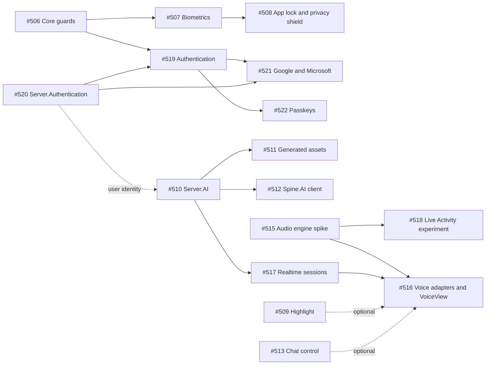

# Implementation plan: AI, voice, sign-in and app security

**Roadmap issue:** [#505](https://github.com/jonatansoderberg/Maui.Spine/issues/505)
**Started:** 2026-10-09
**Last updated:** 2026-10-09 (plan written, proposals in review, nothing implemented)

This is the living plan for the work that came out of the AI and security brainstorm on 2026-10-09. A new session should be able to pick up from here, so every pull request that moves a step forward updates this file in the same PR.

---

## How to continue from a new session

1. Read this file, then the proposal for the step you take.
2. Check the live state of the issues. This file can lag behind GitHub, and GitHub wins:
   `gh issue list --search "505 in:body" --state all --limit 50`
3. Pick the first step in [Steps](#steps) whose status is **Ready**: its dependencies are done and its open questions are answered. If the only steps left have unanswered questions, ask the owner instead of guessing.
4. Work in a git worktree off `origin/master`. Several sessions share the main checkout, so never run `git checkout` there:
   `git fetch origin master && git worktree add ../Maui.Spine-<id> -b issue/<id>-<slug> origin/master`
5. Start the issue with the `/spine-issue <id>` workflow from `CLAUDE.md`. The issue changelog lives in `issues/<id>-<slug>.md`.
6. In the same PR:
   - set the step's status, PR and notes in [Steps](#steps)
   - add any decision you made or got to [Decisions](#decisions)
   - update **Last updated** at the top
7. Before a merge, check the files that every feature branch touches. See [Files every package PR touches](#files-every-package-pr-touches).

Status values: **Proposal** (written, not reviewed), **Waiting** (on another step or on an answer), **Ready**, **In progress**, **In review** (PR open), **Done**, **Parked**, **Dropped**.

---

## Principles

- **Spine is a smorgasbord.** An app takes only what it needs. The core gets small generic hooks and nothing else.
- **Every feature is its own NuGet package** and registers itself only when it is referenced (`<SpineModule>`, #355).
- **Heavy native dependencies get their own packages:** MSAL, the Google bindings, ML Kit and a markdown parser.
- **Server parts are separate packages** next to `Plugin.Maui.Spine.Server`, which stays the push backend.
- **No model abstractions of our own.** Microsoft.Extensions.AI (`IChatClient`, `IImageGenerator`, `IRealtimeClient`) is the contract. Spine adds what sits around it: configuration, cost control, UI, audio and platform integration.
- **No provider keys in an app.** Model calls and realtime sessions are set up by the app's server.
- **Documentation is in English:** wiki, proposals, READMEs, PR bodies and the `issues/` changelogs. Conversation with the owner is in Swedish.

---

## Package map

| Package | Kind | Issues | Proposal | Status |
|---|---|---|---|---|
| `Plugin.Maui.Spine` (core) | Navigation and command guards | #506 | [guards-biometrics §2](../proposals/spine-guards-biometrics.md) | Proposal |
| `Plugin.Maui.Spine.Biometrics` | New | #507, #508 | [guards-biometrics §3–§5](../proposals/spine-guards-biometrics.md) | Proposal |
| `Plugin.Maui.Spine.Controls.Highlight` | New | #509 | [highlight](../proposals/spine-highlight.md) | Proposal |
| `Plugin.Maui.Spine.Server.AI` | New, server | #510, #511, #517 | [ai §3–§6](../proposals/spine-ai.md), [voice §6](../proposals/spine-voice.md) | Proposal |
| `Plugin.Maui.Spine.AI` | New | #512 | [ai §7](../proposals/spine-ai.md) | Proposal |
| `Plugin.Maui.Spine.Controls.Chat` | New | #513 | [ai §8](../proposals/spine-ai.md) | Proposal |
| `Plugin.Maui.Spine.Voice` | New | #515, #516, #518 | [voice](../proposals/spine-voice.md) | Proposal |
| `Plugin.Maui.Spine.Authentication` | New | #519 | [authentication](../proposals/spine-authentication.md) | Proposal |
| `Plugin.Maui.Spine.Authentication.Google` / `.Microsoft` | New | #521 | [authentication](../proposals/spine-authentication.md) | Proposal |
| `Plugin.Maui.Spine.Server.Authentication` | New, server | #520 | [authentication](../proposals/spine-authentication.md) | Proposal |
| Passkeys (client and server) | Feature idea | #522 | [authentication, Passkeys](../proposals/spine-authentication.md) | Waiting (owner decision) |
| On-device `IChatClient`, Android and Windows | Spike outside the repo | #514 | [ai §9](../proposals/spine-ai.md) | Proposal |

---

## Steps

The order follows value against risk. Steps in different phases can run in parallel when their dependencies allow it. Highlight (#509) and the chat control (#513) have no hard dependencies.

### Phase 0: proposals and issues

| Step | What | Issue | Status | PR | Notes |
|---|---|---|---|---|---|
| 0.1 | Roadmap issue and 17 child issues | #505–#522 | Done | — | Created 2026-10-09 |
| 0.2 | Five proposals and this plan | #505 | In review | — | Owner reviews the proposals' open questions. See [Open questions](#open-questions). |

### Phase 1: guards and biometrics

| Step | What | Issue | Depends on | Status | PR | Notes |
|---|---|---|---|---|---|---|
| 1.1 | Core navigation guard and command guard | #506 | 0.2 | Waiting | | Must cover regions, sheets, tabs, `ShowAsync`, shortcuts and deep links |
| 1.2 | `IBiometricAuth`, `[RequiresUnlock]` on pages and commands, `Unlock.Command`, `RequireAsync` | #507 | 1.1 | Waiting | | |
| 1.3 | App lock (global) and `[PrivacyShield]` (per page) | #508 | 1.2 | Waiting | | |

### Phase 2: AI on the server and in the app

| Step | What | Issue | Depends on | Status | PR | Notes |
|---|---|---|---|---|---|---|
| 2.1 | `Server.AI`: named features, provider plug-and-play, metering, cost, budgets, cache, rate limits | #510 | 0.2 | Waiting | | User identity from #520 when present, otherwise an anonymous key. See proposal. |
| 2.2 | Orientera adopts `Server.AI` for the race story | (Orientera repo) | 2.1 + a Spine release | Waiting | | First real consumer. Done in the Orientera repo after `SpineVersion` is bumped. |
| 2.3 | Generated-asset pipeline | #511 | 2.1 | Waiting | | Orientera's arena images are the model, and Almanacka's pictures are a candidate. |
| 2.4 | `Spine.AI` client with on-device fallback | #512 | 2.1 | Waiting | | |
| 2.5 | `Controls.Chat` | #513 | 0.2 | Waiting | | Can start any time |
| 2.6 | On-device `IChatClient` spike, Android and Windows | #514 | none | Waiting | | Outside this repo. Contribute upstream to dotnet/maui-labs if it works. |

### Phase 3: highlight

| Step | What | Issue | Depends on | Status | PR | Notes |
|---|---|---|---|---|---|---|
| 3.1 | `Controls.Highlight`: kinds, repeat, keys, tours | #509 | 0.2 | Waiting | | Can start any time. Voice's screen-edge visual reuses Edge. |

### Phase 4: voice

| Step | What | Issue | Depends on | Status | PR | Notes |
|---|---|---|---|---|---|---|
| 4.1 | Audio engine spike: full duplex, echo cancellation, levels and bands | #515 | 0.2 | Waiting | | Highest risk. Measure echo on a real iPhone and an Android phone. |
| 4.2 | Realtime session endpoints in `Server.AI` | #517 | 2.1 | Waiting | | |
| 4.3 | Provider adapters, `IVoiceSession`, `VoiceView` and visual plug-ins | #516 | 4.1, 4.2 | Waiting | | WebSocket and PCM first, WebRTC later |
| 4.4 | Live Activity and ongoing-notification experiment | #518 | 4.1 | Waiting | | Decide afterwards whether it ships |

### Phase 5: sign-in

| Step | What | Issue | Depends on | Status | PR | Notes |
|---|---|---|---|---|---|---|
| 5.1 | `Server.Authentication`: ID-token validation, own tokens, refresh rotation | #520 | 0.2 | Waiting | | |
| 5.2 | `Authentication` client: Apple, OIDC, email and password, `[RequiresSignIn]`, refreshing handler | #519 | 1.1, 5.1 | Waiting | | Needs a Windows path that works on .NET 10 |
| 5.3 | `Authentication.Google` and `.Microsoft` | #521 | 5.2 | Waiting | | |
| 5.4 | Passkeys | #522 | 5.2, owner decision | Waiting | | |

---

## Decisions

Newest last. Each entry is dated and says who decided.

- **2026-10-09, owner:** Biometrics should also work on commands, not only on pages.
- **2026-10-09, owner:** App lock is both a per-page attribute and a global setting.
- **2026-10-09, owner:** Secrets bound to biometrics (Keychain access control, Keystore CryptoObject) are dropped for now.
- **2026-10-09, owner:** Sign-in should be easy to add, options-style. It covers Sign in with Apple, Google, Microsoft and generic OIDC; passkeys are a maybe.
- **2026-10-09, owner:** BankID is skipped. A broker that speaks OIDC works through `AddOpenIdConnect` if it is ever needed.
- **2026-10-09, owner:** The glow becomes a general highlight for focus and onboarding, with once, repeat and similar modes.
- **2026-10-09, owner:** On-device models for Android and Windows do not belong in Spine. A proof of concept is fine.
- **2026-10-09, owner:** Voice must work out of the box against realtime AI, visualise input and output audio, and take visual agents or avatars as plug-ins.
- **2026-10-09, owner:** A Live Activity for a voice conversation is worth testing.
- **2026-10-09, owner:** AI providers are plug-and-play, and consumption and cost are under control.
- **2026-10-09, owner:** What is general in Orientera's AI code moves to the framework, and the domain parts stay.
- **2026-10-09, owner:** Everything is modular: separate NuGet packages, so an app does not get what it does not use.
- **2026-10-09, Claude:** Microsoft.Extensions.AI is the model contract, so Spine writes no provider abstraction and no Spine package per provider. **Why:** M.E.AI already has the interfaces, middleware and provider adapters, and Microsoft.Maui.Essentials.AI already covers Apple's on-device model.
- **2026-10-09, Claude:** Realtime voice uses WebSocket and PCM first. **Why:** there is no maintained libwebrtc binding for MAUI.

---

## Open questions

Answers go to [Decisions](#decisions), and the step's status moves to Ready.

Collected from each proposal's own "Open questions" section, which has the full wording and the proposal's recommendation. The **Blocks** column says which step cannot start until the question is answered. A question with no step listed can be answered during that step.

| ID | Question | Proposal | Blocks |
|---|---|---|---|
| Q1 | A plain `{Binding XCommand}` bypasses command guards. Is documenting that enough, or should a source generator come later? | guards-biometrics §9.1 | 1.1 |
| Q2 | Default unlock grace period: 1 minute with `Fresh` for destructive commands, or ask every time? | guards-biometrics §9.2 | 1.2 |
| Q3 | When the device has no lock or biometrics: `Allow` or `Deny` by default? | guards-biometrics §9.3 | 1.2 |
| Q4 | Write a default `NSFaceIDUsageDescription`, or fail the build until the app sets one? | guards-biometrics §9.4 | 1.2 |
| Q5 | A guarded tab tap on Android and Windows: accept the brief switch-back, or show an unlock cover? | guards-biometrics §9.5 | 1.1 |
| Q6 | Desktop app lock: minimised time only, or idle time too? | guards-biometrics §9.6 | 1.3 |
| Q7 | Is the Spine server required for sign-in, or is a client-only OIDC mode wanted later? | authentication §10.1 | 5.1 |
| Q8 | Registration: `UseSpineAuthentication(...)` like the other packages, or `o.AddAuthentication(...)` inside `UseSpine`? | authentication §10.2 | 5.2 |
| Q9 | Default user store: ASP.NET Core Identity with EF Core, or a minimal store on Azure Tables? | authentication §10.3 | 5.1 |
| Q10 | Ephemeral iOS browser session by default? | authentication §10.4 | 5.2 |
| Q11 | Send the signed-in token to the push backend automatically when both packages are referenced? | authentication §10.5 | 5.2 |
| Q12 | Passkeys: yes or no, and which domain do the samples use? | authentication §10.6 | 5.4 |
| Q13 | Tours: advance on a tap anywhere (v1), or pass the tap through to the target? | highlight §10.1 | 3.1 |
| Q14 | Android Auto Backup can restore "seen" keys after a reinstall. Accept that, or exclude them? | highlight §10.2 | 3.1 |
| Q15 | Edge's default colours: the spectrum or the app's accent? | highlight §10.3 | 3.1 |
| Q16 | Tips outside Spotlight: announced only, or also a small bubble? | highlight §10.4 | 3.1 |
| Q17 | Make `ReducedMotion` and `SpineOverlay` public in the core? | highlight §10.5 | 3.1 |
| Q18 | The window edge's corners on iOS: a radius table per device class, or square? | highlight §10.6 | 3.1 |
| Q19 | Exposed AI features: require sign-in, or allow the installation id with tighter limits? Orientera has no sign-in today. | ai §12.1 | 2.1 |
| Q20 | Azure Tables, Blobs and Queues inside `Server.AI`, or in a separate `Server.AI.Azure`? | ai §12.2 | 2.1 |
| Q21 | `MarkdownView` inside `Controls.Chat`, or its own `Controls.Markdown` package? | ai §12.3 | 2.5 |
| Q22 | Currency: one per app, or per price row? | ai §12.4 | 2.1 |
| Q23 | On-device usage: keep it on the device, or report it to the server? | ai §12.5 | 2.4 |
| Q24 | Essentials.AI on .NET 10: pin the July preview, or wait for .NET 11? | ai §12.6 | 2.4 |
| Q25 | Budgets: is "at most one call over" acceptable, or should every call reserve its worst case? | ai §12.7 | 2.1 |
| Q26 | The `audio` background mode on by default? | voice §10.1 | 4.3 |
| Q27 | A provider-key-in-app mode for prototyping? The proposal says no. | voice §10.2 | 4.3 |
| Q28 | Provider order: OpenAI and Azure OpenAI, then Gemini, then Voice Live? | voice §10.3 | 4.3 |
| Q29 | A small generic hook in Widgets for Live Activity actions from a non-widget kind? | voice §10.4 | 4.4 |
| Q30 | Android ongoing notification: `CallStyle` or a plain notification? | voice §10.5 | 4.4 |
| Q31 | WebRTC right after v1, or only if latency measurements call for it? | voice §10.6 | none |

---

## Parked ideas

These came up in the brainstorm but are not decided. No issues yet. Move one to an issue when the owner asks.

- Platform AI features as attached properties:
  - Writing Tools on `Editor` and `Entry`
  - Live Text and Visual Look Up in the Lightbox
  - the Image Playground sheet
  - on-device translation of user content
- Text recognition and a document scanner sheet. This would be a separate package next to `Plugin.Maui.Spine.Scanner`, so the scanner does not pull in ML Kit text.
- `[AppIntent]`: pages and methods that Siri, Shortcuts, Apple Intelligence, Android AppFunctions and Windows App Actions can call. It would reuse the Swift build step from Widgets. Related to #312 and #313.
- On-device dictation for the chat composer: SpeechAnalyzer on iOS 26 and Android's on-device recognizer. Check CommunityToolkit's SpeechToText first.
- Receiving shares, as a share extension or share target.
- The in-app review prompt.
- Freja eID, if BankID is ever revisited.

---

## Files every package PR touches

A new package has so far touched the same set of files (for example #476, `Plugin.Maui.Spine.Images`).

**Package and build files**
- `src/<Package>/` with the `build/<Package>.props` `<SpineModule>` entry
- the tests project
- `Spine.slnx`, `Spine.Packages.slnf` and `Directory.Packages.props`
- the package icon in `assets/icons/` and its source in `assets/logo-src/`

**Documentation**
- `README.md`: the package count and the package table
- `docs/wiki/packages.md`: the count, the table, the `Declare their SpineModule` row and the diagram
- a new `docs/wiki/<feature>.md`
- the matching `.claude/skills/spine-*/SKILL.md` and `.claude/skills/spine-setup/SKILL.md`
- the proposal's status line

**Sample app**
- `samples/MauiSpineSampleApp/GlobalXmlns.cs`
- `samples/MauiSpineSampleApp/MauiSpineSampleApp.csproj`
- a page under `Pages/` and its entry in `MainPage.ViewModel.cs`

**Server packages** also get a sample endpoint in the push sample server, or a new sample server.

**Conflicts.** When several package branches are open at once, these files conflict, and a "keep both sides" merge gets them wrong:
- the sample `.csproj`: close every `<Compile>` and run xmllint
- `GlobalXmlns.cs`: one `XmlnsDefinition` block per namespace
- the SKILL.md `description:` line: keep it as one line
- the package counts

Merge `origin/master` into the branch and fix those files by hand before merging.

---

## Plan history

- **2026-10-09:**
  - Plan written.
  - Issues #505–#522 created.
  - Proposals written: `spine-guards-biometrics.md`, `spine-authentication.md`, `spine-highlight.md`, `spine-ai.md`, `spine-voice.md`.
  - Visual concepts for highlight and voice: https://claude.ai/artifact/J5TCSDk8Rk1vZNti9MBM3J (private until the owner shares it).
