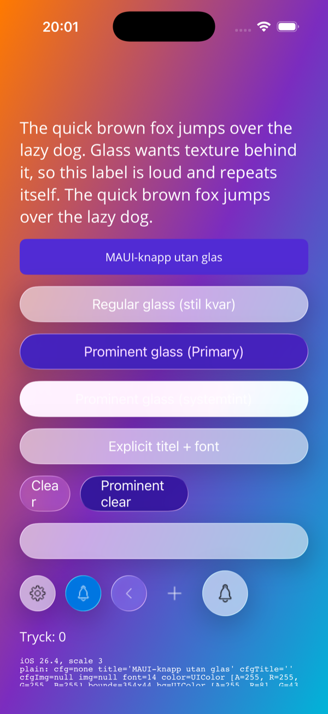
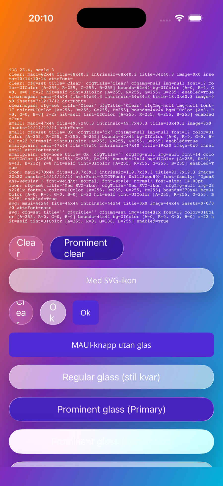
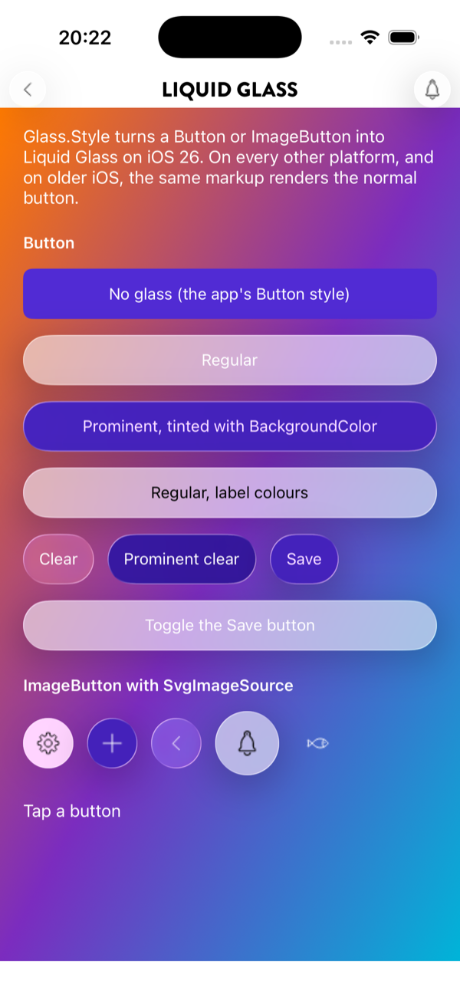

# Glasknappar i Spine — Liquid Glass för Button och ImageButton (förstudie, rev 1)

**Status:** Förstudie med spike, och en första implementation på branchen `feature/glass-buttons` (`Glass.Style`, Apple-mappningen, `SpineOptions.Apple.GlassHeaderActions`, sample-sidan `GlassPage`, [docs/wiki/glass-buttons.md](../wiki/glass-buttons.md)). Verifierad i iOS 26.4-simulatorn (§8); fysisk enhet återstår. Ingen issue ännu.
**Fråga:** Kan en vanlig `Button` och `ImageButton` i en Spine-app renderas som Liquid Glass på iOS 26 — utan att appen byter kontrolltyp, med normala knappar på övriga plattformar, och med Spines SVG-ikoner i ikonknappen?
**Svar:** Ja. En attached property (`Glass.Style`) och en handler-mappning i `Plugin.Maui.Spine` sätter `UIButtonConfiguration.GlassButtonConfiguration` på den `UIButton` MAUI redan skapar. Microsoft.iOS 26.2 binder allt som behövs, MAUI gör inget av det själv, och det som krävs utöver konfigurationen är att neutralisera tre av MAUI:s egna mappningar (bakgrund, hörnradie, kantlinje) och att låta konfigurationen äga titel, typsnitt och insets. Övriga plattformar lämnas orörda i v1; Android kan senare få en Material 3-"tonal"-tolkning av samma attribut.

---

## 1. Slutsatsen i korthet

| Fråga | Svar | Belägg |
|---|---|---|
| Finns API:erna i .NET? | **Ja.** Microsoft.iOS 26.2 (den version repot bygger med, `global.json` → 10.0.201) exponerar `UIButtonConfiguration.GlassButtonConfiguration`, `ProminentGlassButtonConfiguration`, `ClearGlassButtonConfiguration`, `ProminentClearGlassButtonConfiguration`, `UIGlassEffect`, `UIGlassContainerEffect`, `UICornerConfiguration` och `UIView.CornerConfiguration`. | Grep i `Microsoft.iOS.Ref.net10.0_26.2` (xml + dll), §2 |
| Gör MAUI redan något? | **Nej.** MAUI 10.0.50–10.0.80 ritar `Button`/`ImageButton` på iOS som `UIButton(UIButtonType.System)` med `SetTitle`, `SetImage`, `ContentEdgeInsets` och `Layer.CornerRadius`. `UIButtonConfiguration` används bara på Mac Catalyst i Mac-idiom. Bytet till konfigurations-API:et är dotnet/maui#22315, öppen i backlog. Release notes 10.0.60–10.0.80 nämner inga glasknappar. | §3 |
| Extension, behavior eller egen kontroll? | **Attached property + handler-mappning**, samma form som `ButtonExtensions.Compact` och `SvgImageSource` har i dag. Ingen ny kontrolltyp: befintlig markup och implicita `Button`-stilar fortsätter gälla, och attributet kan sättas från en `Style`. En behavior går inte att sätta från en stil; en subklass får inte de implicita stilarna. | §4 |
| Konfiguration eller egen `UIVisualEffectView`? | **Konfiguration.** Det ger systemets egen glasknapp: interaktiv tryckeffekt, kapsel, vibrant text, och anpassning till Reduce Transparency/Increase Contrast utan egen kod. En `UIVisualEffectView` med `UIGlassEffect.Interactive` bakom en `UIButton` fångar antingen touchen eller animerar inte (Apple-forum 816548, DTS utan lösning). | §4 |
| Fungerar SVG-ikonen? | **Ja.** `SvgImageSourceBehavior` sätter en vanlig `ImageSource` som MAUI laddar till en `UIImage` och sätter med `SetImage`; en konfigurerad knapp visar den. Två saker att veta: bilden visas i sin egen storlek (ingen `Aspect`), och bitmappen renderas i 1×-upplösning på iOS i dag. | §6, §8 |
| Fallback? | iOS < 26: attributet ignoreras, knappen ritas som i dag. Android: ingen förändring i v1. Windows: ingen förändring. Mac Catalyst: samma kod som iOS, ej verifierad. | §7 |
| Var ska glas användas? | Apples HIG: i navigations- och kontrollagret som flyter över innehållet, sparsamt, aldrig glas på glas, inte i innehållslagret. För Spine betyder det header-barens tillbaka-knapp och page actions, inte formulärknappar i sidorna. | §2.4, §5.4 |

---

## 2. Vad iOS 26 erbjuder

### 2.1 Fyra knappkonfigurationer

`UIButton.Configuration` fick fyra glasvarianter i iOS 26.0 (iPadOS, Mac Catalyst 26 och tvOS likaså):

| Swift | Microsoft.iOS | Utseende |
|---|---|---|
| `.glass()` | `UIButtonConfiguration.GlassButtonConfiguration` | Frostat glas, systemets textfärg (vibrant) |
| `.prominentGlass()` | `ProminentGlassButtonConfiguration` | Glas tintat med `tintColor` (eller `BaseBackgroundColor`), vit text |
| `.clearGlass()` | `ClearGlassButtonConfiguration` | Nästan genomskinligt, för rika bakgrunder (foto, karta) |
| `.prominentClearGlass()` | `ProminentClearGlassButtonConfiguration` | Tintat, genomskinligt |

Konfigurationen äger form (kapsel som standard; `CornerStyle.Fixed` + `Background.CornerRadius` för annat), `ContentInsets`, `Image`/`ImagePlacement`/`ImagePadding`, `Title`/`AttributedTitle`/`TitleTextAttributesTransformer`, `BaseForegroundColor` och `BaseBackgroundColor`. Tryck-, hover- och disabled-utseende kommer gratis. Alla fabriker är klassmetoder som returnerar en ny instans per anrop.

### 2.2 Glas på egna vyer

För vyer som inte är knappar finns `UIGlassEffect` (`Create(UIGlassEffectStyle.Regular|Clear)`, `TintColor`, `Interactive`) i en `UIVisualEffectView`, form via `UIView.CornerConfiguration` (`UICornerConfiguration.CreateCapsule()`, `CreateUniformCorners(UICornerRadius.CreateFixed(x))`, `UICornerRadius.CreateContainerConcentric()`), och `UIGlassContainerEffect.Spacing` som låter närliggande glasytor smälta ihop. Att animera `Effect`-egenskapen (inte alpha) ger systemets materialize/dematerialize. Det här spåret behövs inte för knappar (§4), men är vägen om Spine någon gång vill ha en glasyta bakom t.ex. en egen flytande verktygsrad.

### 2.3 Vad som redan är glas i en Spine-app

Ett bygge mot iOS 26-SDK:n ger `UINavigationBar`, `UIToolbar`, `UITabBar`, `UIBarButtonItem`, sheets, switch- och slider-tummar det nya utseendet automatiskt. Ingen app i repot sätter `UIDesignRequiresCompatibility` i Info.plist, så de kör redan i den nya designen. Men Spine ritar sin header bar själv (en MAUI-`Grid` med `PageActionView`), så det enda glas en Spine-app visar i dag är sheetens kant och `UISwitch`-tummen. Knapparna i header-baren är platta — det är den synligaste skillnaden mot en iOS 26-app byggd med `UINavigationBar`.

### 2.4 Apples riktlinjer

HIG (*Materials*) och WWDC25-sessionen *Build a UIKit app with the new design* säger samma sak:

- Glas är ett *funktionellt lager* för kontroller och navigation som flyter över innehållet. "Don't use Liquid Glass in the content layer."
- "Use Liquid Glass effects sparingly" — begränsa till de viktigaste kontrollerna, använd systemkomponenter där det går.
- Lägg inte glas på glas: när ett sheet täcker en flytande glasknapp ska knappen bort.
- *Regular* när innehållet bakom kan störa läsbarheten; *clear* bara över visuellt rika bakgrunder (foto, video), gärna med ett mörkt 35 %-lager under.
- Reduce Transparency och Increase Contrast ändrar utseendet automatiskt för systemkomponenter.

För Spine: header-barens knappar är precis det lager HIG beskriver. Formulärknappar (`PrimaryButton`/`SecondaryButton` i Orientera) ligger i innehållslagret och ska inte bli glas by default.

---

## 3. Hur MAUI ritar knappar på iOS i dag — och var det krockar

Källa: `ButtonHandler.iOS.cs`, `ImageButtonHandler.iOS.cs`, `Core/Platform/iOS/ButtonExtensions.cs`, `Controls/Button/Button.iOS.cs` på `main`, bekräftat mot strängarna i `Microsoft.Maui.dll` 10.0.50 och 10.0.80 (`UpdateContentEdgeInsets`, `set_TitleEdgeInsets`, `get_BorderedButtonConfiguration` — inget mer).

| MAUI-egenskap | Vad MAUI gör på `UIButton` | Med en glaskonfiguration | Vad Spine-mappningen gör |
|---|---|---|---|
| `Text` | `SetTitle(text, Normal)` | UIKit lyfter in den state-satta titeln i konfigurationen (`Configuration.Title` läser tillbaka den utan att vi satt den) — men med konfigurationens typsnitt, 17 pt system | `Title` från plattformsknappen (så `TextTransform` följer med) |
| `TextColor` | `SetTitleColor(color, …)` **och** `TintColor = color` | Titelfärgen följer med; `TintColor` styr dessutom prominent-glasets tint när ingen `BaseBackgroundColor` finns (vit text → vitt glas) | `BaseForegroundColor` från `TextColor`; prominent får alltid `BaseBackgroundColor` från `BackgroundColor` |
| `Font` | `TitleLabel.Font` | Konfigurationen ritar 17 pt system oavsett; en `AttributedTitle` med rätt typsnitt överlevde inte en senare `SetTitle` från MAUI | `TitleTextAttributesTransformer` som sätter MAUI:s typsnitt (och `CharacterSpacing`) vid varje rendering, oavsett vilken titel som lagrats |
| `Background`/`BackgroundColor` | `button.BackgroundColor` (+ ett `CALayer` för gradienter) | Målar under/utanför kapseln; synligt i hörnen. Körs om vid varje VisualState-byte (Pressed/Disabled sätter `BackgroundColor` i stilarna) | `BackgroundColor = Clear`, gradientlagret bort. För *prominent* går appens `BackgroundColor` in som `BaseBackgroundColor` — så tintas knappen med appens primärfärg |
| `CornerRadius` | `Layer.CornerRadius` | Klipper glasets tryck-highlight (som växer utanför ramen) och bråkar med kapseln | `Layer.CornerRadius = 0`; kapsel i v1. `Glass.CornerRadius` kan läggas till via `CornerStyle.Fixed` senare |
| `BorderWidth`/`BorderColor` | `Layer.BorderWidth/BorderColor` | Dubbel kant | `Layer.BorderWidth = 0` |
| `Padding` | `ContentEdgeInsets` (deprecated sedan iOS 15, ignoreras när en konfiguration finns) — och **mätningen**: `Button.CrossPlatformMeasure` räknar titel i MAUI:s typsnitt + `Padding`, inte `SizeThatFits` | Glasets egna insets (12/7) och 17 pt-titel behöver mer plats än MAUI mätte fram: "Clear" fick 62 pt, ville ha 68, och radbröt | `ContentInsets` = `Padding` alltid (även 0) och typsnittet enligt raden ovan, så att konfigurationen lägger ut exakt det MAUI mätte |
| `ContentLayout` (knapp med bild) | `ImageEdgeInsets`/`TitleEdgeInsets` (ignoreras) | — | `ImagePlacement` (Leading/Trailing/Top/Bottom) + `ImagePadding` |
| `ImageSource`/`Source` | Asynkron laddning → `SetImage(image.AlwaysOriginal, Normal)` | `ImageButton`: UIKit lyfter in bilden (`Configuration.Image` sätts av sig själv). `Button` med text **och** bild: gör den inte — kapseln visade bara texten | `ConfigurationUpdateHandler` som kopierar `ImageForState(Normal)` in i konfigurationen när den skiljer sig; körs när bilden kommer och vid varje tillståndsbyte |
| `Aspect` (ImageButton) | `ImageView.ContentMode` + `ContentHorizontalAlignment = Fill` | Bilden visas centrerad i sin egen storlek; ingen fill/fit | SVG-bitmappen renderas redan i vyns storlek; insets via `SvgImageSource.Padding` |
| `ClipsToBounds` (ImageButton) | `true` i `CreatePlatformView` | Klipper tryckeffekten | `false` |
| VisualState *Disabled* | Stilarna sätter `BackgroundColor`/`TextColor`/`Opacity` | Konfigurationen tonar själv ner knappen | Bakgrund/textfärg neutraliseras som ovan; `Opacity` fungerar som vanligt |
| Mac Catalyst, Mac-idiom | `MapBackground`/`MapTextColor` sätter `BorderedButtonConfiguration` | Vår mappning körs efter MAUI:s och byter till glas; MAUI läser sedan `PlatformView.Configuration ?? Bordered` och behåller vår | Oförändrat, men ej verifierat (§9) |

Slutsatsen: konfigurationen och MAUI:s mappare kan samexistera om Spine-mappningen (1) körs *efter* MAUI:s för varje berörd nyckel — `AppendToMapping` på `Background`, `CornerRadius`, `StrokeThickness`, `StrokeColor`, `Padding`, `Text`, `TextColor`, `Font`, `CharacterSpacing`, `Source`, `ContentLayout` — (2) alltid bygger konfigurationen från grunden, så att en VisualState-driven `BackgroundColor`-ändring inte hinner ligga kvar, och (3) lägger ut med exakt de mått MAUI mätte med: MAUI:s typsnitt via transformer och `Padding` som insets. Det sista är det som inte gick att läsa sig till; spiken hittade det.

---

## 4. Alternativen

### 4.1 Renderingsspår

| | A. `UIButtonConfiguration` | B. `UIVisualEffectView` + `UIGlassEffect` i knappen | C. Egen `UIControl` i Swift |
|---|---|---|---|
| Tryckeffekt | Systemets, inklusive hover på iPad/Mac | `Interactive` fungerar inte på egna knappar (forum 816548) — måste fejkas | Samma problem som B |
| Form, insets, disabled | Gratis | Egen kod | Egen kod |
| Text/ikon | Konfigurationens vibrancy | Måste läggas i `ContentView` | Egen |
| Samspel med MAUI | Neutralisera tre mappare (§3) | Neutralisera samma tre + hålla ramen synkad | Kräver egen handler |
| Kod | ~150 rader C# | ~250 rader | Swift-brygga (som Widgets) |
| Passar för | Knappar | Ytor som inte är knappar | — |

**A.** Det är också vad Syncfusion gör för knappar (`SfButton.EnableLiquidGlassEffect`) medan deras `SfGlassEffectView` är spår B för behållare.

### 4.2 Var attributet bor

| | Attached property i `Plugin.Maui.Spine` | Nytt paket `…Controls.GlassButton` | `GlassButton : Button` |
|---|---|---|---|
| Markup | `<Button Glass.Style="Regular"/>` | Samma | Byt typ på varje knapp |
| Implicita stilar | Gäller | Gäller | Gäller inte utan `ApplyToDerivedTypes` |
| Kan sättas från en `Style` | Ja (som `SvgImageSource.EnableSvg` i `SvgImageButtonStyle`) | Ja | — |
| Registrering | Ingen: `UseSpine()` anropar redan `ConfigureHandlers` per plattform | Ett `Use…()` till | Handler-registrering |
| Beroenden | Inga nya | Inga nya | — |
| Header-bar-integration | Direkt (`PageActionView` bor här) | Cirkulärt beroende | — |

Rekommendation: **attached property i huvudpaketet.** Paketet äger redan knapp-mappningar (`SpineCompactButton` på Android, `SpineInstantSwitch` på iOS), och header-baren är den första konsumenten. De separata `Controls`-paketen finns för kontroller med egna beroenden (SkiaSharp); det här har inga.

En global "alla knappar blir glas"-inställning avråds som standard (§2.4) men är gratis att få: en `Setter` i appens implicita `Button`-stil.

---

## 5. Föreslagen design

### 5.1 API

```csharp
namespace Plugin.Maui.Spine.Extensions;

public enum GlassStyle
{
    None,            // as today
    Regular,         // frosted, system foreground
    Prominent,       // tinted with the button's BackgroundColor (or the app tint), white foreground
    Clear,           // for rich backgrounds only
    ProminentClear,
}

/// <summary>Renders a Button or ImageButton as Liquid Glass on iOS 26 and Mac Catalyst 26. No-op elsewhere.</summary>
public static class Glass
{
    public static readonly BindableProperty StyleProperty =
        BindableProperty.CreateAttached("Style", typeof(GlassStyle), typeof(Glass), GlassStyle.None,
            propertyChanged: static (b, _, _) => (b as VisualElement)?.Handler?.UpdateValue("SpineGlass"));

    public static GlassStyle GetStyle(BindableObject view) => (GlassStyle)view.GetValue(StyleProperty);
    public static void SetStyle(BindableObject view, GlassStyle value) => view.SetValue(StyleProperty, value);
}
```

Ett attribut, en enum. Ingen `TintColor`, ingen `CornerRadius`, ingen fallback-inställning i v1 — var och en är en rad att lägga till när något faktiskt behöver den, och varje egenskap mer är en egenskap som kan hamna i konflikt med appens stil.

### 5.2 XAML

```xml
<!-- en knapp -->
<Button Text="Spara" Glass.Style="Prominent" Command="{Binding SaveCommand}" />

<!-- ikonknapp med Spines SVG -->
<ImageButton SvgImageSource.Svg="settings.svg" SvgImageSource.Padding="10"
             Glass.Style="Regular" WidthRequest="44" HeightRequest="44"
             Command="{Binding OpenSettingsCommand}" />

<!-- alla knappar i en stil -->
<Style x:Key="FloatingAction" TargetType="Button">
    <Setter Property="Glass.Style" Value="Regular" />
</Style>
```

`Plugin.Maui.Spine.Extensions` är inte med i sample-apparnas `GlobalXmlns.cs` (de mappar `Core`, `Presentation`, `Svg`). En rad till där, eller en `[assembly: XmlnsDefinition]` i paketet självt, gör att `Glass.Style` fungerar utan prefix precis som `SvgImageSource.Svg`.

### 5.3 Mappningen (iOS och Mac Catalyst)

Filen `Extensions/GlassExtensions.Apple.cs`, samma mönster som `SwitchHandlerExtensions.Apple.cs`:

```csharp
static partial void ConfigureHandlers(MauiAppBuilder builder)
{
    // ... SpineInstantSwitch ...

    foreach (var key in GlassKeys)
    {
        ButtonHandler.Mapper.AppendToMapping(key, ApplyGlass);
        ImageButtonHandler.Mapper.AppendToMapping(key, ApplyGlass);
    }
}

static void ApplyGlass(IElementHandler handler, IElement element)
{
    if (!OperatingSystem.IsIOSVersionAtLeast(26) || handler.PlatformView is not UIButton button
        || element is not VisualElement view || Glass.GetStyle(view) is var style && style == GlassStyle.None)
        return; // (and: Configuration = null + re-run MAUI's mappers when the style was just turned off)

    var config = style switch { ... };            // fresh instance every time

    button.BackgroundColor = UIColor.Clear;       // MAUI painted these a moment ago
    button.Layer.CornerRadius = 0;
    button.Layer.BorderWidth = 0;
    button.ClipsToBounds = false;

    // Button: Title from the platform button, MAUI's font through TitleTextAttributesTransformer,
    //         BaseForegroundColor from TextColor, ContentInsets = Padding (always),
    //         ImagePlacement/ImagePadding from ContentLayout, BaseBackgroundColor for Prominent.
    // ImageButton: ContentInsets = 0 (the bitmap carries its own padding).
    // Both: ConfigurationUpdateHandler copies ImageForState(Normal) into the configuration.

    button.Configuration = config;
}
```

Nycklarna är de i §3. Mappningen är idempotent och billig: den körs när MAUI ändå kör en mappare, och en konfiguration är ett litet värdeobjekt. Ingen `InvalidateMeasure` behövs: MAUI:s mätning beror inte på konfigurationen, det är konfigurationen som anpassas till mätningen.

Att stänga av (`None` efter `Regular`) ska återställa knappen: `Configuration = null` och `handler.UpdateValue(...)` för `Background`, `CornerRadius`, `StrokeThickness`, `Padding`, `Text`, `TextColor`, `Font`. Det är det enda tillståndet mappningen behöver komma ihåg (om knappen *var* glas), och det kan läsas ur `button.Configuration`.

### 5.4 Spines egen header bar

`PageActionView` bygger redan en `Button` (text) och en `ImageButton` (SVG via `SvgImageSourceBehavior`) och styr dem med `Compact`, `ApplyCommonVisualStates` och ett Windows-anpassat hover-lager. Förslaget:

- `SpineOptions.Apple.GlassHeaderActions` (bool, **standard `true`**): `PageActionView` sätter `Glass.SetStyle(_imageButton, GlassStyle.Regular)` och `Glass.SetStyle(_textButton, GlassStyle.Regular)` när den skapas, och ger textknappen `Padding = 12,4` eftersom `Compact` nollat den och insets följer `Padding`. På iOS < 26 och övriga plattformar händer inget, så standardvärdet är ofarligt där.
- Tillbaka-knappen är en page action med `ArrowLeft.svg` och får det automatiskt.
- Header-barens egen bakgrund förblir en vanlig yta. Glas på glas är just det HIG varnar för, och header-baren ligger ovanpå sidans innehåll, inte ovanpå en annan glasyta.
- `HideDisabled`/fade-animationerna i `PageActionView` rör `Opacity` och `IsVisible`, inte bakgrund, och fungerar oförändrat.

Standardvärdet är det enda beslutet i förslaget som ändrar hur befintliga appar ser ut. Argumentet för `true`: det är så en iOS 26-app byggd på `UINavigationBar` redan ser ut, och Spine-appar ser i dag ut som iOS 18 i just header-baren. Argumentet för `false`: Orientera har ett eget designsystem som kanske vill välja själv. Det är Jonatans val; koden är densamma.

---

## 6. ImageButton + SVG

Kedjan i dag: `SvgImageSource.Svg` → `SvgImageSourceBehavior` (lyssnar på `SizeChanged` och temabyte) → `SvgBitmapLoader.LoadFromEmbedded(width, height, tint, padding)` → PNG-bytes → `ImageSource.FromStream` → MAUI:s `StreamImageSourceService` → `UIImage` → `ImageButtonHandler.SetImageSource` → `button.SetImage(image.ImageWithRenderingMode(AlwaysOriginal), Normal)`.

Tre saker att ta hänsyn till:

1. **Storlek.** En konfigurerad knapp visar bilden i dess egen punktstorlek, centrerad. Det är rätt för ikoner. Behaviorn renderar i vyns storlek (44 × 44 för en header-knapp) och `SvgImageSource.Padding` ger luften runt glyfen inne i kapseln — 10 ger en 24-punkters glyf, vilket är vad `UIBarButtonItem` använder.
2. **Färg.** MAUI tvingar `AlwaysOriginal`, så glyfen har den färg behaviorn bakade in (`LightTintColor`/`DarkTintColor`), och behaviorn renderar om vid temabyte. Det behålls: standardvärdena svart/vit är precis label-färgen ett glas vill ha, och en `AlwaysTemplate`-glyf hade i stället tagit `TintColor` — systemblått på en `ImageButton`, som inte har någon `TextColor` att styra den med. En prominent ikonknapp sätter `LightTintColor`/`DarkTintColor` till vitt själv.
3. **Upplösning.** `SvgBitmapLoader` renderar `(int)width × (int)height` *pixlar*, och MAUI:s stream-tjänst på iOS skapar `UIImage` med `scale = 1`. På en 3×-skärm blir en 44-punkters ikon alltså en 44-pixlars bitmapp uppskalad tre gånger — mjuk i kanterna. Det är inte glasets fel, det gäller varje SVG-ikon på iOS i dag, men glaskapseln gör det synligare. Rättningen hör hemma i Svg-paketet: rendera i `width × DeviceDisplay.MainDisplayInfo.Density` pixlar och låta plattformen läsa bitmappen med rätt densitet (på iOS `UIImage.LoadFromData(data, scale)`, vilket kräver en egen `IImageSourceService` eftersom `StreamImageSource` inte bär någon skala). Egen issue; se §10.

Punkt 1 och 2 räcker för att glas-ikonknappen ska fungera; punkt 3 är en kvalitetsfråga som blir mer synlig med glas.

---

## 7. Plattformsfallback

| Plattform | v1 | Möjlig senare |
|---|---|---|
| iOS 26+, iPadOS 26+ | Liquid Glass via konfiguration | `Glass.CornerRadius`; glasytor via `UIGlassEffect` |
| iOS 15–18 | Attributet ignoreras; knappen ritas som i dag | `Glass.Fallback="Tinted"`: `UIButtonConfiguration.TintedButtonConfiguration`/`GrayButtonConfiguration` (iOS 15+) ger en kapsel-"tonal"-knapp med samma neutralisering av MAUI-mapparna |
| Mac Catalyst 26 | Samma kod; API:et finns (Apple: Mac Catalyst 26.0+) | Verifiera Mac-idiom (§3 sista raden) |
| Android | Ingen förändring. `Button` är redan `MauiMaterialButton`, `ImageButton` `MauiShapeableImageView` (M3-variant i 10.0.60+ med `UseMaterial3`, som alla tre appar i repot har på) | **M3-tolkning av samma attribut:** `Regular` → tonal kapsel (`ShapeAppearanceModel` med `RelativeCornerSize(0.5)`, `colorSecondaryContainer`/`colorOnSecondaryContainer`), `Prominent` → fylld kapsel (`colorPrimary`/`colorOnPrimary`); ikonknappen → cirkulär `ShapeableImageView` med tonal bakgrund. Allt finns i Material Components 1.12 som MAUI 10.0.50–10.0.80 pinnar. Material 3 *Expressive* (formmorf vid tryck, `SizeOverlay.Material3Expressive.Button.*`, `Theme.Material3Expressive.*`) kräver 1.14.0; `Xamarin.Google.Android.Material` 1.14.0.6 finns på NuGet sedan 2026-07-29 men att lyfta det under MAUI är oprövat, och dotnet/maui#29626 (Expressive) är öppen utan PR |
| Windows | Ingen förändring; WinUI-knappen är redan Fluent | Acrylic-bakgrund är möjlig men inte efterfrågad |

Namnet `Glass.Style` är avsiktligt en *betoningsnivå* snarare än en iOS-detalj, så att Android-tolkningen kan läggas till utan att appar behöver byta attribut. Att Android lämnas orörd i v1 är ett val, inte en begränsning: samma sak som gör iOS-mappningen nödvändig — att appens stil sätter `BackgroundColor`, `CornerRadius` och `TextColor` — gör att en Android-mappning måste ta över samma egenskaper, och det är ett eget designbeslut för Orienteras designsystem.

---

## 8. Spiken

Källorna ligger i [spine-glass-buttons/spike](spine-glass-buttons/spike): en fristående MAUI-app (`net10.0-ios`, MAUI 10.0.50) som refererar `Plugin.Maui.Spine.Svg` ur repot, med `Glass.Style` som attached property och mappningen i `Glass.iOS.cs`. Sidan visar varje stil, en `Button` med text och SVG-ikon, fem `ImageButton` med Spines SVG:er, och en diagnostikrad per knapp som läser tillbaka plattformsknappens tillstånd.

Verifierat på macOS 26.6, Xcode 26.2, .NET 10.0.201, Microsoft.iOS 26.2.10217, iPhone 17 Pro-simulator (iOS 26.4). **Ej verifierat:** fysisk enhet.

| Första renderingen (spike 1) | Diagnostik (spike 3) | Implementationen i sample-appen |
|---|---|---|
|  |  |  |

| Fråga | Utfall |
|---|---|
| Ger konfigurationen glas på MAUI:s `UIButton(System)`? | **Ja**, alla fyra stilar. UIKit sätter själv `Layer.CornerRadius` till kapselradien (22 för 44 pt) efter att mappningen nollat MAUI:s 8. Bakgrunden är `Clear` efter alla MAUI-mappare. |
| Titel satt med `SetTitle`? | Lyfts in i konfigurationen (`Configuration.Title` = titeln utan att vi satt den). Typsnittet blir konfigurationens 17 pt; en `AttributedTitle` med MAUI:s 14 pt fanns kvar på knappen med bild men var borta på knappen utan — därav transformer-vägen. |
| Bild satt med `SetImage`? | `ImageButton`: lyfts in (`Configuration.Image` satt, 44 × 44). `Button` med text och bild: **inte** (`Configuration.Image` null) — kapseln visade bara texten. Löst med `ConfigurationUpdateHandler`. |
| `TextColor` | MAUI sätter `SetTitleColor` **och** `TintColor` (diagnostiken: `tint = vit` på alla `Button`, systemblått på `ImageButton`). Prominent utan `BackgroundColor` blev därför vit-på-vit. `BaseBackgroundColor` från `BackgroundColor` gav Primary-lila. |
| Mätning | `Button` mäter sig själv (`CrossPlatformMeasure`: titel i MAUI:s typsnitt + `Padding`): "Clear" 62 × 44. Konfigurationen ville ha 68 × 40 (17 pt + insets 14) och radbröt "Clea/r". Med `Padding=0` tog systemets insets 12/7 över: MAUI 44, UIKit 64, tre rader. Med typsnitt via transformer och insets = `Padding` sammanfaller måtten. |
| Träffar tryck knappen? | `HitTest` i knappens mitt returnerar knappen själv för alla, `Enabled = true`. (Forum-rapporten om förlorade tryck gällde en 0 × 0-ram; MAUI sätter ramen.) |
| SVG-ikon i kapseln | Ja, centrerad i sin egen storlek, `SvgImageSource.Padding=10` ger 24 pt-glyf i 44 pt-cirkel. |
| SVG-upplösning | `img = 44x44 @1x` på en 3×-skärm: bitmappen är 44 pixlar. Egen issue (§6 punkt 3). |
| `ClipsToBounds` | Nollställs utan synlig effekt på ikonknappen; behålls som `false` för tryckeffektens skull. |
| Implementationen i `MauiSpineSampleApp` (`GlassPage`) | Alla stilar, `IsEnabled`-bindning, SVG-ikonknappar och header-baren renderar som i bilden till höger. Header-barens ikonknappar blev först 48 × 32-piller som hugger skärmkanten (`RegionSideMargin` är 0 på iOS); med glas görs de till 32-punkters cirklar centrerade i sin slot. Tryck är inte testat i simulatorn (verktyget kräver godkännande på plats), men samma hit-test som i spiken gäller. |

Byggkommandot (simulator, ingen signering): `dotnet build GlassSpike.csproj -f net10.0-ios` med repots `global.json` bredvid, annars väljer SDK:n Microsoft.iOS 26.2.10233 som kräver Xcode 26.3.

---

## 9. Risker och det som inte är verifierat

- **Fysisk enhet.** Spiken kör i simulatorn (iOS 26.4). Glasets refraktion och tryckeffekt ser annorlunda ut på enhet, men API-beteendet (fallback, insets, touch) är detsamma. Jonatans iPhone 16 Pro kör iOS 26.5 och signeringskedjan finns.
- **`UIDesignRequiresCompatibility`.** Ingen app i repot sätter den. Sätter en app den, är det odokumenterat vad `GlassButtonConfiguration` renderar som; mappningen bör då inte köras (läs nyckeln ur `NSBundle.MainBundle.InfoDictionary`).
- **Touch på konfigurerade knappar.** Apple-forum 800983 rapporterar en clear-glass-knapp som slutade ta emot tryck; Apples svar pekar på att konfigurerade knappar layoutar annorlunda och kan bli 0 × 0. MAUI sätter ramen själv och hit-testen i spiken träffar knappen; ett riktigt tryck är inte testat i simulatorn.
- **MAUI byter själv till `UIButtonConfiguration`** (dotnet/maui#22315, backlog). Då skapar MAUI en konfiguration och Spine ska byta *stil* på den i stället för att ersätta den. Ändringen är lokal till en fil.
- **Mac Catalyst i Mac-idiom.** Se §3; ej kört.
- **Glas inuti sheets.** Spines sheets har egen header bar med page actions; det är ett glaslager ovanpå sheetens innehåll, inte ovanpå sheetens glaskant, så det bör vara i linje med HIG. Bör tittas på i Orientera.
- **Reduce Transparency / Increase Contrast.** Systemet hanterar det för konfigurerade knappar; ej verifierat.
- **Typsnitt via transformer.** Transformern körs vid varje rendering och fångar en `Font` ur `IFontManager` när mappningen körs; byter appen typsnitt körs mappningen om (`Font`-nyckeln) och en ny transformer sätts. Ej testat med dynamisk textstorlek.

---

## 10. Leveransplan

1. **Glasknappar på iOS 26** — gjort på `feature/glass-buttons`: `Glass` + `GlassStyle` i `Plugin.Maui.Spine.Extensions`, `GlassExtensions.Apple.cs` med mappningen i §5.3 (inklusive återställning vid `None`), `docs/wiki/glass-buttons.md`, sidan `GlassPage` i `MauiSpineSampleApp`. Återstår: issue, PR, och enhet.
2. **Header-baren** — gjort på samma branch: `SpineOptions.Apple.GlassHeaderActions` (standard `true`) och `PageActionView`. Återstår: verifiera i Orientera på enhet, både region och sheet, och beslutet om standardvärdet.
3. **Issue: SVG-bitmappar i skärmens densitet** (§6 punkt 3). Oberoende av glas; gör alla SVG-ikoner på iOS skarpa.
4. **Senare, vid behov:** Android-tolkningen (§7), `Glass.CornerRadius`, `Glass.Fallback` för iOS 15–18.

---

## 11. Referenser

- Apple, *Build a UIKit app with the new design* (WWDC25, session 284): https://developer.apple.com/videos/play/wwdc2025/284/
- Apple, `UIButton.Configuration.glass()`: https://developer.apple.com/documentation/UIKit/UIButton/Configuration-swift.struct/glass()
- Apple, `UIGlassEffect`: https://developer.apple.com/documentation/uikit/uiglasseffect
- Apple, `UIButton.Configuration` (översikt, samspel med `setTitle(_:for:)`): https://developer.apple.com/documentation/uikit/uibutton/configuration-swift.struct
- Apple HIG, *Materials*: https://developer.apple.com/design/human-interface-guidelines/materials
- Apple-forum 816548, interaktivt `UIGlassEffect` på egen `UIButton`: https://developer.apple.com/forums/thread/816548
- Apple-forum 800983, touch försvann med `clearGlassButtonConfiguration`: https://developer.apple.com/forums/thread/800983
- Apple-forum 812233, disabled-utseende med konfigurationer: https://developer.apple.com/forums/thread/812233
- Sebastian Vidal, *What's new in UIKit 26*: https://sebvidal.com/blog/whats-new-in-uikit-26/
- Sarunw, *Dynamic button configuration in iOS 15* (fallback för `setTitle`): https://sarunw.com/posts/dynamic-button-configuration/
- Microsoft, `UIGlassEffect.Create`: https://learn.microsoft.com/en-us/dotnet/api/uikit.uiglasseffect.create?view=net-ios-26.2-10.0
- dotnet/maui #22315, *Use UIButton Configuration APIs on iOS*: https://github.com/dotnet/maui/issues/22315
- dotnet/maui #32814, `UIDesignRequiresCompatibility`: https://github.com/dotnet/maui/issues/32814
- dotnet/maui discussion #32759, *How can .NET MAUI adopt Liquid Glass*: https://github.com/dotnet/maui/discussions/32759
- dotnet/maui #29626, *Material 3 Expressive*: https://github.com/dotnet/maui/issues/29626
- dotnet/maui release notes 10.0.60 och 10.0.80: https://github.com/dotnet/maui/releases/tag/10.0.60, https://github.com/dotnet/maui/releases/tag/10.0.80
- MAUI-källor på `main`: `src/Core/src/Handlers/Button/ButtonHandler.iOS.cs`, `src/Core/src/Handlers/ImageButton/ImageButtonHandler.iOS.cs`, `src/Core/src/Platform/iOS/ButtonExtensions.cs`, `src/Controls/src/Core/Button/Button.iOS.cs`
- Microsoft Learn, *Material 3 – .NET MAUI*: https://learn.microsoft.com/en-us/dotnet/maui/user-interface/material-design?view=net-maui-10.0
- .NET Blog, *Give Your .NET MAUI Android Apps a Material 3 Makeover* (Button/ImageButton i 10.0.60): https://devblogs.microsoft.com/dotnet/dotnet-maui-material-3/
- Material Components, *Material3Expressive themes* (1.14.0): https://github.com/material-components/material-components-android/blob/master/docs/getting-started.md
- Material Components, *Buttons* och *Icon buttons*: https://github.com/material-components/material-components-android/blob/master/docs/components/CommonButton.md, https://github.com/material-components/material-components-android/blob/master/docs/components/IconButton.md
- NuGet, `Xamarin.Google.Android.Material` (1.14.0.6): https://www.nuget.org/packages/Xamarin.Google.Android.Material/
- Syncfusion, *Liquid Glass UI in .NET MAUI*: https://help.syncfusion.com/maui/liquid-glass-ui/getting-started
