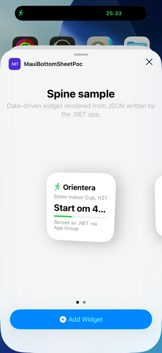
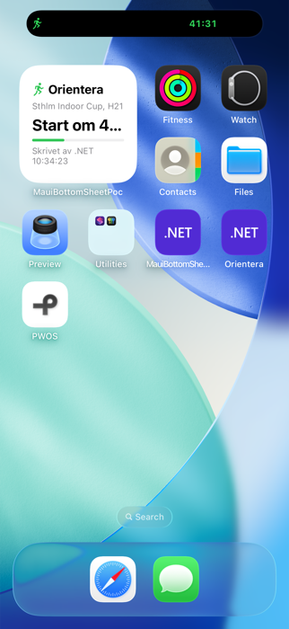
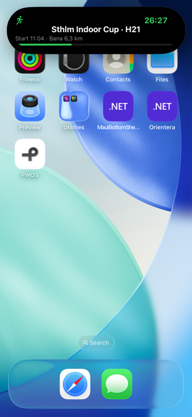
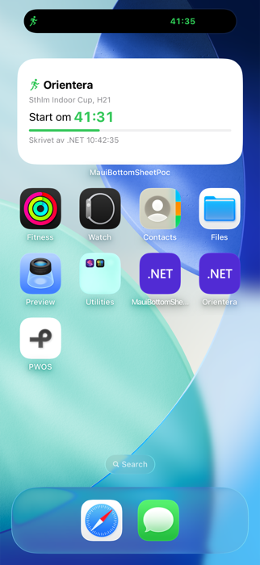

# Spine.Widgets — widgets och Live Activities från Spine (förstudie, rev 1)

**Status:** Implemented — iOS i issue [#165](https://github.com/jonatansoderberg/Maui.Spine/issues/165), Android (v2) i issue [#168](https://github.com/jonatansoderberg/Maui.Spine/issues/168); se [docs/wiki/widgets.md](../wiki/widgets.md). Behålls som designhistorik.
**Fråga:** Går det att, deklarativt eller i C#, definiera en widget i Spine-ramverket som fungerar på de plattformar Spine stödjer, med iOS som referens? Och kan samma modell driva Live Activities i Dynamic Island?
**Svar:** Ja. Spiken i [spine-widgets/spike](spine-widgets/spike) visar en hemskärmswidget och en Live Activity på iOS 26 där **all layout kommer som JSON från .NET-appen**, utan ett enda Xcode-projekt och utan app-specifik Swift. Det som återstår är att göra det till ett paket.

---

## 1. Slutsatsen i korthet

| Fråga | Svar | Bevis |
|---|---|---|
| Kan C# köra inne i en iOS-widget? | **Nej.** WidgetKit kräver ett SwiftUI-`@main` i ett extension, och extensionet dödas vid ~30 MB. Microsoft.iOS binder varken WidgetKit eller ActivityKit (öppna issues sedan 2020/2022, väntar på Swift-interop som fortfarande är experimentell i .NET 11). | Lokal kontroll av `Microsoft.iOS.dll` 26.2: inga namespace för WidgetKit/ActivityKit. dotnet/macios #9215, #17038. |
| Kan Spine ändå äga widgeten? | **Ja**, med en *generisk* Swift-renderare: appen skriver ett vy-träd (JSON) till App Group-containern, extensionet tolkar trädet med SwiftUI. Det är samma arkitektur som Expo (`expo-widgets`) och Kotlin/WARP valt. | Spiken: JSON från C# renderas i widget och i Dynamic Islands alla regioner. |
| Behövs Xcode-projekt? | **Nej.** Extensionet kompileras med `swiftc` direkt (10 s, 150 kB binär) och bakas in av .NET-SDK:ns `AdditionalAppExtensions`. Det är enklare än alla andra ramverk, som antingen kräver manuellt Xcode-target eller pbxproj-generering. | `build-appex.sh` + `spike.targets`. |
| Kan C# trigga uppdatering och starta Live Activity? | **Ja**, via ett litet `@objc`-Swift-framework (`SpineWidgetBridge`) som anropas med `objc_msgSend`. Ingen bindningsprojekt-ceremoni. | Loggen: `reloadAll sent`, `live activity id: D40F760C…`; widgeten visar tiden C# skrev. |
| Cross-platform? | Android: ja i .NET 10 (RemoteViews + Live Updates i API 36). Windows: ja men bara MSIX-paketerat (Widgets Board + Adaptive Cards). Mac Catalyst: samma mekanism som iOS, ej verifierad. macOS 26 visar iPhone-Live Activities automatiskt. | Se §5. |

### Skärmdumpar från spiken

| Widget i galleriet | Widget efter `reloadAll` från C# | Live Activity, expanderad |
|---|---|---|
|  |  |  |

Texten "Skrivet av .NET 10:34:23" är klockslaget då C#-koden skrev JSON-filen och anropade `WidgetCenter.reloadAllTimelines()` genom bryggan. Live Activity-nedräkningen är en `Text(timerInterval:)` som tickar utan att appen är igång.

---

## 2. Vad spiken gör, steg för steg

Alla filer ligger i [spine-widgets/spike](spine-widgets/spike). Inget i repot ändrades; allt injicerades i sample-appen via `-p:CustomBeforeMicrosoftCommonTargets=spike.targets`.

1. **`SpineWidget.swift`** — ett generiskt widget-extension. `Node` är ett rekursivt JSON-schema (`vstack`, `hstack`, `spacer`, `text`, `image` (SF Symbol), `progress`, `timer`), `NodeView` tolkar det med SwiftUI. `SpineWidget` läser `spine-widgets/<kind>.json` ur App Group-containern i sin `TimelineProvider`. `SpineLiveActivity` gör samma sak för Live Activities: `ContentState` är en enda JSON-sträng med en slot per region (`lockScreen`, `expandedLeading/Trailing/Center/Bottom`, `compactLeading/Trailing`, `minimal`). Ett `WidgetBundle` binder ihop dem.
2. **`build-appex.sh`** — kompilerar extensionet med `xcrun swiftc -application-extension … -e _NSExtensionMain` och lägger till en Info.plist med `NSExtensionPointIdentifier = com.apple.widgetkit-extension`. Inget Xcode-projekt.
3. **`SpineWidgetBridge.swift` / `build-bridge.sh`** — ett dynamiskt framework med en `@objc`-klass som exponerar `reloadAll`, `reload(kind:)`, `activitiesEnabled`, `startActivity(kind:json:)`, `updateActivity(id:json:)`, `endActivity(id:)`. Här ligger även `SpineActivityAttributes`; typen måste finnas med samma namn i både app och extension, vilket är fallet eftersom källfilen är gemensam.
4. **`spike.targets`** — fyra rader som räcker för .NET-SDK:n:
   - `AdditionalAppExtensions` → appex kopieras till `PlugIns/` och signeras om med app-gruppens entitlements.
   - `NativeReference Kind="Framework"` → bryggan hamnar i `Frameworks/` och länkas.
   - `PartialAppManifest` → `NSSupportsLiveActivities` mergas in i appens Info.plist.
   - `Compile` → testkoden.
5. **`SpikeWriter.cs`** — en `[ModuleInitializer]` i appen: hämtar App Group-containern via `NSFileManager.GetContainerUrl`, skriver JSON, anropar bryggan med tre `DllImport("/usr/lib/libobjc.dylib", EntryPoint="objc_msgSend")`-deklarationer och `Class.GetHandle("SpineWidgetBridge")`, och startar en Live Activity efter 4 s.

Byggkommandot (simulator, utan signeringsidentitet på den här Macen därav `CodesignKey=-`):

```bash
dotnet build samples/MauiSpineSampleApp/MauiSpineSampleApp.csproj -f net10.0-ios -p:RuntimeIdentifier=iossimulator-arm64 -p:CustomBeforeMicrosoftCommonTargets=<spike-dir>/spike.targets -p:CodesignEntitlements=<spike-dir>/SpineWidget.entitlements -p:CodesignKey=-
```

Verifierat på macOS 26.6, Xcode 26.2, .NET 10.0.201, Microsoft.iOS 26.2, iPhone 17 Pro-simulator (iOS 26.4). **Ej verifierat:** fysisk enhet och App Store-validering, eftersom den här Macen saknar signeringscertifikat. Se §7.

---

## 3. Hur andra ramverk löser det (och vad vi lånar)

Alla lösningar i det vilda faller i fyra familjer:

| Familj | Idé | Exempel | Kommentar |
|---|---|---|---|
| A. Bara databrygga | Appen skriver key/value till App Group, Swift-koden är handskriven per widget. | Flutter `home_widget`, `live_activities`, `@bacons/apple-targets`, OneSignal/Braze, Microsofts egna MAUI-samples, Shiny.LiveActivities | Det är "custom widgets inbakade i en MAUI-app" som frågan nämner. Fungerar men layouten är aldrig C#. |
| B. Rasterisera till bild | Appen ritar sin egen UI till PNG, widgeten visar bilden. | Flutter `renderFlutterWidget`, `react-native-android-widget` | Ingen text-skalning, inga timers, kräver att appen kör. Avfärdas som huvudspår. |
| **C. Generiskt vy-träd → native renderare** | Cross-platform-kod producerar JSON, en generisk Swift/Kotlin-renderare i extensionet tolkar det. | **Expo `expo-widgets`** (JS körs i JavaScriptCore inne i appex), **WARP (KMP)**, Capgo `capacitor-live-activities` | **Det vi bygger.** Beprövat: expo-widgets har stöd för både widgets och alla Dynamic Island-slots med exakt detta upplägg. |
| D. Kodgenerering | DSL kompileras till riktig SwiftUI/Glance-källkod vid bygge. | Flutter `home_widget_generator` | Ger mest native-känsla men kräver Swift-kompilering per widget och per ändring; C kan uppgraderas till D senare utan API-brott. |

Lärdomar vi tar med:

- **En generisk `AppIntent` parametriserad med action-id** (WARP, expo-widgets) för knappar i interaktiva widgets; aldrig Swift per knapp.
- **Timers är en egen nodtyp** (`Text(timerInterval:)`) — det är det som gör Live Activities levande utan push. Capgo och expo-live-activity har det; WARP saknar det.
- **Bilder skrivs som filer i App Group-containern** (Capgo, `live_activities`), aldrig i JSON (ActivityKit-state är max 4 kB).
- **Byggverktyget avgör om folk använder det**: Expo och NativeScript genererar targeten; Flutter kräver Xcode-handpåläggning och det är den vanligaste klagopunkten. Vår `swiftc`-väg är enklare än båda.

---

## 4. Föreslagen arkitektur

```
┌──────────────────────── .NET-appen (Spine) ────────────────────────┐
│  [Widget("race")] RaceWidget : IWidgetProvider                     │
│     BuildTimeline() → WidgetTimeline { (date, WidgetNode)… }       │
│  ILiveActivityService.StartAsync(layout) / UpdateAsync / EndAsync  │
│                       │ serialiserar WidgetNode → JSON             │
│                       ▼                                            │
│  IWidgetPlatform (per plattform)                                   │
└──────┬────────────────────────┬─────────────────────────┬──────────┘
       │ iOS/Catalyst           │ Android                  │ Windows
       ▼                        ▼                          ▼
 App Group-container       Notification.ProgressStyle   Adaptive Cards-JSON
 + SpineWidgetBridge       + RemoteViews byggda från    + IWidgetProvider
   (reload, ActivityKit)     samma träd (stub-layouts)    (COM-server, MSIX)
       │
       ▼
 SpineWidget.appex (generisk SwiftUI-renderare, levereras av Spine)
```

### 4.1 Kärnan: ett plattformsneutralt vy-träd

`WidgetNode` är ett litet, medvetet begränsat vokabulär som *alla tre* renderare kan uttrycka:

| Nod | iOS (SwiftUI) | Android (RemoteViews) | Windows (Adaptive Cards) |
|---|---|---|---|
| `VStack` / `HStack` / `ZStack` | `VStack`/`HStack`/`ZStack` | `LinearLayout` (stub-layout) / `FrameLayout` | `Container` / `ColumnSet` |
| `Text(role, bold, color)` | `Text().font(role)` | `TextView` + `setTextViewTextSize` | `TextBlock(size, weight)` |
| `Icon(name)` | SF Symbol | Bitmap renderad från Spines SVG-pipeline | Bild-URL i paketet |
| `Image(assetId)` | fil i App Group | fil i app-data | asset i paketet |
| `Progress(value)` / `Gauge` | `ProgressView`/`Gauge` | `ProgressBar` | `ProgressBar` (1.4+) |
| `Timer(until)` | `Text(timerInterval:)` | `Chronometer` | text med `{{DATE()}}` |
| `Spacer` / `Divider` | dito | `View` med `layout_weight` via stub | `Container` |
| `Link(url)` | `.widgetURL` / `Link` | `PendingIntent` → `MainActivity` | `Action.OpenUrl` |
| `Button(actionId)` (v2) | `Button(intent: SpineWidgetIntent)` | `PendingIntent` broadcast | `Action.Execute` |

Ikoner är den enda punkten där plattformarna skiljer sig i vad som är "gratis": iOS har SF Symbols, Android/Windows inte. Spine har redan en SVG-ikon-pipeline (`Plugin.Maui.SvgIcon`); appen kan rendera SVG:n till PNG i App Group-containern vid skrivning, så widgeten på iOS kan också använda Spines egna ikoner om man vill ha pixel-paritet.

**Miljö-inputs** som trädet får svara på: `Family` (small/medium/large/lockscreen/island-region), `ColorScheme`, `IsLuminanceReduced`. I v1 löses det genom att appen skriver ett träd per familj (`WidgetTimeline` har en `Dictionary<WidgetFamily, WidgetNode>`); adaptiv layout i trädet (`Adaptive { small: …, medium: … }`) är enkelt att lägga till senare.

### 4.2 C#-API, i Spines anda

Attributskannat, typat, inga strängrutter — samma mönster som `[NavigableRegion]` och `IShortcutHandler`:

```csharp
[Widget("next-start", DisplayName = "Nästa start",
        Families = [WidgetFamily.Small, WidgetFamily.Medium])]
public sealed class NextStartWidget(IRaceService _races) : IWidgetProvider
{
    public async Task<WidgetTimeline> BuildTimelineAsync(WidgetContext context)
    {
        var start = await _races.NextStartAsync();
        return WidgetTimeline.Single(
            W.VStack(spacing: 6,
                W.HStack(W.Icon("figure.run", Color.Green), W.Text("Orientera").Headline().Bold(), W.Spacer()),
                W.Text($"{start.Event}, {start.Class}").Caption().Secondary(),
                W.Timer(until: start.Time).Title().Bold(),
                W.Progress(start.Fraction, Color.Green))
            .Link("spine://widget/next-start"))
            .RefreshAfter(TimeSpan.FromMinutes(15));
    }
}
```

`WidgetTimeline` kan innehålla flera poster med datum, precis som WidgetKits timeline, så appen kan förberäkna "om 42 min", "om 30 min", "Startad" i förväg och extensionet byter utan att appen behöver vakna.

Live Activities:

```csharp
var activity = await _liveActivities.StartAsync("race", new LiveActivityLayout
{
    LockScreen       = W.HStack(...),
    ExpandedLeading  = W.Icon("figure.run"),
    ExpandedTrailing = W.Timer(until: start.Time).Headline(),
    ExpandedCenter   = W.Text("Sthlm Indoor Cup · H21").Headline(),
    ExpandedBottom   = W.VStack(W.Text("Start 11:04 · Bana 6,3 km").Caption(), W.Progress(0.35)),
    CompactLeading   = W.Icon("figure.run"),
    CompactTrailing  = W.Timer(until: start.Time).Caption(),
    Minimal          = W.Icon("figure.run"),
});
await activity.UpdateAsync(layout with { ExpandedBottom = ... });
await activity.EndAsync();
```

På Android mappas samma `LiveActivityLayout` till Android 16 Live Updates (`Notification.ProgressStyle` + `SetRequestPromotedOngoing`, bundet i .NET 10/API 36): `CompactTrailing`-text blir `ShortCriticalText`, `Progress` blir ProgressStyle-segment, timern blir `When` + chronometer. Samsung One UI 8 lyfter in exakt dessa i Now Bar utan Samsung-SDK. På macOS 26 speglas iPhone-aktiviteten till menyraden automatiskt.

Deklarativt alternativ: eftersom `WidgetNode` är ett serialiserbart träd är JSON-literalen i spiken redan ett giltigt "deklarativt" format. XAML-stöd är möjligt men ger inget som C#-buildern inte ger, och Spine är code-first; jag föreslår att vi inte bygger XAML-parsning.

### 4.3 Hur widgeten får data när appen inte kör

Det här är den verkliga begränsningen i familj C, och den måste vara tydlig i dokumentationen:

1. **Förberäknad timeline** (v1) — appen skriver flera poster, extensionet byter enligt datum. Räcker för "nästa start", vädret idag, dagens schema.
2. **Bakgrundsuppdatering i appen** (v1) — `BGAppRefreshTask` på iOS (bundet i Microsoft.iOS), WorkManager på Android, kör `BuildTimelineAsync` och anropar reload. iOS ger typiskt några körningar per dag.
3. **Fjärrkälla i extensionet** (v2) — `[Widget(RemoteSource = "https://api/…/widget")]`: extensionet hämtar trädet självt med `URLSession` i sin `TimelineProvider`. Då behöver appen aldrig köra, och backend (Orientera.Backend) kan rendera trädet server-side med samma C#-modell. iOS 26 lägger dessutom till push-uppdaterade widgets (`WidgetPushHandler`), som passar samma modell.
4. **Push** för Live Activities (v2) — push-to-start (iOS 17.2+) och uppdateringar via APNs kräver bara att JSON-payloaden matchar `ContentState { json }`; bryggan exponerar tokens (`pushToStartTokenUpdates`, `pushTokenUpdates`) till C#.

### 4.3b Hur ofta en widget uppdateras (och varför klockor ändå tickar)

En widget är inte en levande vy utan en serie ögonblicksbilder. Tre helt olika mekanismer styr vad användaren ser:

| Mekanism | Frekvens | Kostar budget? |
|---|---|---|
| **Systemritade, tidsberoende texter** — `Text(timerInterval:)`, `Text(date, style: .timer/.relative/.offset/.time)`, `ProgressView(timerInterval:)` | Varje sekund, ritas av systemet utan att extensionet körs | Nej |
| **Timeline-poster** — flera `(datum, träd)` som appen förberäknat; WidgetKit byter till nästa post vid dess datum | Exakt när posten säger, i praktiken inte tätare än ~5 min | Nej, bytet är gratis; nästa `getTimeline` räknas |
| **Omladdning** — `reloadTimelines` från appen, `TimelineReloadPolicy` (`.atEnd`, `.after(date)`), bakgrundsjobb, push (iOS 26) | Systemet beviljar ungefär **40–70 omladdningar per dygn** per ofta sedd widget, alltså var 15–60 min; extra anrop köas till nästa lucka | Ja, med undantag för när appen går till förgrunden, användaren interagerar med widgeten, eller widgeten just lades till |

Konsekvens för Spine: **allt som ska ticka måste vara en `Timer`-nod, aldrig en text appen räknar ut.** Spikens första widget visade en statisk "Start om 42 min" och stod därför stilla; med en `timer`-nod tickar den lika bra som Live Activityn:



Live Activities har en annan modell: `ContentState` uppdateras direkt av appen (obegränsat lokalt så länge appen kör) eller via push (budgeterat, lyfts med `NSSupportsLiveActivitiesFrequentUpdates`), och timer-texter ritas av systemet på samma sätt. Det är därför nedräkningen i Dynamic Island aldrig behövde någon omladdning.

### 4.3c Fallstudie: realtidsdata som pollas från ett API (t.ex. blodsocker)

Tänk en app som visar aktuellt blodsocker från ett moln-API som ger ett nytt värde var 5:e minut. Med enbart appen på iOS når man **inte** 5-minutersintervall, varken för widget eller Live Activity. Det som fungerar i den här klassen av appar (Dexcom, Gluroo, Sugarmate, Nightscout-klienterna) är att en **server** pollar API:t och pushar till telefonen; appen själv får bara en handfull bakgrundskörningar per timme.

| Yta | Bara appen (inga push) | Med server-push |
|---|---|---|
| iOS-widget | Extensionet får hämta API:t självt i `getTimeline`, men systemet beviljar ~40–70 omladdningar per dygn, alltså var 15–60 min | iOS 26 kan trigga omladdning via push (`WidgetPushHandler`); räknas såvitt känt fortfarande mot samma budget (ej verifierat) |
| iOS Live Activity | Uppdateras bara när appen kör. `BGAppRefreshTask` ger typiskt några körningar per timme, oregelbundet, ~30 s åt gången | APNs `liveactivity`-push var 5:e minut fungerar. `NSSupportsLiveActivitiesFrequentUpdates` i Info.plist höjer budgeten |
| Android-widget | WorkManager: minst 15 min. En foreground service kan uppdatera fritt | FCM-datameddelande var 5:e minut; tjänsten uppdaterar widget + Live Update direkt |
| Android Live Update | Samma som ovan | Samma som ovan |

Tre iOS-detaljer som styr designen:

- **Live Activity lever max 8 timmar**, sedan avslutas den. Med push-to-start (iOS 17.2+) kan servern starta en ny utan att appen körs.
- **`staleDate`** i varje uppdatering låter layouten visa "ingen data" om nästa push uteblir. Kombinera med en `relative`-textnod ("för 7 min sedan") som tickar utan uppdatering. Det är standardmönstret i CGM-appar och bör vara en nodtyp i `WidgetNode` (`Text(date, style: .relative)`).
- **Appen i förgrunden** får polla fritt och uppdatera båda ytorna gratis. Budgetarna gäller bakgrund.

Sidospår: appar som pratar direkt med sensorn över Bluetooth (xDrip4iOS, Loop) väcks av `bluetooth-central`-bakgrundsläget vid varje avläsning och slipper problemet. Det gäller inte när källan är ett moln-API.

**Rekommenderad arkitektur**

1. **Backend** pollar käll-API:t var 5:e minut per användare och skickar en APNs-push av typen `liveactivity` med ny `content-state` (för Spine: samma JSON-träd som appen annars skriver) samt ett FCM-datameddelande till Android. Orientera.Backend är redan en BFF, så mönstret finns i repot.
2. **Appen** levererar tokens till backend. Bryggan exponerar `pushToStartTokenUpdates` (finns innan någon aktivitet startats) och per-aktivitetens `pushTokenUpdates`. Token roterar, så de skickas upp vid varje ändring.
3. **Widgeten** hämtar trädet själv från backend i extensionet (fjärrkälla-alternativet i §4.3) med `reloadPolicy .after(5 min)`. Systemet glesar ut det till 15–60 min, men widgeten visar datats ålder och ljuger därför aldrig.
4. **`BGAppRefreshTask` som komplement**, inte stomme: förnya tokens, synka historik.

**Praktiskt i .NET MAUI**

*Bakgrundsjobb på iOS.* BackgroundTasks är bundet i Microsoft.iOS. Info.plist behöver `UIBackgroundModes: fetch` och `BGTaskSchedulerPermittedIdentifiers`. I `FinishedLaunching`:

```csharp
BGTaskScheduler.Shared.Register("se.myapp.refresh", null, task =>
{
    var refresh = (BGAppRefreshTask)task;
    Schedule();                                   // boka nästa körning först
    var cts = new CancellationTokenSource();
    refresh.ExpirationHandler = () => cts.Cancel();
    _ = Task.Run(async () =>
    {
        try { await _glucose.RefreshAsync(cts.Token); refresh.SetTaskCompleted(true); }
        catch { refresh.SetTaskCompleted(false); }
    });
});

static void Schedule()
{
    var request = new BGAppRefreshTaskRequest("se.myapp.refresh")
    {
        EarliestBeginDate = NSDate.FromTimeIntervalSinceNow(5 * 60)
    };
    BGTaskScheduler.Shared.Submit(request, out _);
}
```

Boka om i `OnSleep` också. Kan bara testas på fysisk enhet, via LLDB-kommandot `_simulateLaunchForTaskWithIdentifier:` i Xcode-debuggern. Det är en naturlig Spine-abstraktion, `IBackgroundRefreshHandler`, i samma stil som `IShortcutHandler` (se leveransplanen, v2).

*Push till Live Activity.* Backend skickar med `apns-push-type: liveactivity`, `apns-topic: <bundle-id>.push-type.liveactivity`, `apns-priority: 10`:

```json
{ "aps": {
    "timestamp": 1757236800,
    "event": "update",
    "stale-date": 1757237400,
    "content-state": { "json": "{\"lockScreen\":{...},\"compactTrailing\":{\"type\":\"text\",\"text\":\"6,8 ↗\"}}" },
    "alert": { "title": "Lågt blodsocker", "body": "3,4 mmol/L" }
} }
```

`event: start` med `attributes-type: SpineActivityAttributes` startar en ny aktivitet via push-to-start.

*Android.* Enklast är FCM-datameddelanden som väcker `FirebaseMessagingService`, som uppdaterar widgeten med `AppWidgetManager.UpdateAppWidget` och postar `Notification.ProgressStyle` med `SetRequestPromotedOngoing(true)`. En foreground service av typen `health` är alternativet för lokal pollning, men Android 14+ kräver att appen motiverar typen, och `dataSync`-typen är begränsad till sex timmar per dygn sedan Android 15.

Sammanfattat: bygg för push från dag ett, låt widgeten visa datats ålder i stället för att låtsas vara realtid, och använd Live Activity som realtidsytan.

### 4.4 Byggpipeline (det viktigaste för adoption)

Paketet `Plugin.Maui.Spine.Widgets` levererar Swift-källorna och en `buildTransitive`-target som på iOS/Catalyst-TFM:

1. Läser widgets ur appens manifest (`[Widget]`-attributen kan inte skannas vid byggtid utan reflektion; enklast är att appen listar dem i csproj: `<SpineWidget Include="next-start" DisplayName="Nästa start" Families="Small;Medium" />`, alternativt en source generator som skriver samma fil).
2. Genererar `Info.plist` (bundle-id `$(ApplicationId).spinewidgets`, DT-nycklar, `NSExtension`), entitlements (`group.$(ApplicationId)` som default, överstyrbart) och en `spine-widgets.json`-manifest med kinds/namn/familjer som extensionet läser vid start.
3. Kör `swiftc` för rätt SDK/arkitektur (`iphonesimulator`/`iphoneos`/`macosx` + Catalyst) till `obj/…/SpineWidget.appex`. ~10 s, cache:as på indata.
4. Lägger till `AdditionalAppExtensions`, `NativeReference` (bryggan, prebuilt xcframework i paketet eftersom den är app-oberoende), `PartialAppManifest` (`NSSupportsLiveActivities`) och ser till att appens `CodesignEntitlements` innehåller App Group.

Kravet är en Mac med Xcode CLI, vilket redan gäller för alla iOS-byggen. Windows + Pair-to-Mac hade en appex-regression i VS 2026 som är fixad uppströms (dotnet/macios #25461); Hot Restart stöds inte alls för extensions.

**Antal widgets:** `WidgetBundle` kan inte lista widgets dynamiskt i runtime. Eftersom vi kompilerar vid bygge genererar targeten helt enkelt ett `SpineWidgetN`-struct per deklarerad widget. (Alternativet med förbyggda binärer skulle kräva fasta "slots".)

---

## 5. Plattformsmatris

| Plattform | Widget | Live Activity-motsvarighet | Krav | Status i förstudien |
|---|---|---|---|---|
| iOS 17+ | WidgetKit via generiskt appex | ActivityKit: låsskärm + Dynamic Island | Mac-bygge, App Group, provisioning för app + appex | **Verifierad i simulator** |
| Mac Catalyst | Samma appex (WidgetKit stöds i Catalyst 14+) | Ingen egen; macOS 26 speglar iPhone-aktiviteter | `AdditionalAppExtensions` stöds för Catalyst enligt SDK-targets (6 träffar i Catalyst-SDK:n) | Ej verifierad; troligen separat `swiftc`-target |
| Android 5+ | `AppWidgetProvider` + `RemoteViews` byggt från trädet med stub-layouts (`AddView` för nästling, API 31 ger marginaler/radier/storlek) | Android 16 Live Updates (`ProgressStyle`, `setRequestPromotedOngoing` — det senare via JNI, obundet i Mono.Android 36.1) | Inget extra verktyg; allt är C# | **Implementerad och verifierad i emulator (API 36/37)**, #168 |
| Windows 11 | Widgets Board: `IWidgetProvider` + Adaptive Cards-JSON | Ingen | **Endast MSIX-paketerad app** (Orientera kör `WindowsPackageType=None` idag), COM-server, x64/ARM64 | Officiellt C#-sample finns; ingen känd MAUI-app har gjort det |

Android-noten: Jetpack Glance går inte att använda från C# (dotnet/android #6379), så det blir RemoteViews. Det räckte för trädet ovan; `layout_weight` (bara i stackar bredare än sitt innehåll), egna typsnitt och `Relative`-formatet är de kända hålen, och ikonerna kommer från en inbäddad SVG per SF-namn. Detaljerna står i wikins Android-sektion.

---

## 6. Föreslagen leveransplan

**v1 — iOS-referens (det som frågan gäller)**
- `Plugin.Maui.Spine.Widgets`: `WidgetNode`-modell + builder, `[Widget]`/`IWidgetProvider`, `ILiveActivityService`, `IWidgetPlatform`.
- iOS: generiskt appex (Swift-källor i paketet), brygg-xcframework, MSBuild-target enligt §4.4. Timers, progress, ikoner, länk till appen via Spines befintliga URL-hantering (`spine://widget/<kind>`) som routas som en shortcut i `IShortcutHandler`-stil.
- Orientera som drivare: widgeten "Nästa start" + Live Activity "Din start" (nedräkning, start, ute på banan, i mål). Det är dessutom det scenario spiken redan visar.
- Verifiera på fysisk enhet + TestFlight-uppladdning (§7).

**v2 — Android + interaktivitet**
- RemoteViews-renderare och Live Updates-mappning. *Levererat i #168.*
- Fjärrkälla i extensionet, push-to-start, generisk `AppIntent` för knappar.
- `IBackgroundRefreshHandler` (BGAppRefreshTask / WorkManager) och token-leverans för push-uppdaterade Live Activities enligt §4.3c.
- Adaptiva träd per familj.

**v3 — Windows/Catalyst**
- Widgets Board-provider (kräver att appen paketeras) och Catalyst-appex.

---

## 7. Risker och det som inte är verifierat

1. **Enhetsbygge och App Store.** Spiken körde bara i simulatorn (inga certifikat på den här maskinen). På enhet krävs ett App ID + profil för appex-bundle-id:t med App Groups. App Store-validering av ett `swiftc`-byggt appex är det osäkraste: Apple förväntar sig DT-nycklar (`DTSDKName`, `DTXcode`, …) i appexets Info.plist som Xcode annars sätter; targeten måste skriva dem. Första verkliga milstolpen är därför en TestFlight-uppladdning.
2. **`AdditionalAppExtensions` kräver `_DetectSigningIdentity`** även för simulator. Utan identitet i nyckelringen måste `CodesignKey=-` sättas; targeten bör göra det automatiskt för simulatorbyggen.
3. **Ingen .NET i extensionet, någonsin.** Alla "varför uppdateras inte widgeten"-frågor kommer att landa i §4.3. Dokumentationen måste vara tydlig om vad som händer när appen inte kör.
4. **Minnesbudget 30 MB** för extensionet gäller även vår Swift-renderare; stora bilder i App Group måste skalas av appen innan de skrivs.
5. **ActivityAttributes måste vara byte-identiska** mellan app och extension (annars slutar uppdateringar tyst). Vi äger båda sidor, så det är ett byggtidsproblem, inte ett användarproblem.
6. **Windows kräver MSIX.** Ingen widget för opaketerade appar; det är en Microsoft-begränsning.
7. **Swift-interop i .NET** kan om några år göra bryggan onödig, men inget av det finns i .NET 11-planen. `objc_msgSend`-vägen är stabil och kräver inga bindningsprojekt.

---

## 8. Referenser

Verifierat lokalt: `Microsoft.iOS.Ref 26.2` (inga WidgetKit/ActivityKit-namespace), `Xamarin.Shared.targets` (`_ExtendAppExtensionReferences`, `PartialAppManifest`), spiken i denna mapp.

- Microsoft, *How to Build iOS Widgets with .NET MAUI* (dec 2025): https://devblogs.microsoft.com/dotnet/how-to-build-ios-widgets-with-dotnet-maui/
- Microsoft, *How to Build Android Widgets with .NET MAUI* (jan 2026): https://devblogs.microsoft.com/dotnet/how-to-build-android-widgets-with-dotnet-maui/
- Microsoft, MAUI Live Activity-sample (maj 2026): https://learn.microsoft.com/en-us/samples/dotnet/maui-samples/platformintegration-live-activity/
- `AdditionalAppExtensions`: https://learn.microsoft.com/en-us/dotnet/ios/building-apps/build-items
- dotnet/macios: WidgetKit #9215, ActivityKit #17038, Swift-interop dotnet/runtime #95638
- Expo widgets (JSON-träd → SwiftUI i appex): https://docs.expo.dev/versions/latest/sdk/widgets/
- WARP (KMP, samma arkitektur): https://github.com/DevAtrii/Warp
- Shiny.Mobile.LiveActivities (beta, sep 2026, familj A): https://www.nuget.org/packages/Shiny.Mobile.LiveActivities
- Android Live Updates: https://developer.android.com/develop/ui/views/notifications/live-update
- Windows Widgets Board, C#: https://learn.microsoft.com/en-us/windows/apps/develop/widgets/implement-widget-provider-cs
- Apple, Live Activities i macOS 26: https://support.apple.com/en-kz/120684
- Apple, BGTaskScheduler: https://developer.apple.com/documentation/backgroundtasks/bgtaskscheduler
- Apple, uppdatera Live Activities med push (inkl. push-to-start, `stale-date`, frequent updates): https://developer.apple.com/documentation/activitykit/starting-and-updating-live-activities-with-activitykit-push-notifications
- Apple, WidgetKit-budget ("Keeping a widget up to date"): https://developer.apple.com/documentation/widgetkit/keeping-a-widget-up-to-date
