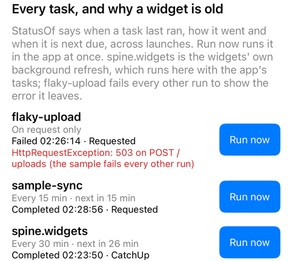

# Background tasks

`Plugin.Maui.Spine.BackgroundTasks` runs work while the app is not on screen: fetch standings, sync a database, plan tomorrow's notifications, and rebuild the widgets from what was fetched. A task is a class with `[BackgroundTask]`, found at startup the way pages and widgets are found, and Spine books it with the platform's scheduler.

**The platform decides when a task runs, and Spine cannot change that.** Plan for it:

- **iOS** runs a task when it judges the app worth it, from how often the user opens the app. That is typically a few times a day, sometimes not for days, and never on a clock. It runs nothing after the user swipes the app away in the app switcher, or with Background App Refresh turned off.
- **Android** runs a task at most every 15 minutes, later in Doze. A force stop (Settings → Force stop) cancels the jobs until the app is opened again. A restart does not.
- **Windows and Mac Catalyst** have no scheduler that launches a Spine app, so tasks run only while the app is running. `IBackgroundTasks.RunsWhileClosed` is `false` there.

Every platform also runs the tasks that are due when the app comes to the foreground. If something has to happen at a set time, send a push that wakes the app; a background task keeps things fresh in between.

## A task

```csharp
[BackgroundTask("standings", IntervalMinutes = 30, RequiresNetwork = true, Widgets = ["team"])]
public sealed class StandingsTask(IStandingsApi api, StandingsStore store) : IBackgroundTask
{
    public async Task RunAsync(BackgroundTaskRun run, CancellationToken cancellationToken) =>
        await store.SaveAsync(await api.FetchAsync(cancellationToken), cancellationToken);
}
```

| `[BackgroundTask]` | Meaning |
|---|---|
| `Name` | Stable name. The schedule and the status are stored under it, and it is what `RequestAsync` and a push's `spine.task` take. |
| `IntervalMinutes` | Minutes between scheduled runs. This is a floor: the task never runs sooner, and often later. `0` (the default) runs the task only on request. Android's floor is 15. |
| `RequiresNetwork` | A scheduled run waits for a connection. A run on request does not wait. |
| `RequiresCharging` | A scheduled run waits for a charger. Applies on Android, and to long tasks on iOS. |
| `Long` | Minutes of work instead of seconds. See [Long tasks on iOS](#long-tasks-on-ios). |
| `Widgets` | Widget kinds to rebuild through `IWidgetService` after a run that completed. |

`UseSpine()` registers the package for an app that references it, and finds the tasks in the assemblies `UseSpine` scans (`options.AddAssembly(...)`). `UseSpineBackgroundTasks(o => …)` is only needed to change the options, and it works before or after `UseSpine`:

```csharp
builder.UseSpineBackgroundTasks(o =>
{
    o.Interval("standings", settings.RefreshEvery);   // replaces IntervalMinutes; TimeSpan.Zero turns it off
    o.CatchUp = true;                                  // run due tasks on return to the foreground (default)
});
```

## What a run may do

Spine creates a task through DI, in a scope of its own for each run, on the thread pool. A scheduled run may start in a process that iOS or Android launched just for it, with no window:

- **Allowed:** `HttpClient`, files, `Preferences`, databases, `IWidgetService`, `ILiveActivityService.UpdateAsync`, and `ILocalNotificationService.SyncAsync` to plan notifications again after a sync.
- **Not allowed:** navigation, pages, dialogs and permission prompts. Spine logs a warning for a task whose constructor takes `INavigationService`.

Honour the cancellation token. On iOS a scheduled run has about 30 seconds in all, shared by every task that is due, and the token is cancelled when the system ends the run. After that Spine reports the run to iOS as unfinished, also when the task is still running. On Android the token is cancelled when JobScheduler stops the job, and the job is booked again.

A background launch also runs `CreateMauiApp` and the app's `App` constructor. Heavy startup work there takes time from the tasks.

At most one run of a task happens at a time. A request while a scheduled run is in progress joins that run.

## On request and from a push

```csharp
await tasks.RequestAsync("standings");      // or RequestAsync<StandingsTask>()
```

`RequestAsync` runs the task at once, in the app's process, and completes when the run ends. It does not go through the platform scheduler. A failing task is logged and recorded in its status; `RequestAsync` does not throw for it.

With `Plugin.Maui.Spine.PushNotifications` in the app, a silent or widget push whose data has `spine.task` runs that task before anything else happens with the message. For a widget push, the widgets are then rebuilt from what the task fetched:

```csharp
// In the server, with Plugin.Maui.Spine.Server's IPushSender
await sender.SendSilentAsync(PushTarget.Tags("team-pike"),
    new Dictionary<string, string> { [PushKeys.Task] = "standings" });
```

The task gets the push's time: about 30 seconds on iOS and 20 on Android. It cannot run longer than that.

## Why is my widget old?

```csharp
var status = tasks.StatusOf("standings");
// status.LastStarted, LastCompleted, LastOutcome (Completed, Failed, Cancelled), LastTrigger, LastError, NextDue
```

The status is kept across launches. `StatusChanged` is raised when a run starts or ends. The Showcase's *Background tasks* page lists every task this way:



## Widgets

With this package in the app, the widgets' own background run from `Plugin.Maui.Spine.Widgets` (`BackgroundRefreshInterval`, `UseBackgroundRefresh<T>()`) becomes the built-in task `spine.widgets`. It shows up in `Names` and `StatusOf` like any other task, and it runs with the app's tasks instead of on its own schedule. iOS allows one pending refresh request per app, so the two could not both be booked. Nothing changes in the app's code:

- `BackgroundRefreshInterval` is the interval of `spine.widgets`. `TimeSpan.Zero` turns it off, as before.
- On iOS the build leaves out Widgets' own `<ApplicationId>.spine-widgets.refresh` identifier. On Android Widgets stops booking its alarm, and cancels the alarm an earlier version booked.

A task that has fresh data for one widget names it in `Widgets = [...]` and leaves the others alone. Without this package, Widgets keeps its own background run as before.

## How it works per platform

| | Scheduled | On request | Building block |
|---|---|---|---|
| iOS | When the system chooses; one refresh identifier for all tasks | At once, in the process | `BGAppRefreshTask`, `BGProcessingTask` |
| Android | At most every 15 minutes per task; survives a restart | At once, in the process | `JobScheduler`: one persisted periodic job per task |
| Mac Catalyst | Only while the app runs, checked every minute | At once | In-process timer |
| Windows | Only while the app runs, checked every minute | At once | In-process timer |

**iOS.** Apple allows one pending refresh request per app and requires a handler for every identifier listed in `Info.plist` before launch finishes. So Spine does not use one identifier per task. The build writes two fixed identifiers, `<ApplicationId>.spine.refresh` and (optionally) `<ApplicationId>.spine.processing`, and Spine registers them in MAUI's `FinishedLaunching`. That is in time also when iOS launches the app in the background for the task. Spine then books the refresh request for the earliest time a task is due, and books it again when the app goes to the background and after every run. When iOS grants a run, Spine runs every task that is due, the most overdue first, until the time runs out. A task is due one interval after its last run started. A task that has never run is due at once.

**Android.** Each task with an interval gets a periodic `JobScheduler` job with a stable id, persisted across restarts, with its network and charging constraints. Jobs are checked when the app comes to the foreground and when it leaves. A job whose parameters have not changed is left alone, because booking it again would restart its period. Jobs of tasks that no longer have an interval are cancelled.

A job skips its run when the task started less than half its period ago, by any trigger. JobScheduler starts a newly booked periodic job at once, so on a first launch the job would otherwise repeat the catch-up's run a few seconds later. The half period leaves room for a job that comes early in its window, so the job's own next run is not lost. In the other order, a job first and then the catch-up, the catch-up finds the task not due and leaves it. Either way a first launch runs every task once.

**Windows and Mac Catalyst.** `BackgroundTaskBuilder` on Windows needs an MSIX package, and Spine apps run unpackaged. On Mac Catalyst, BGTaskScheduler does not launch the app. So a timer in the running app checks every minute for tasks that are due, starting 5 seconds after launch.

## Build settings

| Property | Default | What it does |
|---|---|---|
| `SpineBackgroundTasksEnabled` | `true` | iOS: adds `UIBackgroundModes: fetch` and `<ApplicationId>.spine.refresh` to `Info.plist`. With it on, Widgets leaves out its own identifier. |
| `SpineBackgroundTasksProcessing` | `false` | iOS: adds `UIBackgroundModes: processing` and `<ApplicationId>.spine.processing`, for tasks marked `Long`. |

Both keys are arrays in `Info.plist`, and the SDK replaces an array from a package's partial plist instead of merging it. So Spine's packages contribute `<SpineBackgroundMode>` and `<SpineBackgroundTaskIdentifier>` items, and `Plugin.Maui.Spine.Common.targets` writes them once, together with the modes and identifiers the app's own `Info.plist` declares. The Android manifest gets the `JobService`, `RECEIVE_BOOT_COMPLETED` (needed for a job that survives a restart) and `ACCESS_NETWORK_STATE` from the package itself.

An app that references the project instead of the package imports `build/Plugin.Maui.Spine.BackgroundTasks.targets` and `Plugin.Maui.Spine.Common.targets` explicitly, as the samples do.

### Long tasks on iOS

A task marked `Long` runs as a `BGProcessingTask` when the app sets `SpineBackgroundTasksProcessing=true`. iOS runs processing tasks only while the device is idle, often at night on a charger, and stops them when the user picks up the phone. All long tasks share one request. It asks for a network if any of them needs one, and for a charger only if all of them need one. Without the property, Spine logs a warning at launch and runs long tasks in the refresh's 30 seconds.

## Testing

- **iOS simulator:** BGTaskScheduler does not run in the simulator. Booking fails with `BGTaskSchedulerErrorDomain error 1`, and Spine logs that as a warning. Run a task on request, or bring the app to the foreground for the catch-up run.
- **iOS device:** book a run by sending the app to the background, pause in the debugger, and run:
  ```
  e -l objc -- (void)[[BGTaskScheduler sharedScheduler] _simulateLaunchForTaskWithIdentifier:@"<ApplicationId>.spine.refresh"]
  ```
  `_simulateExpirationForTaskWithIdentifier:` ends the run as if the time ran out.
- **Android:** list the jobs, then force one with the app in the background or not running:
  ```bash
  adb shell dumpsys jobscheduler | grep <package>
  adb shell cmd jobscheduler run -f <package> <job id>
  ```
  The job id is logged when Spine books the job (`Booked background task "standings" as job 1338566023 every 15 min.`). A forced run follows the same rule as any job, because Android does not tell the app that a run was forced: within half a period of the task's last start it is skipped and logged (`skipped its scheduled run: it started 61 s ago`). Wait out the half period, or use `RequestAsync`, which never skips.
