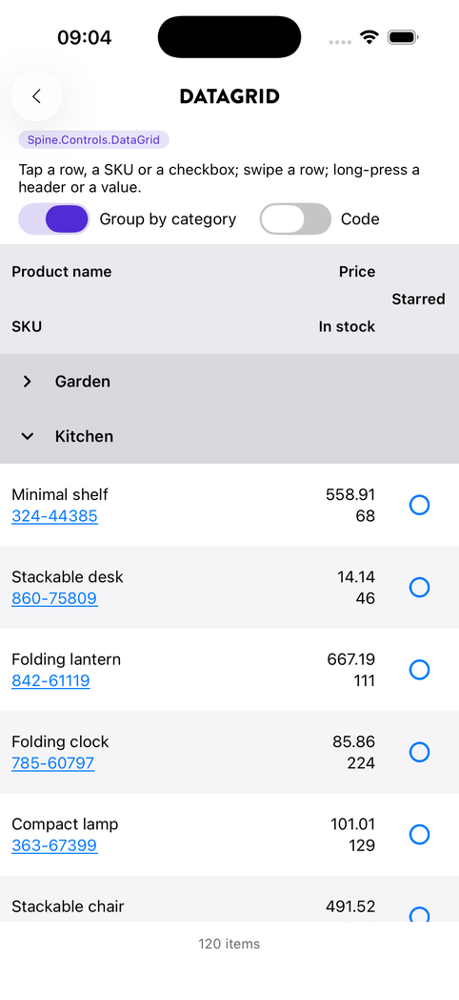
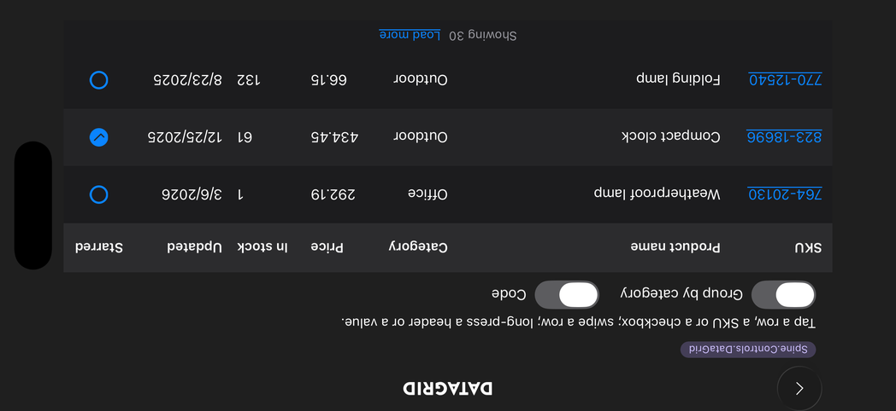

# DataGrid

```bash
dotnet add package Plugin.Maui.Spine.Controls.DataGrid
```

`DataGrid` is a row grid for data screens, built only on MAUI's own views (`CollectionView`, `RefreshView`, `SwipeView`, `Grid`, `Label`): fixed-height virtualised rows, named responsive layouts, sortable headers, grouping, swipe actions, load more and pull-to-refresh. It is not a spreadsheet: there is no editing, no column resizing and no horizontal scrolling. It was ported from a production-tested control.

<p align="center">
  
  
</p>
<p align="center"><sub>The same columns in the Narrow layout (grouped) and the Wide layout (dark, sorted by price)</sub></p>

> Columns define WHAT the data is. Layouts define WHERE it is rendered.

A `DataGridColumn` has no position. Each named `DataGridLayout` places columns with `DataGridCellPlacement` (Row, Column, RowSpan, ColumnSpan), or leaves a column out to hide it in that layout. `LayoutMode` picks the active layout, typically from a VisualStateManager setter.

---

## Platforms

| Platform | Status |
|---|---|
| Android | ✅ Supported |
| iOS | ✅ Supported |
| Mac Catalyst | ✅ Builds; `Auto` widths are measured with UIKit as on iOS |
| Windows (WinUI 3) | ✅ Builds; `Auto` widths are measured with a WinUI `TextBlock` |

---

## Registration

None. The grid's texts register themselves the first time a grid is created (see [Text](#text)), and it depends on `Plugin.Maui.Spine` only for the theme signal, the style-options chain and the string store. Add the namespace to the app's global XAML namespace:

```csharp
[assembly: XmlnsDefinition(
    "http://schemas.microsoft.com/dotnet/maui/global",
    "Plugin.Maui.Spine.Controls", AssemblyName = "Plugin.Maui.Spine.Controls.DataGrid")]
```

---

## A flat table

Without layouts the grid generates one: the columns in order, their `Width`, and a header row on top.

```xml
<DataGrid ItemsSource="{Binding Orders}" RowTappedCommand="{Binding OpenOrderCommand}">
    <DataGridColumn Key="Number" Header="Order" BindingPath="Number" IsSortable="True" Width="Auto" />
    <DataGridColumn Key="Customer" Header="Customer" BindingPath="CustomerName" IsSortable="True" />
    <DataGridColumn Key="Total" Header="Total" BindingPath="Total" Type="Price"
                    HorizontalTextAlignment="End" IsSortable="True" Width="Auto" />
</DataGrid>
```

`Columns` is the content property, so the columns can sit directly inside the grid.

## Responsive layouts

```xml
<Grid>
    <VisualStateManager.VisualStateGroups>
        <VisualStateGroup Name="Width">
            <VisualState Name="Narrow">
                <VisualState.StateTriggers><AdaptiveTrigger MinWindowWidth="0" /></VisualState.StateTriggers>
                <VisualState.Setters>
                    <Setter TargetName="Products" Property="DataGrid.LayoutMode" Value="Narrow" />
                </VisualState.Setters>
            </VisualState>
            <VisualState Name="Wide">
                <VisualState.StateTriggers><AdaptiveTrigger MinWindowWidth="640" /></VisualState.StateTriggers>
                <VisualState.Setters>
                    <Setter TargetName="Products" Property="DataGrid.LayoutMode" Value="Wide" />
                </VisualState.Setters>
            </VisualState>
        </VisualStateGroup>
    </VisualStateManager.VisualStateGroups>

    <DataGrid x:Name="Products" ItemsSource="{Binding Products}">
        <DataGrid.Columns>
            <DataGridColumn Key="Sku" Header="SKU" BindingPath="Sku" CellCommand="{Binding OpenSkuCommand}" />
            <DataGridColumn Key="Name" Header="Product name" BindingPath="Name" IsSortable="True" />
            <DataGridColumn Key="Price" Header="Price" BindingPath="Price" Type="Price" HorizontalTextAlignment="End" />
            <DataGridColumn Key="Starred" Header="Starred" BindingPath="IsFavourite" Type="Checkbox" />
        </DataGrid.Columns>
        <DataGrid.Layouts>
            <DataGridLayout Name="Wide" HeaderMode="TopHeaderRow" ColumnDefinitions="Auto,*,Auto,Auto">
                <DataGridCellPlacement ColumnKey="Sku" Column="0" />
                <DataGridCellPlacement ColumnKey="Name" Column="1" />
                <DataGridCellPlacement ColumnKey="Price" Column="2" />
                <DataGridCellPlacement ColumnKey="Starred" Column="3" />
            </DataGridLayout>
            <DataGridLayout Name="Narrow" HeaderMode="StaticLayoutHeader"
                            ColumnDefinitions="*,Auto,Auto" RowDefinitions="*,*">
                <DataGridCellPlacement ColumnKey="Name" Column="0" Row="0" VerticalTextAlignment="End" />
                <DataGridCellPlacement ColumnKey="Sku" Column="0" Row="1" VerticalTextAlignment="Start" />
                <DataGridCellPlacement ColumnKey="Price" Column="1" Row="0" RowSpan="2" />
                <DataGridCellPlacement ColumnKey="Starred" Column="2" Row="0" RowSpan="2" />
            </DataGridLayout>
        </DataGrid.Layouts>
    </DataGrid>
</Grid>
```

In a VisualStateManager setter the property must be type-qualified (`DataGrid.LayoutMode`). Without a `LayoutMode`, or with an unknown name, the first layout is used.

### Header modes

| `HeaderMode` | Headers |
|---|---|
| `StaticLayoutHeader` (default) | Once above the list, in the same multi-row arrangement as the rows |
| `TopHeaderRow` | One traditional header row (flat tables) |
| `InsideItem` | Small muted captions repeated inside each row |
| `None` | No headers |

A placement's `HeaderIsVisible` hides one header and `HeaderHorizontalTextAlignment` aligns it independently. A caption with a space may wrap onto two lines and breaks at the space; a single word keeps one line and truncates, because a word split in half reads worse than an ellipsis.

**Long-press any header** to read its full caption in a bubble above it (below it when the header is at the top of the grid). A short press still sorts; the tap that ends a long press is swallowed.

### Row heights

Rows have a fixed height, on the Material list scale: 56 for one sub-row, 72 for two, 88 for three (`ItemHeight` plus `MultiRowItemExtraHeight` per extra row), which also clears Apple's 44-point touch target. A layout's own `ItemHeight` wins. Text never grows a row: `MaxLines` and truncation keep it inside.

### Content-fit columns

`Width="Auto"` in a layout means "fit the widest of the header and the loaded values". Grid's own `Auto` cannot do this, because every row is an independent grid and the columns would not line up, so the grid measures the formatted strings with the platform text engine (Android `TextPaint`, UIKit on iOS and Mac Catalyst, a WinUI `TextBlock` on Windows) and resolves `Auto` to one width shared by the header and every row.

- Star columns take the rest and truncate: make the important columns `Auto`, the flexible ones star.
- The first 200 rows are measured, with 5 % + 4 of slack for rendering differences.
- Wrapping cells (`MaxLines` above 1) and image and template cells are not measured; give them a width.
- Widths freeze while rows are appended by load more, so a new page does not reset the scroll position; a fresh list (refresh, sort, filter) measures again.

`NeverTruncate="True"` is for identifiers that must be readable in full, such as article numbers. Give such a column a `Width="Auto"` column of its own in every layout; then every loaded row is measured, the slack doubles, and rows appended by load more are measured too, re-rendering the grid when one needs more room. Debug builds report a `NeverTruncate` column placed in a fixed or star column.

---

## Cells

| `Type` | Renders |
|---|---|
| `Text` (default) | The bound value |
| `Number` | The value, formatted with `Format` when set |
| `Date` | Formatted with `Format`, default `"d"` (the culture's short date) |
| `Price` | Formatted with `Format`, default `"N2"` |
| `Image` | An `Image` bound to the path |
| `Glyph` | Text in the column's own `FontFamily` (an icon font) |
| `Checkbox` | A checkbox; the whole cell is the target |
| `Template` | `CellTemplate`, with the row item as binding context |

`FormatCulture` fixes the culture for a column; otherwise the current culture formats.

A column with a `CellCommand` renders as a link (the link colour, underlined), the whole cell is the target and it wins over `RowTappedCommand`; the parameter is the row item or the value at `CellCommandParameterPath`. A checkbox cell with a `CellCommand` leaves the toggle to the command; without one it toggles the bound value (bind a settable property). `IsEnabledPath` disables the checkbox per row.

### Copying a cell

Long-pressing a text cell (`Text`, `Number`, `Date`, `Price`, links included) copies what the cell shows to the clipboard. The grid confirms with a small "Copied" bubble; Android 13 and later show their own clipboard confirmation instead. To confirm another way, set the app-wide hook once:

```csharp
DataGrid.CellCopied = (column, text) => snackbar.ShowAsync($"{column.Header} copied");   // the app's own confirmation
```

`IsCellCopyEnabled="False"` turns copying off for a grid.

Each row carries one `PointerGestureRecognizer`, which times the press itself: released early it is a tap (dispatched to the link, the checkbox or the row by where it landed), held for `LongPressDuration` (500 ms) it is a long press. A scroll, a swipe or a finger that drifts more than 10 units cancels it.

---

## Sorting

`IsSortable="True"` makes a header tappable: ascending, descending, off. The sorted column shows a caret. `SortColumnKey` and `SortDirection` are two-way, and `ClearSorting()` resets them without raising anything.

By default the grid sorts in memory, comparing the values at `BindingPath`, or at `SortMemberPath` when the cell shows a formatted string but the order should follow the raw value. With a `SortChangedCommand` the grid does not sort; it passes a `DataGridSortDescriptor(ColumnKey, Direction)` and the view model supplies the ordered data, which is the better choice for a paged list.

## Grouping

```xml
<DataGrid ItemsSource="{Binding Products}" GroupByPath="Category"
          GroupTappedCommand="{Binding OpenCategoryCommand}">
```

Rows with the same value at `GroupByPath` render under an expandable header: a chevron zone that folds the group and a text zone that runs `GroupTappedCommand` (without a command, the whole header folds). `GroupDisplayPath` reads the header text from the group's first row; the key's text is the default. Rows with a null or empty key are placed by `UngroupedItemsMode`: `Root` (plain rows before the groups) or `Group` (a group of their own, first, titled `UngroupedGroupText`).

Groups are sorted by their text, the local sort applies within each group, and striping restarts per group. Expanding and collapsing inserts and removes rows in place, and the expanded state survives sorting, reloads and layout switches.

`GroupHeaderTemplate` replaces the header; its binding context is the `DataGridGroup` (`Key`, `DisplayText`, `Items`, `Count`, `FirstItem`, `IsUngrouped`, `IsExpanded`). A custom template owns all interaction: bind `IsExpanded` two-way to toggle.

## Swipe actions

```xml
<DataGrid.RightSwipeActions>
    <DataGridSwipeAction Text="Delete" IconSvg="Trashcan.svg" BackgroundColor="#E5484D"
                         Command="{Binding DeleteCommand}" />
</DataGrid.RightSwipeActions>
```

Rows are only wrapped in a `SwipeView` when a grid has actions. The command parameter is the row item or the value at `CommandParameterPath`; `IsVisiblePath` and `IsEnabledPath` are bool paths on the row item for actions that apply to some rows only. `IconSvg` takes an embedded SVG (tinted with the text colour), or `IconGlyph` with `IconFontFamily` an icon-font glyph.

## Pull-to-refresh and load more

```xml
<DataGrid RefreshCommand="{Binding RefreshCommand}" IsRefreshing="{Binding IsRefreshing}"
          LoadMoreCommand="{Binding LoadMoreCommand}" HasMoreItems="{Binding HasMoreItems}"
          IsLoadingMore="{Binding IsLoadingMore}" ShowLoadedStatus="True" />
```

`LoadMoreCommand` runs when the list comes within `LoadMoreThreshold` rows (5) of its end while `HasMoreItems` is true, and from the "Load more" link in the status row, which also covers a list shorter than the screen and screen-reader users. While more pages exist the status row shows the count (`StatusTextFormatMore`); once everything is in, `ShowLoadedStatus` shows the loaded count (`StatusTextFormat`, or `StatusTextFormatWithTotal` with `TotalItemCount`).

When a view model replaces the list with a superset, or adds rows at the end of an `ObservableCollection`, the grid appends in place and keeps the scroll position. A list with rows only removed is also applied in place. Anything else renders afresh. Replace a list wholesale rather than `Clear()` and `Add()` row by row, so the `Auto` widths are measured once over the whole list.

`IsLoading` shows the loading view (`LoadingText` or `LoadingView`) in place of the empty view (`EmptyText` or `EmptyView`).

---

## Styling

`DataGridStyleOptions` holds the fonts, sizes, paddings, row heights and colours. It is resolved every time the grid renders, through Spine's style-options chain: the grid's `StyleOptions`, then an application resource keyed `DefaultDataGridStyleOptions`, then the code defaults. Every colour left unset follows the light or dark theme, so an instance that only changes a padding stays themed.

```xml
<Application.Resources>
    <DataGridStyleOptions x:Key="DefaultDataGridStyleOptions" FontFamily="Inter" HeaderBackgroundColor="#EAF2FF" />
</Application.Resources>
```

| Property | Default |
|---|---|
| `FontFamily`, `HeaderFontFamily`, `GroupHeaderFontFamily` | The platform font |
| `FontSize` / `HeaderFontSize` / `StatusFontSize` | 14 / 13 / 12 on a phone, 15 / 14 / 13 elsewhere |
| `HeaderFontAttributes`, `GroupHeaderFontAttributes` | Bold |
| `ItemHeight`, `MultiRowItemExtraHeight`, `HeaderRowHeight`, `GroupHeaderHeight` | 56, 16, 48, 48 |
| `CellPadding` / `HeaderCellPadding` | `10,1,4,1` / `10,6,4,6` on a phone, 12 on the left elsewhere |
| `CheckboxSize`, `SortIndicatorSize` | 24, 10 |
| `LongPressDuration`, `TooltipVisibleDuration` | 500 ms, 3 s |
| Row and header colours | Neutral greys close to the platform's grouped lists, striped rows |
| `LinkColor`, `AccentColor`, `SwipeActionBackgroundColor` | The system blue |
| `TooltipBackgroundColor` / `TooltipTextColor` | An inverse surface: dark in light mode, light in dark mode |

The sort caret and the group chevron are drawn as paths in the header's text colour, so the package needs no icon font. The grid colours its rows in code, so it repaints itself on a theme change through `SpineTheme.Track`, keeping the scroll position.

## Text

The grid's own texts come from `SpineStrings.Current` under the `DataGrid.` prefix, in English and Swedish, and register themselves the first time a grid is created. An app overrides any key by defining it in its own strings document; a property set on the grid (`EmptyText`, `LoadingText`, the status formats, `UngroupedGroupText`) wins over both.

| Key | English |
|---|---|
| `DataGrid.Loading` | Loading… |
| `DataGrid.Empty` | No items |
| `DataGrid.LoadMore` | Load more |
| `DataGrid.Status.More` | Showing {0} |
| `DataGrid.Status.Loaded.one` / `.other` | {0} item / {0} items |
| `DataGrid.Status.LoadedOfTotal` | {0} of {1} |
| `DataGrid.Copied` | Copied |
| `DataGrid.Header.SortedAscending` / `SortedDescending` | {0}, sorted ascending / descending (screen readers) |
| `DataGrid.Header.SortHint` | Changes the sort order |
| `DataGrid.Group.Expanded` / `Collapsed` / `ToggleHint` | Group header descriptions for screen readers |
| `DataGrid.Ungrouped` | Other |

---

## Performance

- **Fixed row heights** and `ItemSizingStrategy.MeasureFirstItem`: rows never resize while scrolling. Grouping switches to `MeasureAllItems` (two row types), still cheap because both have a fixed height.
- **One grid per row**, cells placed directly in it, and one pointer recognizer per row whatever the cells are.
- **Striping** looks the row's index up with `IndexOf` on every bind: O(n), fine up to a few thousand rows.
- **Local sorting** renders a sorted copy, so every appended page re-sorts; prefer `SortChangedCommand` for large paged lists.
- **A layout switch or a width change** re-creates the rows (a new template), which happens on rotation and never while scrolling.
- The grid listens to the source's `CollectionChanged` only while it is attached, so a long-lived source does not keep a popped page alive; changes made while detached are read on re-attach.

## Trimming

Cells bind by property path, because templates built in code cannot use compiled bindings, and sorting, grouping and `Auto` measurement read values through a cached reflection getter. MAUI's default (partial) trimming keeps the app's own row types whole, so this works in ordinary Release builds on every platform. With full trimming or Native AOT, the row type's public properties must be preserved, for example with `[DynamicallyAccessedMembers(DynamicallyAccessedMemberTypes.PublicProperties)]` on a type the app references, or a `TrimmerRootDescriptor`. The internal members that reflect carry `[RequiresUnreferencedCode]`.

## Known limitations

- No column drag or resize, no editors and no horizontal scrolling: layouts are designed to fit, with a narrower layout rather than a scrollbar.
- **Grouping and load more do not combine.** Grouping skips the append shortcut (a new row lands inside a group), so every page renders the whole list again, and the load-more threshold counts group headers as rows.
- The local sort compares formatted strings when the binding is a formatted string; point `SortMemberPath` at the raw value.
- Striping is O(n) per rebind; fine up to a few thousand rows.
- Column and layout structure read at render time: a change after the first render needs a new `LayoutMode` (or `StyleOptions`) to take effect. Header text updates live through its binding.
- On iOS a row swiped to the right from near the left edge can start the page's back swipe instead; start the swipe further in.

## Sample

The sample app's **DataGrid** page (`samples/MauiSpineSampleApp/Pages/DataGrid`) shows the Wide/Narrow layouts (rotate the device), sorting, grouping, a link and a checkbox column, swipe actions, load more, pull-to-refresh, the header tooltip, cell copy and a theme toggle in the header bar.
