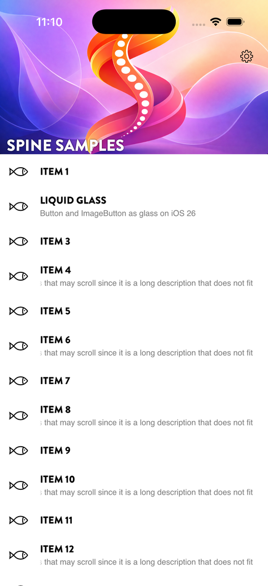
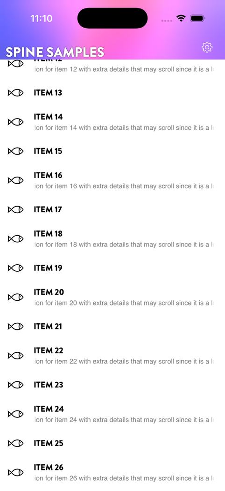

# HeroCollectionView

```bash
dotnet add package Plugin.Maui.Spine.Controls.HeroCollectionView
```

`Plugin.Maui.Spine.Controls.HeroCollectionView` provides `HeroCollectionView` — a `CollectionView` subclass with a collapsing sticky header, optional title overlay, and an adaptive colour-sampling overlay for dynamic theming. On Windows it also doubles as a drag region for custom title-bar windows.

<p align="center">
  
  
</p>
<p align="center"><sub>The hero header expanded and collapsed, with a page action over the image</sub></p>

---

## Platforms

| Platform | Status |
|---|---|
| Android | ✅ Supported |
| Windows (WinUI 3) | ✅ Supported |
| iOS | ✅ Supported |
| Mac Catalyst | ✅ Supported, exercised less than iOS |

---

## Registration

None. The control needs no builder registration, with or without `UseSpine()`. `UseHeroCollectionView()` is kept so existing builder chains still compile, and does nothing.

---

## XAML usage

```xml
<HeroCollectionView
    ItemsSource="{Binding Items}"
    HeaderImageSource="header_bg.png"
    HeaderTitle="My Collection"
    HeaderTitleColor="White"
    HeaderMaxHeight="230"
    HeaderMinHeight="42">

    <HeroCollectionView.ItemTemplate>
        <DataTemplate x:DataType="vm:ItemViewModel">
            <Label Text="{Binding Name}" Padding="16,8" />
        </DataTemplate>
    </HeroCollectionView.ItemTemplate>

</HeroCollectionView>
```

---

### Scrolling under the bottom bar

A hero page usually excludes the bottom edge from `SafeAreaEdges` so the list draws behind the home indicator or the floating tab bar. Add `SafeArea.ScrollInset="Bottom"` to the `HeroCollectionView` (or `ScrollInset = SafeAreaEdges.Bottom` on the page attribute) so the last row scrolls clear of the bar without a footer spacer; see [Scrolling under a bar](regions.md#scrolling-under-a-bar).

## How it works

The control injects itself into a parent `Grid` when attached. The header is pinned above the scroll area and collapses/expands via `TranslationY` transforms as the user scrolls — no layout passes are triggered per frame.

- **Scrolling down** — the header collapses from `HeaderMaxHeight` toward `HeaderMinHeight`.
- **Scrolling up** — the header re-expands.
- **At the top** — the header snaps back to fully expanded.
- **Pulled past the top** — the header stretches with the list so its bottom edge stays on the first item. The image grows from the top edge in both width and height and keeps its aspect ratio; the title stays at its own size on the bottom edge. Releasing returns it to `HeaderMaxHeight`.
- **Bouncing off the end** — the overshoot past the last item is ignored, so the header stays collapsed while the list springs back and expands only on a real scroll up.

On iOS and Mac Catalyst this follows UIKit's bounce. Android's stretch overscroll does not report how far it moved the content, so the control replaces it with a rubber band of its own: the list moves with resistance while pulled past either end and springs back on release, and a fling that hits an end bounces.

An anchor-based algorithm prevents floating-point drift over long scroll sessions.

---

## Header content slots

The header supports several content slots for customisation:

| Slot | Type | Description |
|---|---|---|
| `HeaderOverlayContent` | `View` | Custom content placed over the header image, faded in as the header collapses. A `<Border Material.Kind="Blur" StrokeThickness="0" />` gives the compact header a blur of the image behind it (see [Materials](materials.md)) |
| `HeaderTopContent` | `View` | Content pinned to the top of the header |
| `HeaderBottomContent` | `View` | Content pinned to the bottom of the header |
| `HeaderChildrenLayout` | `Layout` | The layout container for child elements (default: `AbsoluteLayout`) |

A built-in title label is always present. Control its appearance with `HeaderTitle`, `HeaderTitleColor`, `HeaderTitleFontFamily`, and `HeaderTitleFontSize`.

---

## Adaptive overlay

When `EnableAdaptiveOverlay` is `true`, the control samples colours from the header image and automatically tints registered child elements (e.g. buttons, labels in `HeaderTopContent` / `HeaderBottomContent`) to contrast with the image.

```xml
<HeroCollectionView
    EnableAdaptiveOverlay="True"
    AdaptiveLightColor="White"
    AdaptiveDarkColor="Black"
    ...>
```

Register additional targets via `AdaptiveTargets` or let the control auto-register children of `HeaderTopContent` and `HeaderBottomContent`.

The `AdaptiveCaptionButtons` and `CaptionButtonColorRequested` properties integrate with the Windows caption (close/minimise/maximise) buttons so they match the header image as it scrolls.

---

## Windows drag region

On Windows, the header area automatically acts as a window drag region when `EnableHeaderAsDragRegionOnWindows` is `true` (the default). This allows custom title-bar windows to be moved by dragging the header.

Interactive elements (buttons, etc.) inside the header are automatically excluded from the drag region. Use `IsInteractiveElementOverride` to mark additional elements that should receive pointer input instead of initiating a drag.

---

## Property reference — Header image & title

| Property | Type | Default | Description |
|---|---|---|---|
| `HeaderImageSource` | `ImageSource` | `null` | Background image for the header |
| `HeaderTitle` | `string` | `null` | Title text overlaid on the header |
| `HeaderTitleColor` | `Color` | `White` | Title text colour |
| `HeaderTitleFontFamily` | `string` | `null` | Title font family |
| `HeaderTitleFontSize` | `double` | `25` | Title font size |

## Property reference — Header dimensions

| Property | Type | Default | Description |
|---|---|---|---|
| `HeaderMaxHeight` | `double` | `230` | Fully expanded header height |
| `HeaderMinHeight` | `double` | `42` | Fully collapsed header height |
| `HeaderScrollBarInset` | `double` | `0` | Inset applied to the scroll bar to avoid overlap with the header |

## Property reference — Content slots

| Property | Type | Default | Description |
|---|---|---|---|
| `HeaderOverlayContent` | `View` | `null` | Custom overlay content on the header |
| `HeaderChildrenLayout` | `Layout` | `AbsoluteLayout` | Layout container for header child elements |
| `HeaderTopContent` | `View` | `null` | Content at the top of the header |
| `HeaderBottomContent` | `View` | `null` | Content at the bottom of the header |

## Property reference — Windows drag region

| Property | Type | Default | Description |
|---|---|---|---|
| `EnableHeaderAsDragRegionOnWindows` | `bool` | `true` | Use the header as a window drag region on Windows |
| `IsInteractiveElementOverride` | `BindableProperty` | — | Attached property; mark a child element as interactive (excluded from drag) |

## Property reference — Adaptive overlay

| Property | Type | Default | Description |
|---|---|---|---|
| `EnableAdaptiveOverlay` | `bool` | `false` | Enable colour-sampling overlay |
| `AdaptiveCaptionButtons` | `object` | `null` | Reference to Windows caption buttons for colour sync |
| `AdaptiveTargets` | `object` | `null` | Additional visual elements to tint adaptively |
| `AdaptiveLightColor` | `Color` | `White` | Colour used for elements over dark image regions |
| `AdaptiveDarkColor` | `Color` | `Black` | Colour used for elements over light image regions |
| `CaptionButtonColorRequested` | `Action<Color>` | `null` | Static callback invoked when the adaptive overlay determines the caption button colour |
