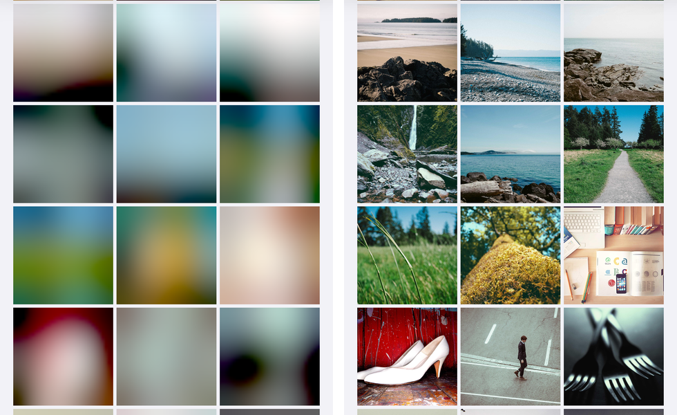

# Remote images

`Plugin.Maui.Spine.Images` keeps a list of remote photos light. Once the package is installed, every `UriImageSource` an `Image` shows goes through it, with no change to the markup:

| | MAUI 10 on its own | With `Plugin.Maui.Spine.Images` |
|---|---|---|
| **iOS, Mac Catalyst** | A file per URL, kept for as long as the file exists; every display decodes the whole image on the main thread; no memory cache | A memory cache (`NSCache`) and a disk cache that honours `CacheValidity`; ImageIO decodes at the size the view shows, off the main thread |
| **Android** | Glide: memory and disk cache, decoded at the view's size | The same Glide cache, plus prefetching, checking and clearing |
| **Windows** | Nothing cached; a new `HttpClient` per image; decoded at full size | A disk cache, one `HttpClient`, decoded at the view's size |
| **Everywhere** | — | `IImageCache` (prefetch, check, clear, a PNG for a widget) and BlurHash placeholders |



---

## Setup

```bash
dotnet add package Plugin.Maui.Spine.Images
```

`UseSpine()` registers it. To change the options, or in an app without Spine's core, call `UseSpineImages` in `MauiProgram`, before or after `UseSpine()` but after `UseMauiApp`:

```csharp
builder.UseSpineImages(options =>
{
    options.DiskCacheSize = 200L * 1024 * 1024;  // iOS, Mac Catalyst, Windows; default 150 MB
    options.MemoryCacheSize = 64L * 1024 * 1024; // iOS, Mac Catalyst; default 100 MB, 0 = off
    options.MaxConcurrentDownloads = 4;
});
```

For XAML, map the namespace in the app's `GlobalXmlns.cs`:

```csharp
[assembly: XmlnsDefinition(
    "http://schemas.microsoft.com/dotnet/maui/global",
    "Plugin.Maui.Spine.Images", AssemblyName = "Plugin.Maui.Spine.Images")]
```

---

## Placeholders: `ImageOptions.BlurHash`

A [BlurHash](https://blurha.sh) is a picture's colours in 20–30 characters. Set it next to the source and the view shows it at once, in the right colours, until the image has loaded:

```xml
<Image Source="{Binding PhotoUrl}"
       ImageOptions.BlurHash="{Binding PhotoHash}"
       Aspect="AspectFill" HeightRequest="118" />
```

- The placeholder is decoded in C# at 32 pixels on its long side, in the view's proportions, and scaled up smoothly by the platform. It needs a view with a size (requested, or from its layout).
- An image already in memory is shown straight away, without the placeholder; a recycled cell never flashes its previous photo.
- A malformed hash is logged as a warning and the image loads without a placeholder.
- On Android the placeholder goes into the view after Glide has cleared it and before Glide sets the image.

### Computing the hash

The hash is computed once, where the image is uploaded, not in the app. `BlurHash` lives in `Plugin.Maui.Spine.Common` (`net10.0`, no dependencies), so a server needs no image library from Spine: decode the upload with the one it already has and pass the pixels as RGBA.

```csharp
using Plugin.Maui.Spine.Images;

// rgba: width × height × 4 bytes. About 100 pixels on the long side gives the same hash as the full image.
string hash = BlurHash.Encode(rgba, width, height, componentsX: 4, componentsY: 3);

byte[] pixels = BlurHash.Decode(hash, 32, 32); // RGBA, for a placeholder of your own
bool ok = BlurHash.IsValid(hash);
```

Many image services (Unsplash, Mastodon) deliver a ready-made BlurHash with each image.

---

## Decoding at the view's size: `ImageOptions.Downsample`

On by default on iOS, Mac Catalyst and Windows (Android's Glide always does it). The box an image is decoded for is the view's requested size, else its laid-out size, else the screen; an image whose size comes from its layout waits for that layout, one pass, as Glide does. `Aspect` decides how much of the box the image must cover (`AspectFill` covers it, `AspectFit` fits inside it), and an image is never decoded larger than it is.

The decoded image still measures as MAUI's would: one point per pixel of the original. A page lays out the same with or without the package; the difference is in the pixels behind it.

Turn it off for an image that must keep every pixel, such as one to zoom into:

```xml
<Image Source="{Binding FullSizeUrl}" ImageOptions.Downsample="False" />
```

---

## `IImageCache`

Inject it where the app knows what will be shown next.

```csharp
public partial class CompetitionsViewModel(IImageCache images) : ViewModelBase
{
    // Tomorrow's competition images, on disk before the list needs them, and offline
    Task PrefetchAsync(IEnumerable<Competition> tomorrow) =>
        images.PrefetchAsync(tomorrow.Select(c => c.ImageUrl));
}
```

| Member | What it does |
|---|---|
| `PrefetchAsync(uris)` | Downloads into the disk cache; skips images that are there and fresh. One failure throws `HttpRequestException` with the status and URL; several throw an `AggregateException` with each. |
| `ContainsAsync(uri)` | Whether the image is on disk; nothing is downloaded. |
| `LoadPngAsync(uri, maxPixelSize)` | The image at most that many pixels on its long side, as PNG, from the cache or the network. |
| `ClearAsync(scope)` | Empties `ImageCacheScope.Memory`, `.Disk` or `.All`. |

On iOS, Mac Catalyst and Windows the files live in `spine-images` under `FileSystem.CacheDirectory`, named by the SHA-256 of the URL. A file is fresh for the source's `CacheValidity` (MAUI's default is one day; `SpineImagesOptions.PrefetchValidity` for prefetches). A stale file is downloaded again, and shown anyway when that download fails, so images still appear offline. Requests for the same URL share one download. Past `DiskCacheSize` the least recently shown files are deleted down to three quarters. `CachingEnabled = false` on a source skips the disk both ways.

On Android the cache is Glide's, which MAUI already loads every `UriImageSource` through. A prefetch asks Glide for exactly what MAUI asks for (an `android.net.Uri` of the source's original string), so the view finds it: verified with the emulator in flight mode.

---

## Pictures for widgets and Live Activities

A widget or Live Activity runs in another process and only shows pictures the app has stored for it. It does not share the image cache: an LRU cache may be trimmed by the system while a widget still shows its picture. Give the widget its own copy, at the size it shows:

```csharp
foreach (var team in teams)
{
    await using var png = await images.LoadPngAsync(team.LogoUrl, maxPixelSize: 120);
    await widgets.StoreAssetAsync($"logo-{team.Id}.png", png);
}
await widgets.RefreshAsync<GamesWidget>();
```

See [Widgets](widgets.md#images) for the asset store: ids are file names and are never deleted, so use a fixed set of ids per team or slot.

---

## Measured

The Showcase's **Remote images** page: 200 photos of 1600 × 1200 pixels from picsum.photos (fixed ids, the first 200 of `picsum.photos/v2/list`) in a three-column grid of 118-point cells, on the iPhone 17 Pro simulator, a Debug build (the Mono interpreter, so every managed frame is slower than in Release). A harness walked the grid from the first row to the last at 10 rows a second, 6.7 seconds, and counted frames: 60 Hz is about 400. The same build ran with MAUI's own `UriImageSourceService` for comparison.

| | Frames, first pass | Frames, second pass | Memory after the first pass | Peak |
|---|---|---|---|---|
| No images at all (the grid alone) | 343 | 399 | 107 MB | 130 MB |
| MAUI, from the network | 43 (worst frame 1.5 s) | 100 | 684 MB | 926 MB |
| MAUI, from its disk cache | 146 | 156 | 373 MB | 620 MB |
| Spine.Images, from the network | 89–110 | 336–344 | 155–191 MB | 212–241 MB |
| Spine.Images, from its disk cache | 270–281 | 339–344 | 118–119 MB | 146–148 MB |

MAUI decodes each photo at 1600 × 1200 (7.7 MB of pixels) on the main thread when the cell first draws; Spine.Images decodes it at 472 × 354 (0.7 MB) on a background thread. A second launch showed every photo from disk: no request reached the network. What is left of the hitches with Spine.Images is the grid creating its cells, as the first row shows.

---

## Limits

- **`FadeIn` and ThumbHash are not in this version.** BlurHash is the placeholder; ThumbHash can come behind the same `ImageOptions` when an app needs alpha or the aspect ratio from the hash.
- **Only `Image` gets the view's box.** `ImageButton`, a button's image and other views that show a `UriImageSource` go through the same cache but are decoded for the screen's size.
- **Animated GIFs** are played by MAUI's own stream service, from the cached file, at full size.
- **Android's disk cache size** is Glide's 250 MB: MAUI owns Glide's configuration, and changing it needs an API Glide marks as for tests only. `DiskCacheSize` and `MemoryCacheSize` do not apply there.
- **Windows has no memory cache** of decoded images (WinUI keeps what is on screen); whether a `BitmapImage` can be shared between views is not verified. The Windows code is compiled, not run.
- **Registration order.** MAUI Controls registers its own service for `UriImageSource` in `UseMauiApp`; Spine's replaces it because it is registered later. Call `UseSpineImages` (or `UseSpine`) after `UseMauiApp`, as every MAUI app does.
- **Image URLs in a widget's remote document** (a backend pointing a widget at a picture the app has not stored) are a separate step for the widget renderer.
