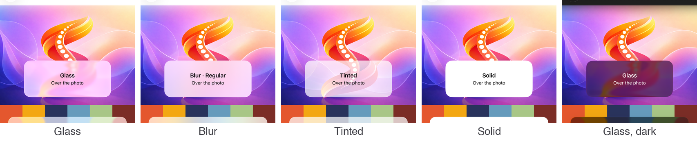
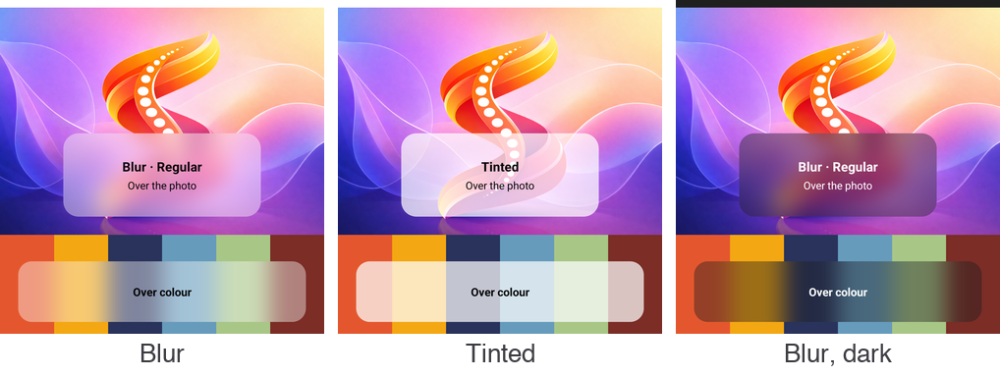
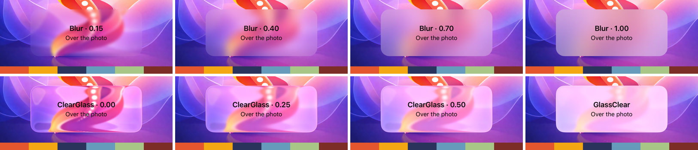
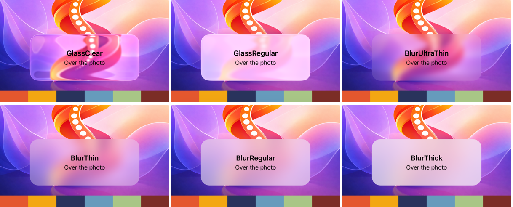
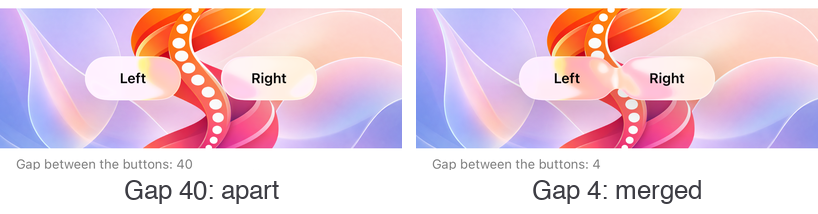

# Materials (glass, blur, tinted)

`Material` gives a `Border`, a `ContentView` or a layout a platform material behind its content: Liquid Glass, a blur of what is behind it, and a tint over either, or on its own from see-through to solid. It is an attached property on the ordinary views, in the same shape as [`Glass.Style`](glass-buttons.md) for buttons. There is no new control type, and it works from a `Style`. The shape comes from `Border.StrokeShape`.

```xml
<Border Material.Kind="Blur" StrokeThickness="0" StrokeShape="RoundRectangle 20" Padding="16">
    <Label Text="Over the photo" />
</Border>
```

<p align="center">
  
</p>
<p align="center">
  
</p>
<p align="center"><sub>The sample's Materials page: iOS 26, then Android 16, where the blur is Spine's own</sub></p>

It replaces packages such as Sharpnado.MaterialFrame. The sample's collapsing hero used MaterialFrame for its compact header, and now uses a `Border` with `Material.Kind="Blur"` (see [HeroCollectionView](hero-collection-view.md)).

---

## Two layers

A material is two layers behind the view's content:

1. **What is done to what is behind:** `Material.Kind` (`None`, `Blur` or `Glass`), as frosted as `Material.Intensity` (0 to 1).
2. **A colour over it:** `Material.Tint` (the theme's surface when unset, following light and dark), as opaque as `Material.TintOpacity` (0 to 1).

That is all a material is. A tinted panel is a tint without a kind, a solid panel is a tint at opacity 1, and the system's thicker materials are a blur with more tint over it.

```xml
<!-- A blur with some milk over it -->
<Border Material.Kind="Blur" Material.TintOpacity="0.5" StrokeShape="RoundRectangle 20" StrokeThickness="0" />

<!-- Half-frosted glass -->
<Border Material.Kind="Glass" Material.Intensity="0.5" StrokeShape="RoundRectangle 22" StrokeThickness="0" />

<!-- A tinted panel, no blur -->
<Border Material.TintOpacity="0.7" StrokeShape="RoundRectangle 16" StrokeThickness="0" />
```

## Kinds

| `Material.Kind` | `Intensity` 0 → 1 | iOS / Mac Catalyst 26 | iOS / Mac Catalyst 15–18 | Android 12+ | Android before 12 | Windows | Pick it for |
|---|---|---|---|---|---|---|---|
| `None` (default) | | The tint alone | Same | Same | Same | Same | A panel without blur, the same everywhere |
| `Blur` | Sharp → fully blurred | The thinnest system material (`UIBlurEffect`), following light and dark | Same | What is behind the view, blurred on the GPU | The tint, at least 72 % opaque | `AcrylicBrush` | Panels over photos, maps and heroes |
| `Glass` | Clear glass → regular glass | `UIGlassEffect`, shaped by UIKit from the `StrokeShape`; UIKit morphs clear glass into regular glass | `Blur` | `Blur` | The tint, at least 72 % opaque | `Blur` | Controls that float over content: a bar, a floating button |

Apple's guidance applies everywhere: glass belongs to the controls that float over content, panels that hold content use `Blur` or a tint, and there is never glass on glass.

With Reduce Transparency (iOS, Mac Catalyst) or transparency effects off (Windows), the system materials turn opaque by themselves, and so does a tint without a blur.

<p align="center">
  
</p>

## Properties

| Attached property | Type | Default | Description |
|---|---|---|---|
| `Material.Kind` | `MaterialKind` | the preset's, else `None` | What is done to what is behind: `None`, `Blur`, `Glass` |
| `Material.Intensity` | `double` | the preset's, else `1` | How frosted what is behind becomes, 0 to 1: a blur from none to full, glass from clear to regular |
| `Material.Tint` | `Color?` | `null`: the theme's surface, white in light mode and near-black (#1C1C1E) in dark | The colour over the material; on glass it tints the glass. Its own alpha counts too |
| `Material.TintOpacity` | `double` | the preset's, else `0` | How much of the tint shows, 0 to 1 (opaque) |
| `Material.Preset` | `MaterialPreset` | `None` | A named set of `Kind`, `Intensity` and `TintOpacity`. See [Presets](#presets) |
| `Material.Interactive` | `bool` | `false` | iOS 26 glass lights up and swells under the finger, as system buttons do, content and all. `Glass` only |

A view has a material when it has a kind or a tint opacity above 0.

## Presets

Named materials, from clear to thick, named as Apple names its own. A preset is only a set of values: the `Kind`, `Intensity` and `TintOpacity` a view gets unless it sets them itself. `Material.Preset="BlurThin"` needs nothing else, and `Material.Preset="BlurThin" Material.Intensity="0.5"` is the thin material with half the blur. `Material.Values(preset)` returns them in code.

| `Material.Preset` | `Kind` | `Intensity` | `TintOpacity` |
|---|---|---|---|
| `GlassClear` | `Glass` | 0 | 0 |
| `GlassRegular` | `Glass` | 1 | 0 |
| `BlurUltraThin` | `Blur` | 0.3 | 0 |
| `BlurThin` | `Blur` | 0.55 | 0.15 |
| `BlurRegular` | `Blur` | 0.8 | 0.3 |
| `BlurThick` | `Blur` | 1 | 0.45 |

The glass presets are UIKit's own two styles. The blur presets are a scale from a light blur to a thick, readable one, in which the blur and the milk over it grow together; Apple's own materials blur about as much as each other and differ mostly in milk, so thin, regular and thick come out nearly solid. Apple's `systemChromeMaterial` has no preset: it is the material of system bars.

<p align="center">
  
</p>

## Borders

The material fills the view's shape, `StrokeShape` on a `Border` (square corners on a `ContentView` or layout), and a `Stroke` is drawn over it on every kind, interactive glass included. Glass draws its own lit edge, so it rarely needs one. Leave the view's own `Background` unset: the material is drawn behind the content, and a background would cover it on iOS or be covered by it elsewhere.

## Glass that merges

A `MaterialContainer` holds glass surfaces that belong together. On iOS and Mac Catalyst 26, surfaces within its `Spacing` (default 20) of each other merge into one piece of glass and pull apart as they move away, as the system's own bar buttons do. Everywhere else it is an ordinary `ContentView`.

```xml
<MaterialContainer Spacing="20">
    <HorizontalStackLayout Spacing="8">
        <Border Material.Kind="Glass" Material.Interactive="True" StrokeShape="RoundRectangle 22" WidthRequest="96" HeightRequest="44" />
        <Border Material.Kind="Glass" Material.Interactive="True" StrokeShape="RoundRectangle 22" WidthRequest="96" HeightRequest="44" />
    </HorizontalStackLayout>
</MaterialContainer>
```

<p align="center">
  
</p>

## How it is drawn

- **iOS and Mac Catalyst.** One `UIVisualEffectView` at the back of the view's platform view, as large as it:
  - Glass takes its corners from `UICornerConfiguration` (a capsule for an ellipse or a fully rounded rectangle, fixed corners otherwise), because a mask would cut off its edge highlights.
  - A blur is masked to the `StrokeShape` through the effect view's `MaskView`.
  - UIKit has no blur radius or glass thickness, so an `Intensity` below 1 is the animation from no effect to the whole one, paused part of the way (`UIViewPropertyAnimator.FractionComplete`). It is started again when the view comes back on screen and the app to the foreground.
  - Interactive glass reacts only to touches on views inside the effect view, so it holds the view's content while it is interactive.
  - A `MaterialContainer` moves its content into a `UIGlassContainerEffect`.
- **Android 12 and later.** Android has no way to blur what is behind a view. Before each frame, Spine records what is behind the view into a `RenderNode`: the ancestors' backgrounds and the siblings drawn before it, at every level up to the window. The GPU blurs that node with `RenderEffect.CreateBlurEffect`, and the view's own background draws it, clipped to the shape, with the theme's surface over it. `Intensity` scales the blur radius (up to 24 dp), and the tint is drawn over it. On Windows, acrylic's tint colour and opacity are the tint's, and `Intensity` the brush's opacity.
  - The view itself is never recorded, so the blur cannot feed on its own output.
  - Only the node is recorded again as content moves, not the view.
  - Content inside the view is not part of the blur.
  - Views drawn by the system outside the view tree, such as a `SurfaceView` (video, some maps), do not show in the blur.
- **Android before 12.** The tinted surface.
- **Windows.** An `AcrylicBrush` (in-app acrylic) on the Border's shape, or a solid brush. Acrylic's blur is fixed, so `Intensity` is the brush's opacity.

## Registration

None. `UseSpine()` registers the handler mappings. Add the namespace to the app's `GlobalXmlns.cs` so `Material.Kind` works without a prefix:

```csharp
[assembly: XmlnsDefinition(
    "http://schemas.microsoft.com/dotnet/maui/global",
    "Plugin.Maui.Spine.Extensions", AssemblyName = "Plugin.Maui.Spine")]
```

## Also built on it

- **The header bar's scroll edge where the system does not draw one** (Android, Windows) is a `Blur` material with a fade (`SoftEdge`, `SoftStatusBar`) or a hairline (`HardEdge`). On Android 12+ that is a real blur of the rows under the bar. On iOS 27 it keeps the system's thin (soft) and standard (hard) materials, which it is tuned against. See [Header bar backgrounds](regions.md#backgrounds).

## Sample

The sample app's **Materials** page (`samples/MauiSpineSampleApp/Pages/Materials`) shows every kind and preset, with sliders for intensity and tint opacity and a choice of tints over a photo and over colour, interactive glass, a `MaterialContainer` whose buttons merge as a slider brings them together, and the code for the combination on screen.
