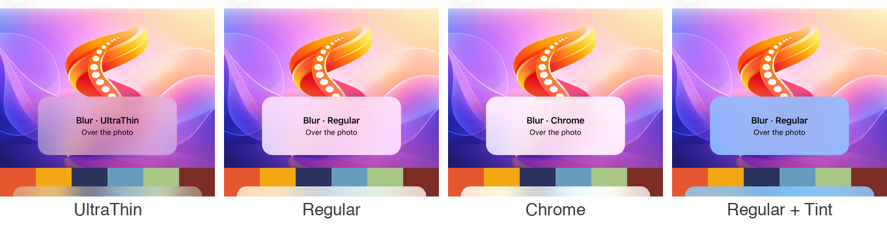

# Materials (glass, blur, tinted)

`Material.Kind` gives a `Border`, a `ContentView` or a layout a platform material behind its content: Liquid Glass, a blur of what is behind it, a tinted or a solid surface. It is an attached property on the ordinary views, in the same shape as [`Glass.Style`](glass-buttons.md) for buttons. There is no new control type, and it works from a `Style`. The shape comes from `Border.StrokeShape`.

```xml
<Border Material.Kind="Blur" StrokeThickness="0" StrokeShape="RoundRectangle 20" Padding="16">
    <Label Text="Over the photo" />
</Border>
```

<p align="center">
  
</p>
<p align="center">
  
</p>
<p align="center"><sub>The sample's Materials page: iOS 26, then Android 16, where the blur is Spine's own</sub></p>

It replaces packages such as Sharpnado.MaterialFrame. The sample's collapsing hero used MaterialFrame for its compact header, and now uses a `Border` with `Material.Kind="Blur"` (see [HeroCollectionView](hero-collection-view.md)).

---

## Kinds

| `Material.Kind` | iOS / Mac Catalyst 26 | iOS / Mac Catalyst 15–18 | Android 12+ | Android before 12 | Windows | Pick it for |
|---|---|---|---|---|---|---|
| `Glass` | `UIGlassEffect`, shaped by UIKit from the `StrokeShape` | `Blur` | `Blur` | `Tinted` | `Blur` | Controls that float over content: a bar, a floating button |
| `Blur` | A system material (`UIBlurEffect`) by `Material.Thickness`, following light and dark | Same | What is behind the view, blurred on the GPU, with the theme's surface over it | `Tinted` | `AcrylicBrush` | Panels over photos, maps and heroes |
| `Tinted` | The theme's surface, see-through | Same | Same | Same | Same | A light panel without blur, the same everywhere |
| `Solid` | The theme's surface, opaque | Same | Same | Same | Same | Where the content must be readable above all |

Apple's guidance applies everywhere: glass belongs to the controls that float over content, panels that hold content use `Blur` or `Tinted`, and there is never glass on glass.

With Reduce Transparency (iOS, Mac Catalyst) or transparency effects off (Windows), the system materials turn opaque by themselves, and `Tinted` becomes `Solid`.

## Properties

| Attached property | Type | Default | Description |
|---|---|---|---|
| `Material.Kind` | `MaterialKind` | `None` | `None`, `Glass`, `Blur`, `Tinted`, `Solid` |
| `Material.Thickness` | `MaterialThickness` | `Regular` | How much of what is behind a `Blur` comes through: `UltraThin`, `Thin`, `Regular`, `Thick`, `Chrome` |
| `Material.Tint` | `Color?` | `null` | A colour bled in: the tint of glass, a layer over a blur (give it some transparency), or the colour of a tinted or solid surface instead of the theme's |
| `Material.Interactive` | `bool` | `false` | iOS 26 glass lights up and stretches under the finger, as system buttons do. Glass only |

<p align="center">
  
</p>

Leave the view's own `Background` unset: the material is drawn behind the content, and a background would cover it on iOS or be covered by it elsewhere.

## Glass that merges

A `MaterialContainer` holds glass surfaces that belong together. On iOS and Mac Catalyst 26, surfaces within its `Spacing` (default 20) of each other merge into one piece of glass and pull apart as they move away, as the system's own bar buttons do. Everywhere else it is an ordinary `ContentView`.

```xml
<MaterialContainer Spacing="20">
    <HorizontalStackLayout Spacing="8">
        <Border Material.Kind="Glass" Material.Interactive="True" StrokeShape="RoundRectangle 22" WidthRequest="96" HeightRequest="44" />
        <Border Material.Kind="Glass" Material.Interactive="True" StrokeShape="RoundRectangle 22" WidthRequest="96" HeightRequest="44" />
    </HorizontalStackLayout>
</MaterialContainer>
```

<p align="center">
  
</p>

## How it is drawn

- **iOS and Mac Catalyst.** One `UIVisualEffectView` at the back of the view's platform view, as large as it:
  - Glass takes its corners from `UICornerConfiguration` (a capsule for an ellipse or a fully rounded rectangle, fixed corners otherwise), because a mask would cut off its edge highlights.
  - A blur is masked to the `StrokeShape` through the effect view's `MaskView`.
  - A `MaterialContainer` moves its content into a `UIGlassContainerEffect`.
- **Android 12 and later.** Android has no way to blur what is behind a view. Before each frame, Spine records what is behind the view into a `RenderNode`: the ancestors' backgrounds and the siblings drawn before it, at every level up to the window. The GPU blurs that node with `RenderEffect.CreateBlurEffect`, and the view's own background draws it, clipped to the shape, with the theme's surface over it.
  - The view itself is never recorded, so the blur cannot feed on its own output.
  - Only the node is recorded again as content moves, not the view.
  - Content inside the view is not part of the blur.
  - Views drawn by the system outside the view tree, such as a `SurfaceView` (video, some maps), do not show in the blur.
- **Android before 12.** The tinted surface.
- **Windows.** An `AcrylicBrush` (in-app acrylic) on the Border's shape, or a solid brush.

## Registration

None. `UseSpine()` registers the handler mappings. Add the namespace to the app's `GlobalXmlns.cs` so `Material.Kind` works without a prefix:

```csharp
[assembly: XmlnsDefinition(
    "http://schemas.microsoft.com/dotnet/maui/global",
    "Plugin.Maui.Spine.Extensions", AssemblyName = "Plugin.Maui.Spine")]
```

## Also built on it

- **The header bar's scroll edge where the system does not draw one** (Android, Windows) is a `Blur` material with a fade (`SoftEdge`, `SoftStatusBar`) or a hairline (`HardEdge`). On Android 12+ that is a real blur of the rows under the bar. See [Header bar backgrounds](regions.md#backgrounds).

## Sample

The sample app's **Materials** page (`samples/MauiSpineSampleApp/Pages/Materials`) shows every kind, thickness and tint over a photo and over colour, interactive glass, a `MaterialContainer` whose buttons merge as a slider brings them together, and the code for the combination on screen.
