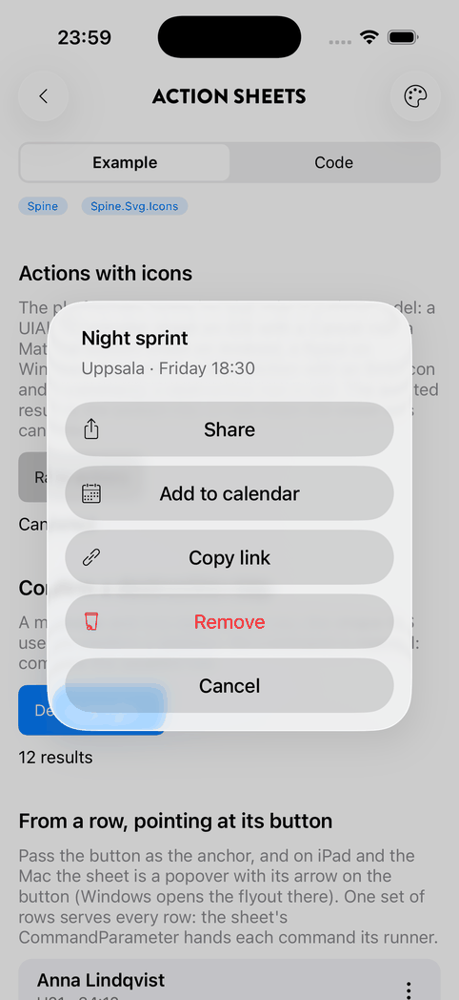
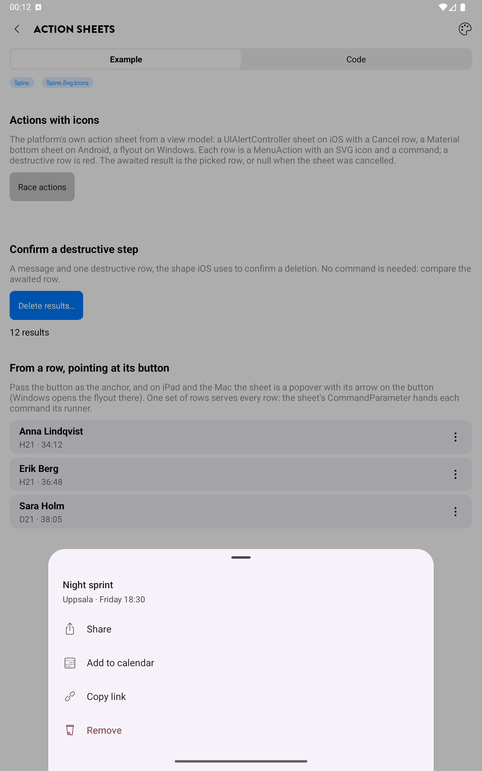

# Menu buttons and context menus

A button that opens the platform's own menu on tap: `UIButton.Menu` on iOS and Mac Catalyst (a
glass button morphs into its menu on iOS 26), a `PopupMenu` on Android, a `MenuFlyout` on
Windows. Any view can also have a context menu that opens on a long press or a right click
(see [Context menus](#context-menus)). One declaration, rendered natively everywhere, with
icons, checkmarks, sections, submenus and destructive rows.

## The model

| Type | What it is |
|---|---|
| `MenuItems` | The root collection a menu shows. Observable: change it and the menu follows. |
| `MenuAction` | One row: `Title`, `Svg`, `Command`, `CommandParameter`, `IsChecked`, `IsEnabled`, `IsVisible`, `IsDestructive`, `KeepsMenuOpen`. |
| `MenuSection` | An inline group with separators and an optional title. |
| `SubMenu` | A row that opens a nested menu. `IsVisible` hides it with its rows. |
| `MenuPicker` | A single-selection group: one row checked, a pick moves the check, sets `Selected` and runs the picker's `Command` with the row's `CommandParameter` (or the row itself). |

```csharp
var filter = new MenuPicker(FilterCommand)
{
    new MenuAction("All items", "house.svg") { IsChecked = true },
    new MenuAction("Favourites", "star.svg"),
    new MenuAction("Edited", "edit.svg"),
};

var menu = new MenuItems
{
    new MenuSection("Filter:") { filter },
    new MenuSection
    {
        new SubMenu("Media types", "fish.svg")
        {
            new MenuAction("Photos") { IsChecked = true, KeepsMenuOpen = true },
            new MenuAction("Videos") { KeepsMenuOpen = true },
        },
        new MenuAction("Reset", "refresh.svg", ResetCommand) { IsDestructive = true },
    },
};
```

`KeepsMenuOpen` makes a row a toggle: the pick flips `IsChecked` and the menu stays open on
iOS 16+ and Windows. Android closes the menu on every pick, so a toggle there is a tap and a reopen.

`IsVisible = false` leaves a row out of the menu. `IsEnabled = false` keeps it, dimmed. A context
menu shows only what applies, so it hides rows rather than dimming them, for example "Follow"
and "Unfollow" with one of them visible.

## On a header-bar action

```csharp
PageActions.Add(new PageAction(null, menu) { Svg = "more.svg" });
PageActions.Add(new PageAction("Sort", sortMenu) { MenuShowsSelection = true });
```

A `PageAction` built with a menu has no command; the menu is its action. With
`MenuShowsSelection` a text action takes the picked row's title.

## On a button in the page

```xml
<Button Text="Name" Glass.Style="Regular"
        MenuButton.Items="{Binding SortMenu}" MenuButton.ShowsSelection="True" />

<ImageButton SvgImageSource.Svg="more.svg" SvgImageSource.Padding="10" Glass.Style="Regular"
             WidthRequest="44" HeightRequest="44" MenuButton.Items="{Binding MoreMenu}" />
```

`MenuButton.Items` works on `Button` and `ImageButton`. Give a menu button no `Command`: on
Android and Windows the platform would run it under the menu, on iOS it never fires. With
`MenuButton.ShowsSelection` the button's `Text` follows the picked row, which makes a pop-up
button for "Sort by" and "Season" style choices.

## Changing a menu while it exists

Every `MenuAction`, section, submenu and picker is observable, and the collections are
`ObservableCollection`s. Set `IsChecked`, `Title` or `IsEnabled`, add or remove rows, or set a
picker's `Selected`, and the native menu is rebuilt for its next opening.

## Context menus

`ContextMenu.Items` gives any view the system's own context menu, opened with a long press on
touch or a right click with a mouse. It takes the same `MenuItems`, so a list row and its detail
page's header action can share one instance.

```xml
<Border Tap.Command="{Binding OpenCommand}" ContextMenu.Items="{Binding CardMenu}">
    ...
</Border>

<CollectionView ItemsSource="{Binding Races}">
    <CollectionView.ItemTemplate>
        <DataTemplate x:DataType="Race">
            <Border ContextMenu.Items="{PageBinding RowMenu}"
                    ContextMenu.CommandParameter="{Binding .}">
                ...
            </Border>
        </DataTemplate>
    </CollectionView.ItemTemplate>
</CollectionView>
```

```csharp
public MenuItems RowMenu { get; } =
[
    new MenuSection
    {
        new MenuAction("Copy name", "copy.svg", CopyCommand),
        new MenuAction("Share", "share.svg", ShareCommand),
    },
    new MenuAction("Remove", "trashcan.svg", RemoveCommand) { IsDestructive = true },
];

[RelayCommand]
private void Remove(Race race) => Races.Remove(race);
```

- **One menu for every row.** A picked row's command gets its own `CommandParameter` or, when
  that is null, the view's `ContextMenu.CommandParameter`. Put the menu on the root of the row
  template.
- **Built when it opens.** Nothing is built or watched until the long press, so a row costs one
  interaction or listener, and a recycled row shows its current item. A disabled view, or one
  whose rows are all hidden, opens nothing.
- **With `Tap.Command`.** A tap still runs the command. A long press opens the menu and the tap
  does not follow. On iOS the press highlight is cleared before the view is lifted.
- **On a `Button`.** The context menu becomes the button's `UIButton.Menu` on Apple, opened with
  a long press. If the button also has `MenuButton.Items`, the menu button wins.
- **The preview.** iOS and iPadOS 16+ lift the view with its own shape: rounded like a `Border`'s
  `RoundRectangle`, filled with its background (or the system background when it has none). iOS
  15 lifts a plain rectangle. Mac Catalyst, Android and Windows show the menu without a preview,
  because the platforms have none.
- **Opening it from code.** `ContextMenu.Show(view)` opens the menu on Android, with the long-press haptic, and on Windows. Use it for a view whose own long press never reaches the platform's: on Android, a view with MAUI gesture recognizers takes the touch before the long click. iOS and Mac Catalyst open a context menu only from the system's gesture, so there it returns `false`.
- **In a `DataGrid`**, set `RowContextMenu` on the grid instead (see [DataGrid](data-grid.md#row-context-menu)).
- **Don't mix it with `FlyoutBase.ContextFlyout`** on the same view. Windows and Mac Catalyst
  would then have two mechanisms fighting over the right click.

## Action sheets

`INavigationService.ShowActionsAsync` shows the platform's own action sheet from a view model and
waits for the pick. The rows are the same `MenuAction` as in a menu, so a row with an icon, a
command and `IsDestructive` reads the same everywhere.

<p align="center">
  
  
</p>
<p align="center"><sub>The same sheet on iOS 26 and on an Android tablet</sub></p>

```csharp
var picked = await _navigation.ShowActionsAsync(new ActionSheet("Night sprint", "Uppsala · Friday 18:30")
{
    Actions =
    [
        new("Share", SpineIcons.Share, ShareCommand),
        new("Add to calendar", SpineIcons.Calendar, AddToCalendarCommand),
        new("Remove", SpineIcons.Trashcan, RemoveCommand) { IsDestructive = true },
    ],
});

if (picked is null)
    Status = "Cancelled";
```

- **The result** is the picked `MenuAction`, or `null` when the sheet was cancelled: the Cancel
  row, a tap outside, a swipe down or Back. The row's command has already run when the task
  completes, so use either style. A confirmation needs no command at all:

  ```csharp
  var delete = new MenuAction("Delete 12 results", SpineIcons.Trashcan) { IsDestructive = true };
  var picked = await _navigation.ShowActionsAsync(new ActionSheet(null, "This can't be undone.") { Actions = [delete] });
  if (picked == delete)
      DeleteResults();
  ```

- **The rows** take `Title`, `Svg`, `Command`, `CommandParameter`, `IsDestructive`, `IsEnabled`
  and `IsVisible`. `IsChecked` and `KeepsMenuOpen` belong to menus and are not shown. A sheet is
  one flat list: no sections, submenus or pickers. A sheet with no visible row shows nothing and
  returns `null`.
- **One set of rows for many items.** `ActionSheet.CommandParameter` goes to a row's command when
  the row has none of its own, as `ContextMenu.CommandParameter` does for a shared row menu.
- **`CancelText`** names the Cancel row on iOS; it defaults to the localised `Spine.Header.Cancel`.
- **The anchor.** Pass the view the sheet is about, usually the button that opened it:
  `ShowActionsAsync(sheet, anchor: button)`. iPad shows the sheet as a popover with its arrow on
  the view, iOS 26 grows the sheet out of it on the iPhone too, and Windows opens its flyout there.
  Without an anchor iPad centres the popover. Android and the Mac do not use it. From XAML, hand the
  button over with `CommandParameter="{Binding Source={RelativeSource Self}}"`.

```xml
<ImageButton SvgImageSource.Svg="more.svg"
             Command="{PageBinding ShowActionsCommand}"
             CommandParameter="{Binding Source={RelativeSource Self}}" />
```

```csharp
[RelayCommand]
private Task ShowActions(View button)
{
    var runner = (Runner)button.BindingContext;
    return _navigation.ShowActionsAsync(new ActionSheet(runner.Name)
    {
        Actions = RunnerActions,   // the same rows for every runner
        CommandParameter = runner,
    }, anchor: button);
}
```

**Menu or action sheet?** A menu belongs to a control: a header action, a button or a long press
on a row, and it opens at that control. An action sheet is something the view model decides to
ask, after a tap on a plain button or as the confirmation of a destructive step. On iOS 26 both
grow out of their source; the action sheet also has a title and a message.

## Platform notes

| Platform | Building block | Notes |
|---|---|---|
| iOS 14+, Mac Catalyst | `UIButton.Menu`, `ShowsMenuAsPrimaryAction` | Pickers use `SingleSelection` (15+), toggles `KeepsMenuPresented` (16+), pop-up buttons `ChangesSelectionAsPrimaryAction` (15+). Glass buttons morph on iOS 26. A section's title is not drawn in a button menu; the separator is. The pop-up chevron's width is added to the button's trailing padding once, so the title does not wrap. |
| Android | `PopupMenu` anchored to the button | Icons shown on API 29+, group dividers on 28+. Sections are groups, pickers exclusive checkable groups, destructive rows red, icon included. The menu closes on every pick. |
| Windows | `MenuFlyout` as the button's `Flyout` | `RadioMenuFlyoutItem` for pickers, `ToggleMenuFlyoutItem` for toggles, `MenuFlyoutSubItem`, separators between sections. |

Context menus:

| Platform | Building block | Notes |
|---|---|---|
| iOS, iPadOS | `UIContextMenuInteraction` | Long press. The view lifts with its rounded shape on 16+. A right click with a mouse or trackpad on iPad gives the compact menu. |
| Mac Catalyst | `UIContextMenuInteraction` | Right click or Ctrl-click. A compact menu at the pointer with icons, no preview. |
| Android | `PopupMenu` anchored to the view | Long press, and right click on API 23+. It shows below the view, or above it when there is no room. TalkBack offers the long press as "Show actions" (`Spine.ContextMenu.Open`). |
| Windows | `UIElement.ContextFlyout` | Right click, or press and hold with a finger or pen. The flyout is filled when it opens. |

Action sheets:

| Platform | Building block | Notes |
|---|---|---|
| iOS, iPadOS | `UIAlertController`, `ActionSheet` style | Icons as template images through the `UIAlertAction` `image` key. Destructive rows red, a Cancel row last. On iOS 26 a sheet without an anchor floats in the middle of the screen, and one with an anchor grows out of it, without the Cancel row. On iPad a popover at the anchor or centred. The sheet follows the app's Light or Dark choice. VoiceOver reads the title, message and rows; an icon adds nothing. |
| Mac Catalyst | `UIAlertController`, `ActionSheet` style | macOS presents it as an alert with the icons and a Cancel row; the anchor is not used. |
| Android | Material `BottomSheetDialog` | The M3 drag handle, the title and message, then one 56 dp row per action with a 24 dp icon; destructive rows in `colorError`, disabled rows dimmed. No Cancel row: a swipe down, the scrim or Back cancels. TalkBack hears the title when the sheet opens, the title as a heading and each row as a button. Long lists scroll. |
| Windows | `MenuFlyout` | At the anchor, or in the middle of the window. The title and message are dimmed rows over a separator. A click outside cancels. |

Icons are the same SVG names as everywhere else in Spine (`Plugin.Maui.Spine.Svg.Icons` or the
app's own embedded SVGs), rendered as template images so the menu tints them.
