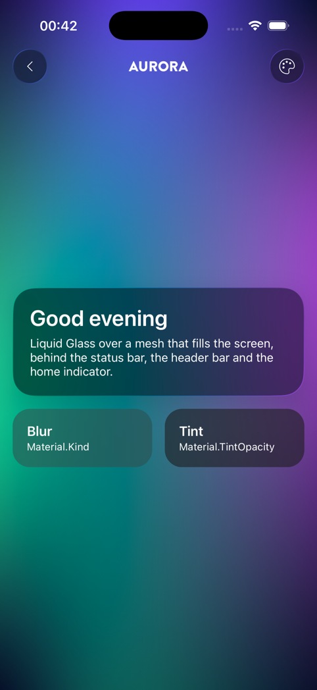
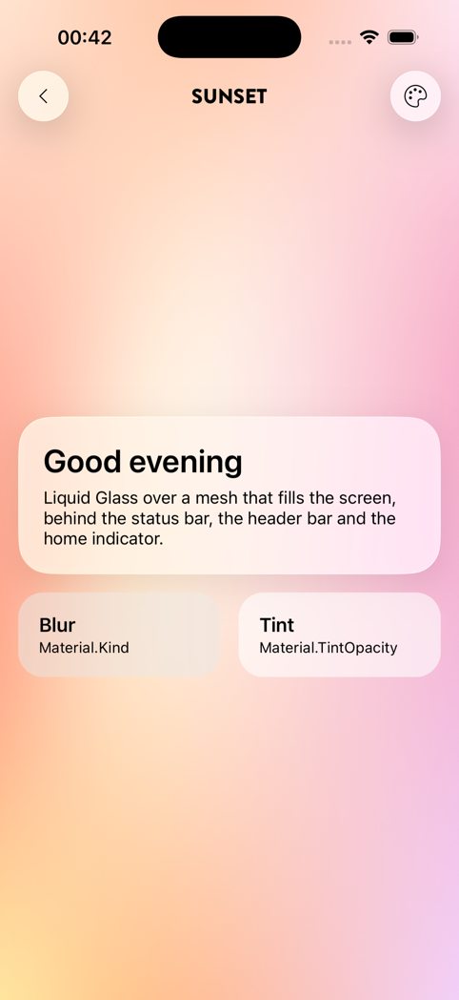

# MeshBackground

```bash
dotnet add package Plugin.Maui.Spine.Controls.MeshBackground
```

`MeshBackground` is a mesh gradient: a grid of coloured points blended smoothly into each other, still or drifting slowly. SwiftUI has `MeshGradient` from iOS 18; UIKit, Android and MAUI have nothing like it. This one is drawn with SkiaSharp, so it looks the same on every platform.

It is a background. Put it behind other content, and above all behind [materials](materials.md): glass and blur need something with colour and shape behind them to look like glass.

<p align="center">
  
  &nbsp;
  
</p>
<p align="center"><sub>Glass, blur and a tint over a full-screen mesh: Aurora in dark mode, Sunset in light mode</sub></p>

---

## Platforms

| Platform | Status |
|---|---|
| iOS | ✅ Supported |
| Android | ✅ Supported |
| Mac Catalyst | ✅ Supported, exercised less than iOS |
| Windows (WinUI 3) | ✅ Compiles; not run yet |

---

## Registration

With `UseSpine()` nothing is needed: it registers the package, including the SkiaSharp renderers the control draws with. An app without Spine calls `UseMeshBackground()`; calling it next to `UseSpine()` is harmless.

```csharp
using Plugin.Maui.Spine.Controls;

builder
    .UseMauiApp<App>()
    .UseMeshBackground();
```

The control lives in `Plugin.Maui.Spine.Controls`; map it to a prefix or to the global namespace as for the other controls.

---

## Usage

The mesh fills the space it is given, so it goes first in a `Grid`, with the content over it:

```xml
<Grid>
    <MeshBackground Preset="Aurora" Drift="Slow" />

    <Border Material.Kind="Glass" StrokeThickness="0" StrokeShape="RoundRectangle 24"
            Padding="20" Margin="16" VerticalOptions="Center">
        <Label Text="Good evening" FontSize="22" FontAttributes="Bold" />
    </Border>
</Grid>
```

Behind a whole page, including the status bar and the header bar, give the page an overlay header bar and no safe-area padding, and pad the content yourself:

```csharp
[NavigableRegion(Title = "Welcome", HeaderBar = HeaderBarMode.Overlay,
    HeaderBarBackground = HeaderBarBackground.Transparent, SafeAreaEdges = SafeAreaEdges.None)]
public partial class WelcomePage { … }
```

```xml
<Grid>
    <MeshBackground Drift="Slow" />
    <VerticalStackLayout Padding="{Binding SafeAreaInsets}" VerticalOptions="Center"> … </VerticalStackLayout>
</Grid>
```

In a layout that does not give it a size, such as a `VerticalStackLayout`, set `HeightRequest`: on its own the mesh is as small as an empty view.

---

## Properties

| Property | Type | Default | Description |
|---|---|---|---|
| `Preset` | `MeshPreset` | `Accent` | The colours while `Colors` is unset, each with a light and a dark version |
| `Colors` | `IReadOnlyList<Color>?` | `null` | One colour per point, row by row from the top left; a shorter list repeats. In XAML a comma-separated list |
| `Columns` | `int` | `3` | Points across, 2 to 8 |
| `Rows` | `int` | `3` | Points down, 2 to 8 |
| `Drift` | `MeshDrift` | `None` | How fast the points wander: `None`, `Slow` (about half a minute a round), `Medium`, `Fast` (about seven seconds) |
| `FrameRate` | `int` | `30` | The most redraws a second while drifting, 1 to 60 |

### Presets

| `MeshPreset` | Light mode | Dark mode |
|---|---|---|
| `Accent` | A pale wash of the accent's hue with lighter glows of it and its neighbours | A deep ground of the accent's hue with the accent glowing in it |
| `Aurora` | Mint, sky and lavender pastels | Green, teal and violet over a night sky |
| `Sunset` | A warm dawn: peach, coral, butter and pink | Dusk: plum overhead, rose, coral and amber along the bottom |

`Accent` takes the colour from the [theme](theming.md): `IThemeService.Accent` when one is set, otherwise the app's `Primary` (and `PrimaryDark`) colour resources, and the system blue when the app has neither. A mesh with a preset repaints itself when the theme or the accent changes. Each preset is designed as 3 × 3 points; a mesh with other `Columns` and `Rows` samples the same design, so it looks alike with more points to move.

### Your own colours

```xml
<!-- A dawn theme: night at the top, gold at the horizon -->
<MeshBackground Drift="Slow"
                Colors="#2B2F6B, #6B4C9A, #F2A07B,
                        #9A5C8E, #F7C59F, #FFD9A8,
                        #FDE3C2, #FFE9C9, #FFF1DC" />

<!-- Two colours on a 5 × 4 grid alternate like a chessboard -->
<MeshBackground Columns="5" Rows="4" Colors="#0A84FF, #BF5AF2" Drift="Medium" />
```

Hex and named colours are accepted, separated by commas or semicolons; a token that is not a colour is an error that names it. From code or a binding, `Colors` takes any `IReadOnlyList<Color>`, such as a `Color[]`. Colours may be translucent. Your own colours do not change with the theme; bind `Colors` to a property that does if they should.

---

## How it is drawn

- **A smooth surface.** The points span a bicubic (Catmull-Rom) surface that passes through each of them, in position and in colour. It is sampled into a fine triangle grid and drawn with one `SKCanvas.DrawVertices` call. Skia's own Coons patches (`DrawPatch`) blend each patch's four corner colours by themselves and leave a crease along every patch edge; this surface is smooth across them, as SwiftUI's mesh is with `smoothsColors`.
- **Colour in Oklab.** Colours are blended in the Oklab colour space, so two hues meet in a blend that keeps some colour instead of a flat grey (halfway from blue to yellow is grey in plain sRGB), and lightness changes evenly.
- **Drift.** Each inner point wanders on its own slow path, at its own speed. Points on an edge slide along it and the corners stay put, so the mesh always covers the view, and it never folds over itself. A still mesh shows the first frame of the drift, so the points sit near their grid places, not exactly on them.
- **A small bitmap.** A soft gradient has no detail to lose, so the mesh is drawn at half the view's size in points (a sixth of the pixels across on a 3× phone) and scaled up by the platform's compositor. A full-screen mesh is a 204 × 441 pixel bitmap on an iPhone 17 Pro.

## Battery

- A still mesh (`Drift="None"`, the default) is drawn when it appears and again only when its size, colours or theme change.
- A drifting mesh redraws on a timer at `FrameRate` (30 by default; a slow drift does not need more). The timer stops while the mesh is not in a window (the page was left or covered by the next one), while the mesh itself is hidden, and while the app is in the background, and it starts again when that ends. While an ancestor is hidden (an unselected tab, a collapsed panel) or the mesh is scrolled out of sight, the timer keeps ticking but nothing is drawn.
- With Reduce Motion on (Remove animations on Android, Animation effects off on Windows) the mesh stays still. The setting is read again when the app returns to the foreground.

Measured on the iPhone 17 Pro simulator (Debug build, Apple silicon Mac), for the whole app with a full-screen Aurora mesh behind three glass and blur panels: about 3 % CPU still, 9–14 % drifting at 30 frames a second, 14 % at 60. Drawn at full resolution instead, the same drifting mesh cost about 25 %. Drawing one frame of a full-screen mesh takes the control about 5 ms on the Android emulator (0.5 ms for the geometry, 4.5 ms to fill the bitmap).

On Android 12 and later a `Blur` or `Glass` material records and blurs what is behind it again on every frame in which that changes, so blur panels over a drifting mesh cost more than the mesh itself. Use few of them, or a tint (`Material.TintOpacity` without a kind), over a mesh that drifts.

## Accessibility

The mesh is decoration: it is not in the accessibility tree and does not take touches, so what lies over it reads and responds as it would without it. Keep text on a material or a tint rather than straight on a busy mesh.
