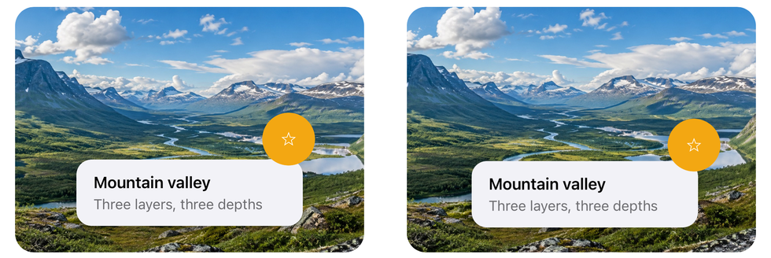

# Motion (depth that follows the tilt)

`Motion.Depth` gives a view depth: as the device tilts, the view moves by up to that many points. Views with different depths move against each other, so a screen built from layers looks like it has real depth, the way the iOS home screen does. A positive depth floats above the screen, a negative depth sits behind it.

```xml
<Border StrokeThickness="0" StrokeShape="RoundRectangle 20" HeightRequest="260">
    <Grid>
        <Image Source="valley.jpg" Aspect="AspectFill" Margin="-16" Motion.Depth="-14" />
        <Border Motion.Depth="4" ...>
            <Label Text="Mountain valley" />
        </Border>
        <Border Motion.Depth="16" ...>
            <Image SvgImageSource.Svg="star.svg" />
        </Border>
    </Grid>
</Border>
```

<p align="center">
  
</p>
<p align="center"><sub>The sample's Motion page on iOS: at rest, and as a tilt to the right and down moves the layers (each by its depth; the simulator has no motion, so the tilt is simulated)</sub></p>

It is an attached property in `Plugin.Maui.Spine.Extensions`, in the core package. `UseSpine()` sets it up, so there is nothing else to register.

## How far and which way

- **The depth is in points.** At full tilt, about 20 degrees from where the phone rests, a view with `Motion.Depth="12"` has moved 12 points. Smaller tilts move it proportionally.
- **Positive floats above the screen.** The view moves toward the edge that tilts away from you, as something lifted off the glass would. Negative depths move the other way and look sunk behind the screen. Zero, the default, turns the motion off.
- **It comes back to the middle.** Hold the phone still at any angle, upright or flat on a table, and the views slowly settle back to where the layout put them. Only changes in the tilt move them.
- **The layout does not change.** The view is moved on top of its own `TranslationX` and `TranslationY`, so animating those still works, and nothing around it reflows. Give a moving view room: a photo with `Motion.Depth="-14"` needs 14 points to spare on each side (`Margin="-16"` above), or its edges show. A parent `Border` clips whatever moves inside it.

## A highlight that sweeps over a surface

A soft light inside a [material](materials.md) panel, with a deep negative depth, slides across the panel as the phone tilts. The panel clips it to its shape, so it reads as a reflection on the surface.

```xml
<Border Material.Preset="BlurThin" StrokeThickness="0" StrokeShape="RoundRectangle 24">
    <Grid>
        <Border WidthRequest="280" HeightRequest="280" StrokeThickness="0" InputTransparent="True"
                HorizontalOptions="Center" VerticalOptions="Center"
                Motion.Depth="-70">
            <Border.Background>
                <RadialGradientBrush>
                    <GradientStop Color="#73FFFFFF" Offset="0" />
                    <GradientStop Color="#00FFFFFF" Offset="1" />
                </RadialGradientBrush>
            </Border.Background>
        </Border>
        <Label Text="Aurora" />
    </Grid>
</Border>
```

## Platforms

| Platform | How it moves |
|---|---|
| iOS / iPadOS | `UIInterpolatingMotionEffect` on the view, run by the system: the same effect as the home screen's parallax |
| Android | The game rotation vector sensor (the rotation vector on devices without a gyroscope), smoothed, through one listener shared by every view |
| Mac Catalyst | Nothing moves: a Mac has no tilt |
| Windows | Nothing moves |

On Android the listener runs only while at least one view with a depth is attached to a window and the app is in front. It stops when the last such view leaves the screen or the app goes to the background, so a page with depth costs nothing once you leave it. A device with neither rotation sensor shows the views where the layout put them.

## Reduce Motion

- **iOS:** the system turns its motion effects off under *Reduce Motion*.
- **Android:** the views stay still when *Remove animations* is on (an animator duration scale of 0). The setting is read again when the app comes back to the front.

## Checking it

The iOS simulator has no motion, so the effects never move there; check the feel on a phone. The Android emulator's rotation can be driven from its extended controls (*Virtual sensors*), or from the command line through the gyroscope that the rotation vector is fused from:

```bash
adb emu sensor set gyroscope-uncalibrated 0.6:0:0   # turn about the device's x axis
sleep 0.6
adb emu sensor set gyroscope-uncalibrated 0:0:0
```

`adb emu sensor set acceleration` on its own hardly moves the rotation vector, because the sensor fusion trusts the (still) gyroscope.

## See also

- [Materials](materials.md): the surfaces a highlight sweeps over.
- The sample app's **Motion** page (`samples/MauiSpineSampleApp/Pages/Motion`): three layers, a highlight on a blurred panel, and a slider to try a depth.
