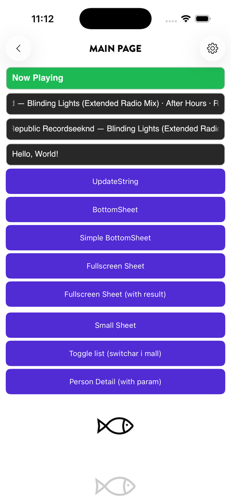
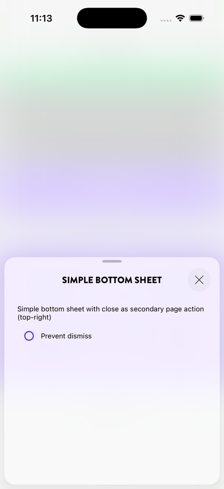
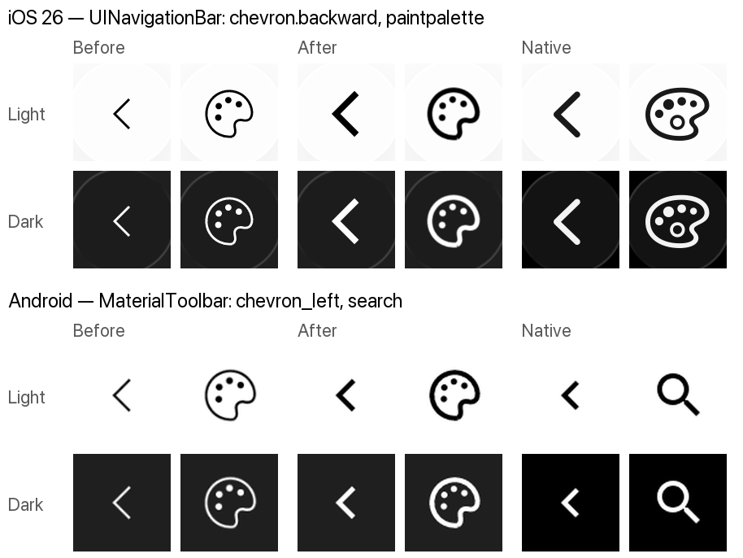

# Page Actions (Header Bar Buttons)

**Page actions** are buttons rendered in Spine's built-in header bar. They appear in the trailing (right) slot of the bar, next to the back/close button. Each action shows a text label or an SVG icon, and can carry a small badge.

<p align="center">
  
  
  
</p>
<p align="center"><sub>Page actions: an SVG icon, a text label, and close moved to the trailing slot</sub></p>

---

## Declaring page actions

Put `[PageAction]` on a `[RelayCommand]` method. Spine creates the `PageAction` once, before the page first appears, and wires it to the generated command:

```csharp
public partial class MainPageViewModel(INavigationService _navigation) : ViewModelBase
{
    // Icon-only button (SVG from Resources/Images)
    [PageAction(Svg = "settings.svg")]
    [RelayCommand]
    private async Task OpenSettings() => await _navigation.NavigateToAsync<SettingsPage>();

    // A confirm: a checkmark, which a screen reader calls "Save"
    [PageAction("Save", Role = PageActionRole.Confirm)]
    [RelayCommand]
    private async Task Save() { /* ... */ }

    // Text button, for an action with no standard icon
    [PageAction("Filter")]
    [RelayCommand]
    private void Filter() { /* ... */ }
}
```

The command property is found by the toolkit's naming rule (`SaveAsync` and `Save` both give `SaveCommand`). The attribute also works on a property of type `ICommand`, and `Command = "MyCommand"` names the property explicitly when neither applies.

| Attribute property | Default | Description |
|---|---|---|
| `Text` (constructor) | `null` | Label; leave it out for an icon-only button |
| `Svg` | `null` | SVG resource name, e.g. `"settings.svg"` |
| `Role` | `None` | `Confirm` (checkmark) or `Cancel` (X); see [Roles](#roles-confirm-and-cancel) |
| `Placement` | `Secondary` | `Primary` (left) or `Secondary` (right); `Primary` for a `Cancel` role |
| `Order` | `0` | Order among the page's declared actions |
| `Badge` | `null` | Initial badge text |
| `IsVisible` | `true` | Initial visibility |
| `Command` | `null` | Name of the command property, when not derived from the member |

### Adding actions by hand

`PageActions` is an ordinary observable collection. Add to it from the constructor, or at any time while the page shows; the header bar follows both additions and removals:

```csharp
PageActions.Add(new PageAction(text: "Cancel", command: CancelCommand) { Placement = PageActionPlacement.Primary });
PageActions.Remove(cancel);
```

Declared actions are added before the page first appears and stay for the life of the view model, so there is nothing to guard against in `OnAppearingAsync`.

---

## Changing an action while the page shows

`PageAction` is observable. Set a property on the instance and the button updates in place:

```csharp
private PageAction FilterAction => PageActions.First(a => a.Command == FilterCommand);

void OnFilterChanged(int count)
{
    FilterAction.Text = count > 0 ? $"Filter ({count})" : "Filter";
    FilterAction.Badge = count > 0 ? count.ToString() : null;
}

void OnEditingChanged(bool editing) => FilterAction.IsVisible = !editing;
```

| Property | Type | Default | Description |
|---|---|---|---|
| `Text` | `string?` | — | Label shown on the button. `null` for icon-only buttons |
| `Svg` | `string?` | `null` | SVG resource name from `Resources/Images`; changing it cross-fades |
| `Badge` | `string?` | `null` | Short text in a small pill over the button, e.g. `"3"`; `null` hides it |
| `IsEnabled` | `bool` | `true` | Whether the button responds to taps |
| `IsSelected` | `bool` | `false` | Whether a toggle the button stands for is on; see below |
| `IsVisible` | `bool` | `true` | Whether the button is shown; the next visible action in the slot takes over |
| `Command` | `ICommand` | — | Command executed when the button is tapped (fixed at creation) |
| `CommandParameter` | `object?` | `null` | Optional parameter forwarded to the command |
| `Placement` | `PageActionPlacement` | `Secondary` | `Primary` (left) or `Secondary` (right) slot (fixed at creation) |

---

## A search field

`[PageSearch]` on a string property puts a search field with the header bar, declared the same way as an action. See [Search](search.md).

## An action that opens a menu

`new PageAction(null, menu) { Svg = "more.svg" }` opens a native menu instead of running a command: sections, a picker with checkmarks, submenus, toggles and destructive rows, from one `MenuItems` declaration. See [Menu buttons](menus.md).

## A toggle that is on

`IsSelected = true` marks a button whose toggle is on, such as a torch or a filter. The button is filled with the header bar's foreground colour, white under a light-on-dark header and the label colour otherwise, and its glyph or text is drawn in the colour that reads on that fill. On iOS 26 with glass header actions it is glass tinted with that colour, the way a confirm is tinted with the accent. The command still decides what a tap does; set `IsSelected` from the state it changes:

```csharp
partial void OnIsTorchOnChanged(bool value) => _torch.IsSelected = value;
```

## A haptic on tap

`[PageAction("Save", Haptic = Haptic.Success)]` or `new PageAction("Save", SaveCommand) { Haptic = Haptic.Success }` plays a haptic when the button is tapped, before the command runs. See [Haptics](haptics.md).

## Liquid Glass on iOS 26

On iOS 26 and Mac Catalyst 26 the header bar renders its back button and page actions as Liquid Glass, the way a `UINavigationBar` shows its items. The SVG keeps the tint `PageActionView` gives it (black in light theme, white in dark); a text action keeps the app's accent (`Primary`, or `IThemeService.Accent`). Turn it off in `UseSpine` with `options.Apple.GlassHeaderActions = false`. See [Glass buttons](glass-buttons.md) for the attached property behind it.

---

## Placement

| Value | Position | Typical use |
|---|---|---|
| `Secondary` | Trailing / right side | Page-specific actions (Save, Edit, Share) |
| `Primary` | Leading / left side | Navigation-level actions (Menu, Cancel) |

Each slot shows the **first visible** action with that placement. The back button occupies the `Primary` slot implicitly; an explicit `Primary` action replaces it for that page.

```csharp
[PageAction("Cancel", Role = PageActionRole.Cancel)]   // Primary by its role
[RelayCommand]
private async Task Cancel() => await _navigation.BackAsync();
```

---

## Roles: confirm and cancel

Confirming and cancelling are the header actions every editing screen and sheet has, and the platforms
draw them as icons: a **checkmark** to confirm and an **X** to cancel (the iOS 26 Human Interface
Guidelines; Spine uses the same on Android). `Role` picks the icon, the slot and what a screen reader says:

| Role | Icon | Slot | Screen reader |
|---|---|---|---|
| `Confirm` | `check.svg` (Spine's) | `Secondary` (right) | The action's text, or the localised `Spine.Header.Done` |
| `Cancel` | `close.svg` (Spine's) | `Primary` (left) | The action's text, or the localised `Spine.Header.Cancel` |

A `Confirm` is also drawn **prominently**, as the one action the screen leads with: on iOS 26 it is Liquid Glass
tinted with the accent (`GlassStyle.Prominent`), elsewhere a filled accent circle (Material 3's filled icon
button); the glyph takes the colour that reads on the accent.

An explicit `Svg`, `Description` or `Placement` still wins. For a hand-made action:

```csharp
PageActions.Add(new PageAction("Save", SaveCommand) { Role = PageActionRole.Confirm });
```

Use a text button only for an action with no standard icon (Filter, Sort, a word the user must read).

---

## SVG icons

SVG images require **Plugin.Maui.Spine.Svg** (included transitively with Spine). Place `.svg` files in `Resources/Images/` and reference them by file name:

```csharp
[PageAction(Svg = "settings.svg")]
[RelayCommand]
private Task OpenSettings() { /* ... */ }
```

The header bar draws the glyph at the size and weight of the platform's own bar icons, so a Spine icon sits next to a system one without looking thin. The numbers are on `HeaderBarConstants`, measured against a `UINavigationBar` on iOS 26 and a `MaterialToolbar` on Android:

| | iOS and Mac Catalyst | Android | Windows |
| --- | --- | --- | --- |
| `GlyphSize` | 25 points | 24 dp | 22 |
| `GlyphLineWidthScale` | 2 (2-point lines, like SF Symbols) | 2.05 (2 dp, like Material Symbols at weight 400) | 1 |
| `BackGlyphSize` / `BackGlyphLineWidthScale` | 34 / 1.84 (UIKit's larger back chevron) | 24 / 2.05 | 22 / 1 |

The scale multiplies the SVG's own strokes, so it assumes icons drawn like the Spine set: 2-unit lines in a 50-unit view box. A button of your own that should match the bar takes the same values, `SvgImageSource.LineWidthScale="{x:Static HeaderBarConstants.GlyphLineWidthScale}"`.

<p align="center">
  
</p>

---

## Async commands

A `[RelayCommand]` on an async method gives an `IAsyncRelayCommand`; the action exposes it as `AsyncCommand` so the UI can bind to its busy state:

```csharp
[PageAction("Save", Role = PageActionRole.Confirm)]
[RelayCommand]
private async Task SaveAsync() => await _dataService.SaveAsync();
```

---

## Desktop (Windows)

On Windows, when the native title bar is shown (`IsTitleBarVisible = true`), page actions are rendered inside the title bar chrome using `TitleBar.LeadingContent` and `TitleBar.TrailingContent`. The same `PageActions` collection drives both header bar and title bar contexts, including changes made while the page shows — no extra code needed.
