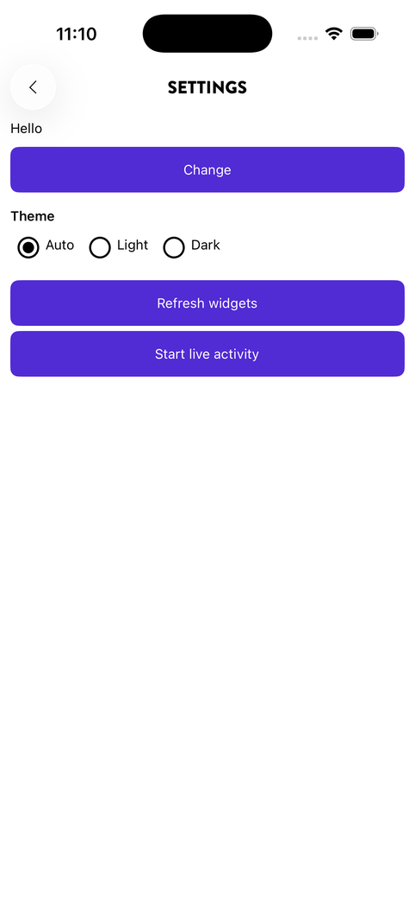
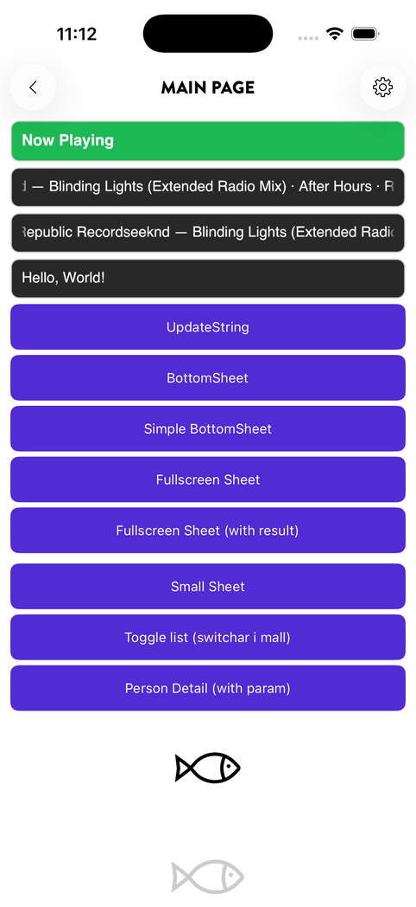
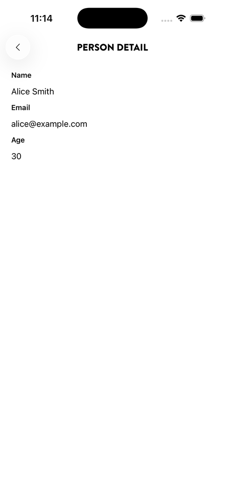
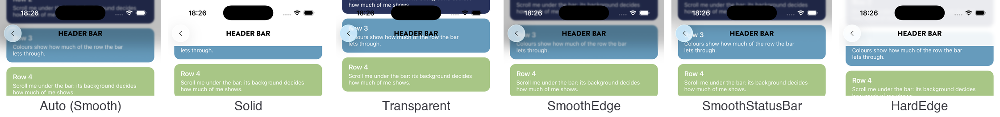
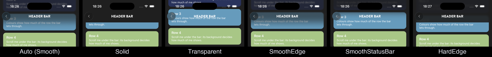
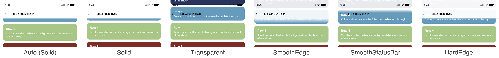
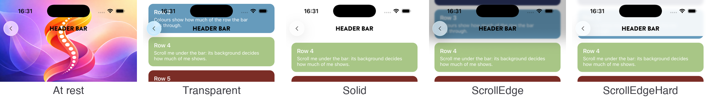

# Regions

A **region** is a full-screen page that participates in Spine's stack-based navigation. Navigating forward pushes a new page onto the stack; navigating back pops it off. The header bar, back button, and slide transitions are handled automatically.

<p align="center">
  
  
  
</p>
<p align="center"><sub>Regions from the sample app: the header bar, the back button, and page actions come with the page</sub></p>

---

## Declaring a region page

Apply `[NavigableRegion]` to the code-behind class:

```csharp
namespace MyApp.Pages;

[NavigableRegion(Title = "Settings")]
public partial class SettingsPage { public SettingsPage() => InitializeComponent(); }
```

### Attribute properties

| Property | Type | Default | Description |
|---|---|---|---|
| `Title` | `string` | `""` | Text shown in the header bar or title bar |
| `Lifetime` | `ServiceLifetime` | `Transient` | `Transient` creates a fresh instance each navigation; `Singleton` retains state |
| `IsHeaderBarVisible` | `bool` | platform default | Show/hide the Spine in-page header bar |
| `IsBackButtonVisible` | `bool` | `true` | Show/hide the back arrow in the header bar |
| `IsTitleBarVisible` | `bool` | platform default | Show/hide the native window title bar (desktop only) |
| `TitlePlacement` | `TitlePlacement` | platform default | `HeaderBar` or `TitleBar` |
| `TitleAlignment` | `TitleAlignment` | platform default | `Left` or `Center` |
| `SafeAreaEdges` | `SafeAreaEdges` | `All` | Which edges Spine pads for system bars. Exclude an edge to render edge-to-edge behind it — use `ViewModelBase.SafeAreaInsets` to offset content manually |
| `HeaderBar` | `HeaderBarMode` | `Normal` | Where the content starts: below the bar (`Normal`) or at the top of the screen behind it (`Overlay`). See [Header bar](#header-bar) |
| `LargeTitle` | `bool` | `false` | The page opens on its own large title, which collapses into the header bar as it scrolls. See [Large title](#large-title) |
| `HeaderBarBackground` | `HeaderBarBackground` | `Auto` | What is behind the header bar when content is under it: `Auto`, `Solid`, `Transparent`, `SmoothEdge`, `SmoothStatusBar` or `HardEdge`. See [Backgrounds](#backgrounds) |
| `HeaderBarForeground` | `string?` | `null` | A fixed colour (hex) for the header bar's title and action icons; `null` follows the theme |
| `StatusBarStyle` | `StatusBarStyle` | `Default` | `LightContent` or `DarkContent` for the status bar's clock and icons while the page is shown |
| `ScrollInset` | `SafeAreaEdges` | `None` | Edges on which the page's first `ScrollView` / `CollectionView` takes the safe-area inset as a native content inset, so it can scroll under an excluded bar and still reach its last row. See [Scrolling under a bar](#scrolling-under-a-bar) |

Platform defaults:

| Platform | `IsHeaderBarVisible` | `IsTitleBarVisible` | `TitlePlacement` | `TitleAlignment` |
|---|---|---|---|---|
| Mobile (Android) | `true` | `false` | `HeaderBar` | `Center` |
| Desktop (Windows) | `false` | `true` | `TitleBar` | `Left` |

> **iOS / Mac Catalyst** use the mobile defaults; Mac Catalyst is exercised less than iOS.

---

## Navigating to a region page

Inject `INavigationService` into the ViewModel and call `NavigateToAsync<TPage>()`:

```csharp
public partial class MainPageViewModel(INavigationService _navigation) : ViewModelBase
{
    [RelayCommand]
    private async Task OpenSettings() => await _navigation.NavigateToAsync<SettingsPage>();
}
```

Spine automatically decides the presentation style — if the target page carries `[NavigableRegion]` it will be pushed onto the stack; if it carries `[NavigableSheet]` it will be presented as a bottom sheet.

---

## Navigating back

```csharp
await _navigation.BackAsync();
```

The back button in the header bar calls this automatically. Implement `OnBackRequestedAsync` to intercept or cancel it:

```csharp
public override async Task<bool> OnBackRequestedAsync()
{
    // e.g. prompt the user if there are unsaved changes
    bool confirmed = await DisplayAlert("Discard changes?", "", "Yes", "No");
    return confirmed;
}
```

Return `false` to cancel the navigation; return `true` (the default) to allow it.

---

## Singleton pages

Use `Lifetime = ServiceLifetime.Singleton` to retain state when the user navigates away and returns:

```csharp
[NavigableRegion(Title = "Settings", Lifetime = ServiceLifetime.Singleton)]
public partial class SettingsPage { public SettingsPage() => InitializeComponent(); }
```

---

## Lifecycle hooks

Override these methods in the ViewModel to react to navigation events:

```csharp
public partial class SettingsPageViewModel : ViewModelBase
{
    public override async Task OnAppearingAsync(NavigationDirection navigationDirection)
    {
        // navigationDirection == NavigateTo  ? page was pushed
        // navigationDirection == Back        ? returned to this page from a child page
        await LoadDataAsync();
        await base.OnAppearingAsync(navigationDirection);
    }

    public override Task OnDisappearingAsync(NavigationDirection navigationDirection)
    {
        // Called just before the page leaves the screen
        return base.OnDisappearingAsync(navigationDirection);
    }

    public override async Task OnResumedAsync()
    {
        // Called when the app comes back to the foreground while this page is shown
        await LoadDataAsync();
        await base.OnResumedAsync();
    }
}
```

`NavigationDirection` values:

| Value | Meaning |
|---|---|
| `None` | Page set as root (first shown) |
| `NavigateTo` | Page was pushed onto the stack |
| `Back` | Returned to this page because a child was popped |

### Coming back to the app

`OnResumedAsync` is called when the app returns to the foreground, or its window is activated again, on the pages that are **shown**: the current page of the region (or of the selected tab), and of an open sheet together with the page under it. Pages covered by another page on the stack, or on another tab, are not called; they get `OnAppearingAsync` when they are shown again. The page does not subscribe to window events itself; Spine owns the window.

It is not called at launch, because the first `OnAppearingAsync` covers that. It is called only after the app was deactivated, and anything that takes the window out of the foreground or out of focus counts: going to the background, but also the notification shade or a system dialog on a phone, and another window on the desktop. Keep the override cheap, or check whether anything actually changed.

Spine does not follow the calendar day. A page that shows "today" compares the date when it comes back, and runs its own timer to midnight if it must turn while it is on screen:

```csharp
public override async Task OnResumedAsync()
{
    var today = DateOnly.FromDateTime(DateTime.Now);

    if (Day != today)
        await ShowDayAsync(today);

    await base.OnResumedAsync();
}
```

---

## Header bar

Three settings shape the header bar. Each is on the page attribute, is an app-wide default in `options.RegionDefaults` / `TabDefaults` / `SheetDefaults`, and can be set on the page's view model while the page is shown. They are independent: every combination works.

| Setting | Decides |
|---|---|
| `HeaderBar` (`Normal`, `Overlay`) | Where the content starts: below the bar, or at the top of the screen behind it |
| `LargeTitle` | Whether the page opens on a large title that collapses into the bar |
| `HeaderBarBackground` (`Auto`, `Solid`, `Transparent`, `SmoothEdge`, `SmoothStatusBar`, `HardEdge`) | What is behind the bar's title and actions when content is under the bar |

`HeaderBarForeground` (a fixed colour for the title and the action icons) and `StatusBarStyle` (the clock's colour) go with a page whose top is a photo. The sample's **Header bar** page combines all of them live, explains each choice and shows the code for the combination on screen.

### Backgrounds

The background only shows when content is under the bar: content that has scrolled under it, or the top of an `Overlay` page. With nothing under the bar, every value looks the same.

| Value | iOS / Mac Catalyst 26 | iOS / Mac Catalyst before 26 | Android | Windows | Pick it for |
|---|---|---|---|---|---|
| `Auto` (default) | The navigation bar's default, on a region or tab page whose list fills it from the top: `SmoothEdge` on iOS 26, `HardEdge` from iOS 27; `Solid` otherwise | `Solid` | `Solid` | `Solid` | Almost every page: the platform's own bar |
| `Solid` | The page's colour; content under the bar is hidden | Same | Same | Same | A classic bar; a photo page whose bar closes once the list scrolls |
| `Transparent` | Nothing; content shows through, the title floats over it | Same | Same | Same | A photo or a map under an `Overlay` bar |
| `SmoothEdge` | UIKit's scroll edge effect, soft style: content fades and blurs into the whole header | `Solid` | The page's colour, slightly see-through behind the bar, fading out below it | As Android | The iOS 26 navigation bar look, on every version |
| `SmoothStatusBar` | The soft effect behind the status bar only; content behind the title and the actions stays sharp | `Solid` | The same band behind the status bar only, fading out over 16 points | As Android | A light bar, where rows should stay readable behind the title |
| `HardEdge` | The hard style: a frosted, nearly opaque band with a clear edge | `Solid` | The page's colour, nearly opaque, with a hairline at the bar's bottom edge | As Android | The iOS 27 navigation bar look, on every version and platform |

Under `Overlay`, `Auto` is `Transparent`, since the page draws its own top. With Reduce Transparency on (iOS/Mac), or transparency effects off (Windows), every scroll edge value is `Solid`. `ViewModelBase.EffectiveHeaderBarBackground` says what the page got: what `Auto` resolved to, and `Solid` where a scroll edge value could not be drawn.

<p align="center">
  
</p>
<p align="center">
  
</p>
<p align="center">
  
</p>
<p align="center"><sub>The same list scrolled under a normal bar: iOS 26 light and dark, then Android, where <code>Auto</code> is <code>Solid</code></sub></p>

- **`Solid` under `Normal`** gives the bar a row of its own; the content starts and stays below it. Under `Overlay` or a large title, where content starts under the bar, the colour fades in over the first `HeaderBarConstants.ScrollEdgeFadeLength` points of scroll. The colour is the page's own background when it has an opaque one, otherwise what the platform paints behind pages (the system background on iOS, the window background on Android).
- **`Transparent` and the scroll edge values under `Normal`** lay the page out under the bar, and Spine adds `Top` to the scroll source's `SafeArea.ScrollInset`, so the first row starts below the bar at rest and scrolls under it.
- **`Auto` follows the navigation bar's default:** `SmoothEdge` on iOS 26, `HardEdge` from iOS 27. Spine pins the style per version rather than leaving it to UIKit's automatic style, which is soft on iOS 26.4 and hard on iOS 27.0.
- **`SmoothStatusBar`** puts UIKit's interaction on a view of its own, as tall as the status bar, holding a label: UIKit sizes the effect to the labels, images and controls in the container and ignores an empty one.
- **Before `Auto` on iOS 26 or later picks a scroll edge value,** the page's scroll view (`HeaderBar.ScrollSource`, or else the first `ScrollView` / `CollectionView`) must fill the page from the top: every container between the page and the list holds only the list, or is a grid in which the list spans all rows (a list with a floating button). A page with fixed content above its list keeps `Solid`, so nothing that does not scroll ends up under the bar. Sheets keep `Solid`.

### Overlay header

A page that opens on a photo, a map or a hero wants the content to start at the top of the screen with the header floating over it, in a colour that reads on the image:

```csharp
[NavigableRegion(Title = "Trip",
                 HeaderBar = HeaderBarMode.Overlay,
                 HeaderBarForeground = "#FFFFFF",
                 StatusBarStyle = StatusBarStyle.LightContent,
                 SafeAreaEdges = SafeAreaEdges.Left | SafeAreaEdges.Right)]
```

<p align="center">
  
</p>
<p align="center"><sub>An <code>Overlay</code> page at rest, then scrolled with each background (iOS 26)</sub></p>

- `HeaderBar = Overlay`: the content host is not padded at the top; the title row and the actions sit over the content, pushed down by the status bar. Page actions keep their glass on iOS 26, which is what makes them readable over imagery.
- The page keeps clear what it wants to. `ViewModelBase.SafeAreaInsets.Top` reports status bar plus header height (`HeaderBarConstants.BarHeight`); a list takes it with `SafeArea.ScrollInset="Top"` to start below the bar, or leaves it off to start its first item (a photo) under the bar. Spine does not add a top inset under `Overlay`.
- `HeaderBarForeground`: the title and the action icons take this colour instead of the theme's. It stays fixed on a `Solid` or scroll edge bar too, where white disappears in light mode; `Transparent` is the background that goes with it.
- `StatusBarStyle`: applied when the page appears, when the page changes it, and on a theme change. On Android it sets the window's light/dark status bar appearance. On iOS it needs `<key>UIViewControllerBasedStatusBarAppearance</key><false/>` in `Info.plist`; without it Spine logs a hint and leaves the bar alone.
- On iOS 26, `SmoothEdge` over a photo already softens the photo's top at rest, as UIKit does for anything under the edge. Use `Transparent` or `Solid` for a photo page.

### Large title

The iOS large title and the Material 3 medium top app bar: the page opens on its own large title, and as that title scrolls away under the bar the bar's own title fades in.

```csharp
[NavigableRegion(Title = "Inbox", LargeTitle = true)]
```

```xml
<CollectionView ItemsSource="{Binding Messages}" SafeArea.ScrollInset="Bottom">
    <CollectionView.Header>
        <HeaderBarLargeTitle />
    </CollectionView.Header>
    …
```

`HeaderBarLargeTitle` shows the page's title (set `Text` to show something else) in the platform's large-title size, weight, row height and margin, in the header's `HeaderBarForeground` when the page fixes one and in the app's label style otherwise. Spine measures it to decide when the bar's title fades in, wherever it sits in the scroll content. For a title of your own, the numbers are public on `HeaderBarConstants` (`LargeTitleFontSize`, `LargeTitleFontAttributes`, `LargeTitleHeight`, `LargeTitleMargin`); set `HeaderBar.CollapseDistance` on the page to where its text has gone.

- A large title always has content scrolling under the bar, so the page is laid out under it. Under `Normal`, Spine adds `Top` to the scroll source's `SafeArea.ScrollInset`, so the large title starts right under the bar without the page doing anything.
- The background is whatever `HeaderBarBackground` says: with `Auto` that is the navigation bar's own scroll edge on iOS 26 and later, and a bar that turns from transparent to the page's colour elsewhere.
- `Overlay` and `LargeTitle` combine: a hero with a greeting in it, `HeaderBar.CollapseDistance` set to where the greeting has gone, and `HeaderBarBackground = Solid` so the bar closes over the photo once the list passes under it.
- `HeaderBar.ScrollSource` (on the page) names the `ScrollView` or `CollectionView` to follow. Without it Spine follows the page's first one, and waits for it when the page builds it later (a state view that swaps in its body). On iOS Spine reads the native scroll offset, because MAUI's `CollectionView` stops raising `Scrolled` while only its header is on screen.
- The bar's title fades in over the last `HeaderBarConstants.LargeTitleFadeLength` points before the collapse distance: `HeaderBar.CollapseDistance` when the page sets it, otherwise the offset at which the `HeaderBarLargeTitle`'s text has gone under the bar (its top in the scroll content plus half its row and half its font size), otherwise `HeaderBarConstants.LargeTitleCollapseDistance`.
- `ViewModelBase.HeaderBarCollapseProgress` (0 to 1) follows the title's fade, for a page that fades something of its own with it.
- With Reduce Motion on (iOS), animations removed (Android) or animation effects off (Windows) there is no fade: the title and the background switch at the middle of their ranges.
- The large-title constants are per platform: 34-point bold in a 52-point row on iOS, 24 sp in 56 dp on Android (Material 3 medium top app bar), 28 on Windows, all with 16 points of side margin.

### Scroll edge

How the iOS 26 effect is drawn. On a page that gets `SmoothEdge` or `HardEdge`, the header's title row gets a `UIScrollEdgeElementContainerInteraction` pointing at the scroll view, and UIKit draws the edge effect as it does behind a `UINavigationBar`: from the top of the screen over the status bar and the whole bar. The glass page actions stay as they are.

- UIKit sizes the effect to the elements in the container view (labels, images, controls), not to the container itself: an empty view in the container does not count, and the effect stops below the lowest element. That is why the title label fills the bar's height. A page with a visible header bar but an empty title has nothing for UIKit to size the effect to.
- Under an inline title with `HardEdge` the label ends with the 44-point item row instead, because that is where UIKit's own hard band stops behind an inline navigation bar title (see [Header bar height](#header-bar-height)).
- The Android and Windows stand-ins fade in as rows pass under the bar.

### Changing the header while the page is shown

`HeaderBarMode`, `LargeTitle`, `HeaderBarBackground`, `HeaderBarForeground` and `StatusBarStyle` are properties on `ViewModelBase`. The attribute sets them before the page appears; set them later and Spine resolves the header again (`Auto`, Reduce Transparency and the fallbacks included) and lays the page out again, under the bar or below it.

```csharp
// In the page's view model, e.g. from a setting:
HeaderBarBackground = HeaderBarBackground.HardEdge;
LargeTitle = true;
```

Opt out of the iOS 26 effect app-wide with `options.RegionDefaults.HeaderBarBackground = HeaderBarBackground.Solid` (and the same on `TabDefaults`), or per page on the attribute.

### Header bar height

The header bar is a row of items (`HeaderBarConstants.Height`: the back button, the title, the page actions) with the bar below it. `HeaderBarConstants.BarHeight` is the whole bar, measured from under the status bar. Everything that depends on the header's height uses it: where content below the bar starts, `SafeAreaInsets.Top` and the scroll inset under a floating bar, a `Solid` background, the Android/Windows scroll edge band, and the element UIKit sizes the scroll edge effect to.

| Platform | `Height` (items) | `BarHeight` (bar) |
|---|---|---|
| iOS / Mac Catalyst 26 and later | 44 | 54: the items at the top, 10 points of bar below, as `UINavigationBar` |
| iOS / Mac Catalyst before 26 | 44 | 44 |
| Android | 48 | 48 |
| Windows | 32 | 32 |

The title's text centres on the item row, not on the whole bar, so it lines up with the buttons. Measured against a `UINavigationController` on the iOS 26 simulator: the bar is 54 points in a region and in a sheet (where it starts 16 points below the sheet's top edge), and a large title's 52-point row starts at the bar's bottom edge. The scroll edge effect differs by case. The soft style fades a little past the bar's bottom edge. The hard band ends at the bar's bottom edge under a large title and in a sheet. Under an inline title in a region, UIKit's hard band stops at the bottom of the items, 10 points above the bar's edge, and Spine does the same.

---

## Scrolling under a bar

Excluding an edge from `SafeAreaEdges` lets content draw behind that bar — the home indicator, the gesture bar, or the floating tab bar inside the tab host. A list that does this still has to let its last row scroll clear of the bar. Give the list the inset as a *content inset* instead of a spacer:

```xml
<CollectionView ItemsSource="{Binding Rows}" SafeArea.ScrollInset="Bottom" />
```

`SafeArea.ScrollInset` works on `ScrollView`, `CollectionView` and `HeroCollectionView`. It reads the page's `ViewModelBase.SafeAreaInsets` (non-zero only on the edges Spine is not padding; inside the tab host the bottom value includes the tab bar) and applies it natively: `UIScrollView.ContentInset` on iOS and Mac Catalyst, padding with `clipToPadding` off on Android, `Padding` on Windows. The rows keep drawing through the bar; only the scrollable range grows. Rotation and tab-bar changes flow through automatically.

To apply it without touching the list, set it on the attribute — or once for every page through `options.RegionDefaults.ScrollInset` (and `TabDefaults` / `SheetDefaults`):

```csharp
[NavigableRegion(SafeAreaEdges = SafeAreaEdges.Top | SafeAreaEdges.Left | SafeAreaEdges.Right,
                 ScrollInset = SafeAreaEdges.Bottom)]
```

Spine then sets `SafeArea.ScrollInset` on the page's first `ScrollView` or `CollectionView`. A view that sets its own value keeps it.

---

## Work that lives with the page

Three members of `ViewModelBase` take care of the bookkeeping a live page otherwise repeats: a timer with its own cancellation, subscribe-on-appear/unsubscribe-on-disappear with a dispatch to the UI thread, and a refresh on resume.

```csharp
public LiveViewModel(IScoreService scores)
{
    // Runs on the UI thread when the page appears, then every 15 s; pauses in the background and
    // while the page is hidden; runs again at once when the page or the app is back.
    Poll(TimeSpan.FromSeconds(15), ct => RefreshAsync(ct));

    // Subscribed while the page shows, handler marshalled to the UI thread. Overloads for
    // Action, Action<T> and EventHandler<T>; a raw (subscribe, unsubscribe) pair for anything else.
    WhileVisible(h => scores.Changed += h, h => scores.Changed -= h, OnScoresChanged);
}

// A load that should not outlive the page: PageLifetime cancels when the page is left.
private Task RefreshAsync(CancellationToken ct) => _scores.LoadAsync(PageLifetime);
```

| Member | Starts | Stops |
|---|---|---|
| `PageLifetime` | a new token when the page appears | cancelled when the page disappears (not on backgrounding) |
| `Poll(interval, work)` | when the page appears, and again at once on activation | while the page is hidden or the window is deactivated |
| `WhileVisible(...)` | subscribes when the page appears | unsubscribes when the page disappears |

Register them once, from the constructor or `OnAppearingAsync`; a registration lives as long as the view model, so a singleton tab page polls every time it is shown. Spine's own service events (`ILiveActivityService.ActivitiesChanged`, `IPushNotificationService.RegistrationChanged`, `IWidgetService.PushTokenChanged`) are raised on the UI thread.

---

## Interactive back-swipe gesture

On mobile, the user can swipe from the left edge to go back, matching the native iOS behavior. This is built into `NavigationRegion` and requires no extra configuration.

The gesture only claims a drag that starts at the leading edge, runs rightward and more sideways than up or down, and only while there is a page to go back to. Anything else — a vertical drag in a list, a drag inside a canvas that handles its own touches, a drag on the root page — is left to the content. On iOS and Mac Catalyst that is enforced on the native pan recognizer before it begins, since a `UIPanGestureRecognizer` that has begun cancels the touches of the views under it.

---

## Overriding global defaults per page

Properties not set on the attribute fall back to `SpineOptions.RegionDefaults`. Set them on the attribute to override for a specific page:

```csharp
[NavigableRegion(
    Title = "Detail",
    IsHeaderBarVisible = true,
    TitleAlignment = TitleAlignment.Left)]
public partial class DetailPage { public DetailPage() => InitializeComponent(); }
```
