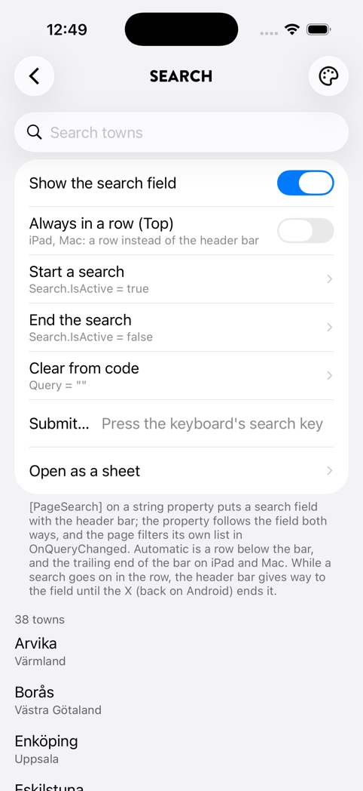
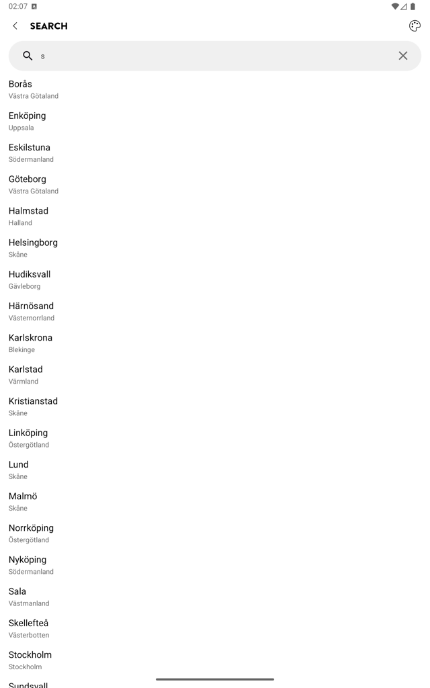
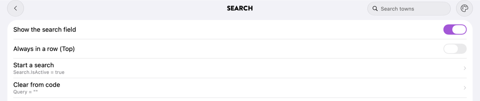
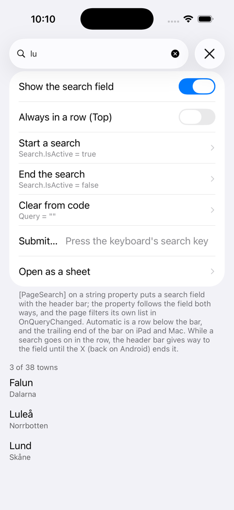
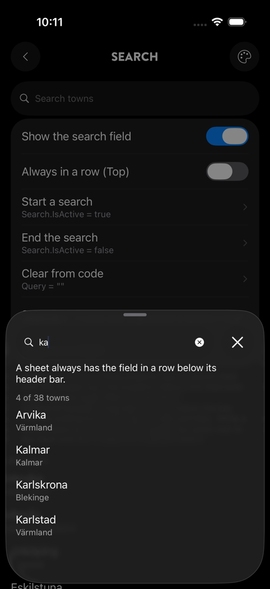

# Search in the header bar

A page declares a search field the way it declares a header button: with an attribute in its view model. Spine draws the field with the header bar, where the platform puts search, and keeps it in step with a string property. The page filters its own list as the text changes; Spine draws no results.

The field is MAUI's `SearchBar`, so the keyboard's search key, the clear button and the keyboard itself are the platform's own. Everything is in the core package.

 

---

## Declaring search

Put `[PageSearch]` on the string property that holds the text:

```csharp
public partial class TownsPageViewModel : ViewModelBase
{
    [PageSearch(Placeholder = "Search towns", Submit = nameof(OpenFirstCommand))]
    [ObservableProperty]
    public partial string Query { get; set; } = "";

    [ObservableProperty]
    public partial IReadOnlyList<Town> Towns { get; private set; } = AllTowns;

    partial void OnQueryChanged(string value) =>
        Towns = AllTowns.Where(t => t.Name.Contains(value, StringComparison.CurrentCultureIgnoreCase)).ToArray();

    [RelayCommand]
    private Task OpenFirst(string text) => /* the keyboard's search key, with the text */;
}
```

```xml
<!-- Nothing for the field in XAML: the list the page already has is what search filters. -->
<CollectionView ItemsSource="{Binding Towns}" />
```

Spine creates `ViewModelBase.Search`, a `PageSearch`, once before the page first appears. Typing writes `Query`, and setting `Query` in code writes the field, so `Query = ""` clears it.

| Attribute property | Meaning |
|---|---|
| `Placeholder` | The prompt while the field is empty |
| `Submit` | A command run with the text when the search key is pressed: an `ICommand` property (`nameof(OpenFirstCommand)`) or a `[RelayCommand]` method (`nameof(OpenFirst)`) |
| `Placement` | `Automatic` (the default) or `Top`; see below |

The attribute also works on a toolkit field (`[ObservableProperty] private string _query;`). A page has one search field. A property that is not a string, a second `[PageSearch]` or a `Submit` that names no command throws when the page is prepared, with the type and member in the message.

## Changing it while the page shows

`PageSearch` is observable, like `PageAction`:

| Property | Meaning |
|---|---|
| `Text` | The text, the same as the declared property |
| `Placeholder` | The prompt |
| `IsActive` | Whether a search is going on. Set it to `true` to start one from code (the field takes the focus and the keyboard comes up), `false` to end it. It follows the user too; see [While searching](#while-searching) |
| `IsVisible` | Set it to `false` to take the field away; the content moves up |
| `Placement` | Where the field goes |
| `SubmitCommand` | The search key's command (set when the search is created) |

```csharp
Search!.IsActive = true;          // a "Search" row elsewhere on the page
Search.IsVisible = Items.Count > 0;
```

Without the attribute, set `Search = new PageSearch { Placeholder = "…", SubmitCommand = … }` yourself and follow `Search.Text` through `PropertyChanged`. Setting `Search = null` removes the field.

## Where the field goes

| | `Automatic` | `Top` |
|---|---|---|
| iPhone | A row below the header bar | A row below the header bar |
| iPad and Mac Catalyst | At the trailing end of the header bar, left of the trailing action; a row below the bar when the window is narrower than 600 points (Split View, a small window) | A row below the header bar |
| Android | A Material 3 capsule in a row below the header bar | The same |
| Windows | A row below the header bar | The same |
| A sheet, anywhere | A row below the sheet's header bar | The same |

- **The row is part of the header.** It moves with the page in a push or a pop, the way the title does. Under a floating header (`Overlay`, a large title, or a scroll edge background) content scrolls under the row as well as the bar: `SafeAreaInsets.Top` and the scroll inset include it, and the scroll edge effect or solid background reaches below it.
- **On Apple platforms** the field is the system's own `UISearchBar` in its minimal style, so it looks like the OS version's search field; its cancel button shows while a search goes on, clears the text and ends the search.
- **On Android** it is MAUI's `SearchView` in a fully rounded capsule, without the underline; while a search goes on a back arrow takes the magnifier's place.
- **The keyboard** covers only the list, which Spine already keeps above it (see [The on-screen keyboard](regions.md#the-on-screen-keyboard)).
- **No header bar, no field:** a page with `IsHeaderBarVisible = false` shows no search.



## While searching

When a search starts in the row (the user taps the field, or `IsActive = true`), the header bar gives way to it, the way a `UISearchController` hides its navigation bar and Material 3's search view covers the top app bar. The title, the back button, the page actions and, in a sheet, the sheet's close button slide up and fade, and the field moves up into the bar's place with the list under it. The screen then shows the field, its clear button while there is text, and one button that ends the search.

 

- **The search lasts until it is ended**, not only while the keyboard is up: after the keyboard's search key the keyboard goes away and the results stay, as in UIKit. It ends with the round X on iOS (UIKit's cancel button), back or the back arrow at the field's leading end on Android, or `Search.IsActive = false` from code. Ending a search clears its text, so the page shows everything again as the header bar comes back.
- **Leaving the page in the middle of a search** (a row that opens a detail page) keeps it: coming back shows the field in the bar's place again, without the keyboard.
- **Under Reduce Motion** the change cross-fades on iOS instead of sliding; with Android's animations removed it is immediate.
- **Where the field sits in the bar** (iPad and Mac Catalyst at 600 points and wider) nothing moves, as UIKit keeps the bar on iPad; there, and on Windows, whose field has no button to end a search with, the search follows the focus and the bar stays.

## Not yet

These come later; see `docs/proposals/spine-header-search.md`:

- On iPhone with iOS 26, search at the bottom of the screen above the home indicator, and a search button in the header bar for pages with a tab bar or a footer.
- Suggestions under the field, and ⌘F on Mac Catalyst.
- On Windows, the field in the window's title bar.
- A row that slides away as the list scrolls, and the row below a large title instead of above it.
- Scopes: a menu button next to the field.
