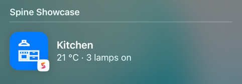
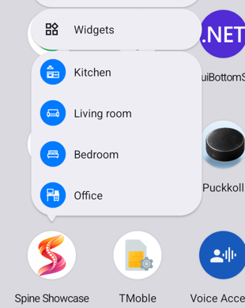

# Searchable items

**Searchable items** put the app's content in the platform's search: Spotlight on iOS and the Mac, the launcher on Android. Each item carries a typed target, a page and its parameter, and a tapped result opens that page, also when the app was not running. No route strings, no URL scheme.

<p align="center">
  
</p>
<p align="center"><sub>A room from the Showcase in Spotlight, with its SVG icon drawn on the accent</sub></p>

---

## Concepts

| Term | Description |
|---|---|
| `ISearchIndex` | The app's entries in the platform's search. Registered by `UseSpine`; inject it |
| `SearchableItem` | One entry: an `Id`, a `Title`, a `Target`, and optionally a `Description`, an `Icon` and `Keywords` |
| `NavigationTarget` | A page and its parameter as data: `NavigationTarget.To<TPage>()` or `NavigationTarget.To<TPage, TParam>(param)` |
| `[Searchable]` | Puts a page itself in the search as a fixed entry, indexed at every start |

---

## 1. Index items

```csharp
public sealed record RoomId(string Value);

[NavigableRegion(Title = "Room")]
public partial class RoomPage : INavigableWithParameter<RoomId> { }
```

```csharp
public partial class RoomsPageViewModel(ISearchIndex searchIndex) : ViewModelBase
{
    private Task IndexAsync(Room room) => searchIndex.UpsertAsync(new SearchableItem(
        Id: $"room-{room.Id.Value}",
        Title: room.Name,
        Target: NavigationTarget.To<RoomPage, RoomId>(room.Id),
        Description: room.Summary,
        Icon: "kitchen",
        Keywords: ["fridge", "stove"]));
}
```

- Upserting the same `Id` again replaces the item. `UpsertAsync(IEnumerable<SearchableItem>)` indexes many in one call.
- `RemoveAsync(id)` takes one away, `RemoveAllAsync()` all the app's items (not the `[Searchable]` pages), and `GetIdsAsync()` says what is in the index.
- Index when the content arrives or changes (a competition is loaded, a team is followed), and remove what is gone. The index outlives the app's process, so it does not need to be rebuilt at every start.

---

## 2. When a result is tapped

Spine opens the target with `ShowAsync<TPage, TParam>(param)`, the call it uses for every way into the app from outside (see [Showing a page from outside the app](regions.md#showing-a-page-from-outside-the-app)): a page already on the stack is gone back to, and the page gets its parameter in `OnNavigationParameterAsync`.

On a cold start Spine waits for the app's root page to be in place and shows the target over it, so going back from the result leads into the app.

---

## 3. Store an id, not the data

The platform's index hands back only the item's id. Spine keeps the rest in `spine-search.json` in the app's data directory: the page by its full type name and the parameter as JSON, which is read back when the result is tapped, maybe by a newer version of the app.

- Pass the id the page loads from, not the loaded data.
- The parameter is written and read back when it is indexed, so a type that cannot make the round trip throws `NotSupportedException` from `UpsertAsync`, not later.
- A result whose page no longer exists, whose page no longer takes that parameter type, or whose stored JSON no longer reads as the type, opens nothing: Spine logs a warning with the id and the reason, removes the item from the index, and the app opens as usual.
- Renaming a page class or its namespace makes its stored results dead in the same way; index them again after such a change.

The parameter is stored with `System.Text.Json` and reflection. A trimmed build that turns reflection off gives Spine a source-generated context:

```csharp
builder.UseSpine(options =>
    options.Search.JsonOptions = new JsonSerializerOptions { TypeInfoResolver = AppJson.Default });

[JsonSerializable(typeof(RoomId))]
internal partial class AppJson : JsonSerializerContext;
```

---

## 4. Pages as fixed entries

```csharp
[NavigableRegion(Title = "Theming")]
[Searchable(Description = "Light, dark or the system", Icon = "theme", Keywords = ["dark mode", "appearance"])]
public partial class ThemePage { }
```

Spine indexes every `[Searchable]` page shortly after startup, under the id `spine.page:<full type name>`, and opens it without a parameter. The title defaults to the page's navigable `Title`. An entry whose page has lost the attribute is removed at the next start.

---

## 5. Icons

`Icon` names an SVG, found as `SvgImageSource.Svg` finds it (the app's own SVGs first, then [Plugin.Maui.Spine.Svg.Icons](svg.md)). Spine draws it in white (black on a light accent) on a tile of the app's accent (`IThemeService.Accent`, or system blue), because the OS shows it on its own background in light and dark mode. Unlike [shortcut icons](shortcuts.md#3-icons-and-subtitles-optional), nothing needs declaring in the project: the picture is handed to the OS when the item is indexed. A missing SVG is logged and the result shows the app icon.

---

## Platform behavior

| Platform | Where items appear | Notes |
|---|---|---|
| iOS | Spotlight: swipe down on the Home Screen | Core Spotlight (`CSSearchableIndex`), continued through `NSUserActivity`. Title, description, keywords and the icon are used |
| Mac Catalyst | Spotlight | The same code as iOS |
| Android | Dynamic shortcuts: the long-press menu on the app icon, and launchers that search shortcuts | See below |
| Windows | Nowhere | No system index: `IsSupported` is `false` and every call does nothing |

### Android

Android has no index a third-party app can fill for the system to show, so each item becomes a **dynamic shortcut** opening the item's page. Things to know:

- There is room for `ShortcutManager.MaxShortcutCountPerActivity` (usually 15) shortcuts in all, the app's own [shortcuts](shortcuts.md) included. The most recently upserted items get the room; the rest stay recorded and come back when room frees up.
- The long-press menu shows the first four or so. The app's own shortcuts come first, so search items appear there only when the app has fewer than that.
- The title is the shortcut's label. Description and keywords are not used.
- Whether the launcher's search lists shortcuts depends on the launcher. The Pixel launcher on the Android 16 emulator listed a preinstalled app's shortcut (Clock's "Start stopwatch") but not the Showcase's, nor documents the Showcase put in the platform's AppSearch.

<p align="center">
  
</p>
<p align="center"><sub>Search items as shortcuts in the long-press menu on Android</sub></p>

---

## `SearchableItem` parameters

| Parameter | Type | Default | Description |
|---|---|---|---|
| `Id` | `string` | — | Stable and unique in the app; ids starting with `spine.` are Spine's own |
| `Title` | `string` | — | What the result says |
| `Target` | `NavigationTarget` | — | The page the result opens, and its parameter |
| `Description` | `string?` | `null` | A second line under the title (iOS, Mac) |
| `Icon` | `string?` | `null` | An SVG by name, drawn on a tile of the accent |
| `Keywords` | `IReadOnlyList<string>?` | `null` | More words the item is found by (iOS, Mac) |
