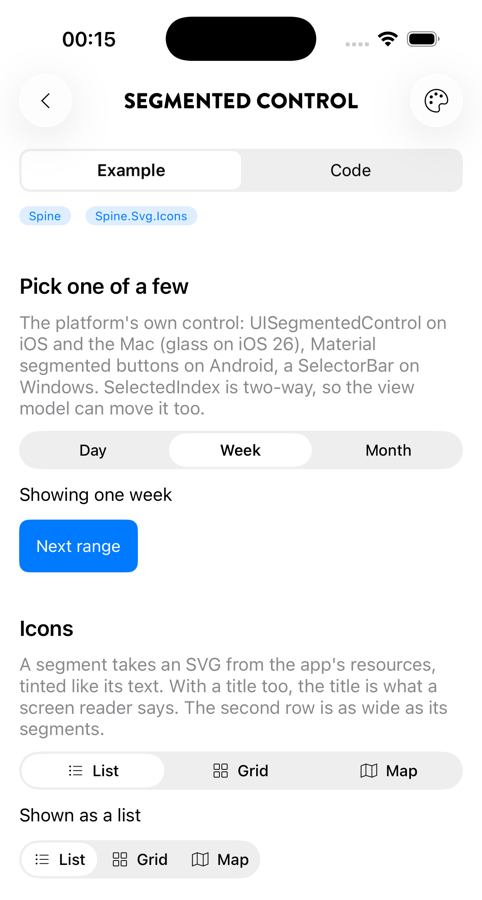
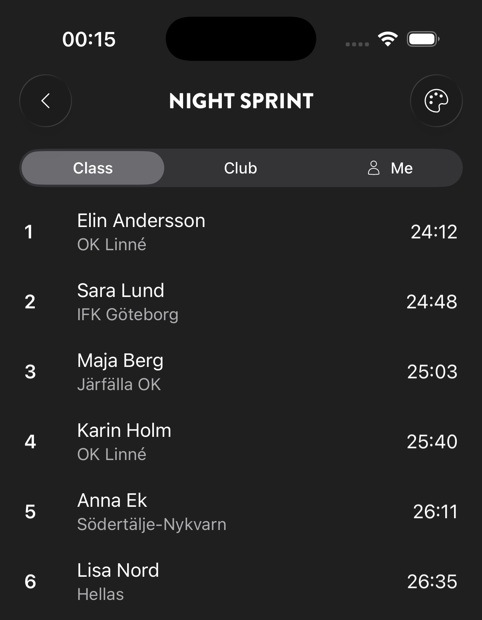
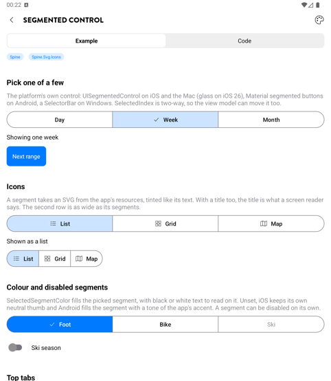

# Segmented control and top tabs

`SegmentedControl` is a row of mutually exclusive choices, drawn by the platform. `TopTabs` puts one over the content of the picked tab, for in-page sections such as Class / Club / Me. Both are in the core package (`Plugin.Maui.Spine.Presentation`) and are registered by `UseSpine()`.

| Platform | Building block |
|---|---|
| iOS / iPadOS / Mac Catalyst | `UISegmentedControl` (glass on iOS 26, drawn by UIKit) |
| Android | Material 3 segmented buttons: a `MaterialButtonToggleGroup` of outlined buttons with a check mark on the picked one |
| Windows | `SelectorBar` |

<p align="center">
  
  
</p>
<p align="center"><sub>Segmented controls on iOS 26; top tabs over a results list in the dark theme</sub></p>

<p align="center">
  
</p>
<p align="center"><sub>Android: Material 3 segmented buttons in the app's accent</sub></p>

## SegmentedControl

```xml
<SegmentedControl SelectedIndex="{Binding Range}">
    <Segment Title="Day" />
    <Segment Title="Week" />
    <Segment Title="Month" />
</SegmentedControl>
```

| Property | Meaning |
|---|---|
| `Segments` | The choices (the content property). Changing the list or a segment updates the native control in place. |
| `SelectedIndex` | The picked segment, two-way; `-1` for none. Default `0`. |
| `SelectedSegmentColor` | The fill of the picked segment, with black or white text to read on it. See [Colour](#colour). |
| `SelectionChanged` | Raised with the old and new index, by a tap or from code. |

A `Segment` has `Title`, `Svg` (an SVG resource name, as everywhere in Spine) and `IsEnabled`. Segments are logical children of the control, so they bind against its binding context:

```xml
<SegmentedControl SelectedIndex="{Binding View}">
    <Segment Title="List" Svg="list.svg" />
    <Segment Title="Grid" Svg="grid.svg" />
    <Segment Title="Map" Svg="map.svg" IsEnabled="{Binding HasLocation}" />
</SegmentedControl>
```

### Width

With `HorizontalOptions="Fill"` (the default in a stack) the segments share the width equally. With `Start`, `Center` or `End` the control is as wide as its widest segment times their number, on every platform.

### Icons

The SVG is tinted like the title: grey when unpicked and disabled, the picked colour when picked.

- **iOS and the Mac:** a `UISegmentedControl` segment shows either a title or an image. A segment with both gets them drawn into one image, which UIKit tints like a title. Its title becomes the image's accessibility label, so VoiceOver still reads the word.
- **Android:** the icon sits before the title. A picked segment without an icon of its own shows a check mark, as Material 3 does.
- **Windows:** an `ImageIcon` beside the text.

An icon-only segment (`Svg` without `Title`) has nothing for a screen reader to say. Give it a `Title` too, or use text.

### Colour

| | `SelectedSegmentColor` unset | `SelectedSegmentColor` set |
|---|---|---|
| iOS / Mac | UIKit's own neutral thumb | The thumb in that colour, the text black or white |
| Android | A tone of the app's accent (`IThemeService.Accent`, or the `Primary` resource), the Material 3 tonal container | The segment filled with that colour, the text black or white |
| Windows | The system accent on the selection pill | Not applied |

The control repaints when the theme or the accent changes. To follow the accent on iOS too, bind the colour to it:

```xml
<SegmentedControl SelectedSegmentColor="{DynamicResource Accent}" ... />
```

### Haptics

A segment picked by the user plays `SpineOptions.Haptics.TabSwitch`, which is off unless the app sets it. A change from code plays nothing.

## TopTabs

```xml
<TopTabs SelectedIndex="{Binding Section}">
    <TopTab Title="Class">
        <CollectionView ItemsSource="{Binding ClassResults}" />
    </TopTab>
    <TopTab Title="Club">
        <CollectionView ItemsSource="{Binding ClubResults}" />
    </TopTab>
    <TopTab Title="Me" Svg="user.svg">
        <TopTab.ContentTemplate>
            <DataTemplate>
                <views:MyResults />
            </DataTemplate>
        </TopTab.ContentTemplate>
    </TopTab>
</TopTabs>
```

- **Lazy:** a tab's content is added to the page the first time the tab is picked, so its handlers and native views are not created before then. With `ContentTemplate` the view itself is not built until then either; use it for heavy tabs.
- **Kept:** a tab once shown stays in the page, hidden while another is picked, so a list keeps its scroll position and a form its input.
- **Header bar:** unless the page sets `HeaderBar.ScrollSource` itself, `TopTabs` points it at the first `ScrollView` or `CollectionView` of the tab showing, so a large title or a scroll edge follows the visible list. A tab's list built after the page was set up gets the page's `ScrollInset`, as the page's first list does.
- `SelectedSegmentColor` and `BarMargin` (default 16 at the sides, 8 above and below) style the bar; `SelectionChanged` is raised like the control's.

`TopTabs` is a plain composition of a `SegmentedControl` and the tab contents. Switching is instant, as it is between segments on iOS; there is no swipe between tabs yet.

## Platform notes

- **Accessibility:** each platform's own: UIKit's for `UISegmentedControl`; on Android every segment is a checkable button in a single-selection group; `SelectorBar`'s automation peers on Windows. An icon segment is announced by its `Title`.
- **Right to left:** the segments follow the view's `FlowDirection` on every platform, and on Apple the icon of a segment with a title moves to the trailing side.
- **Dynamic Type:** UIKit draws segment titles at a fixed size; a segment with an icon and a title uses the same size.
