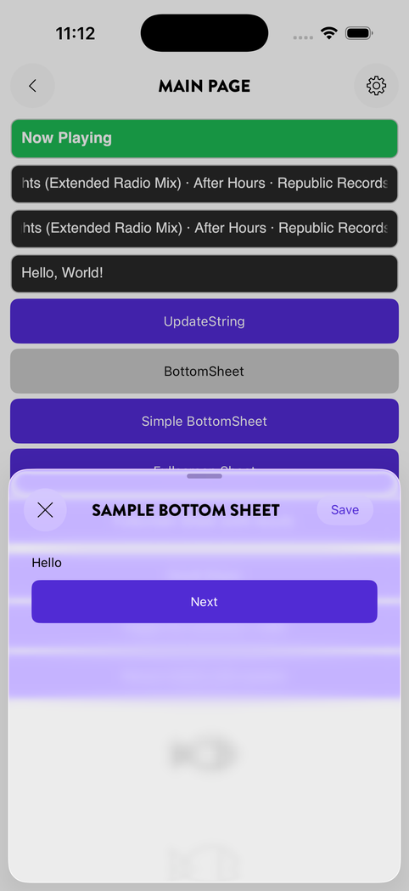
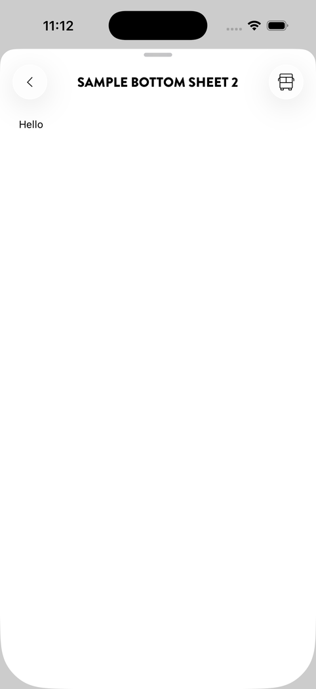
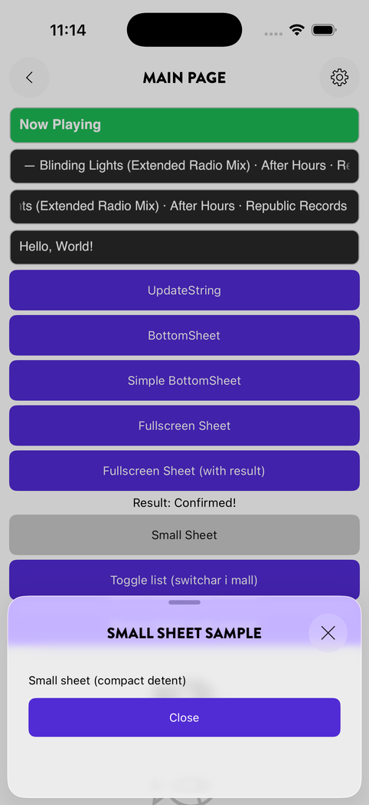
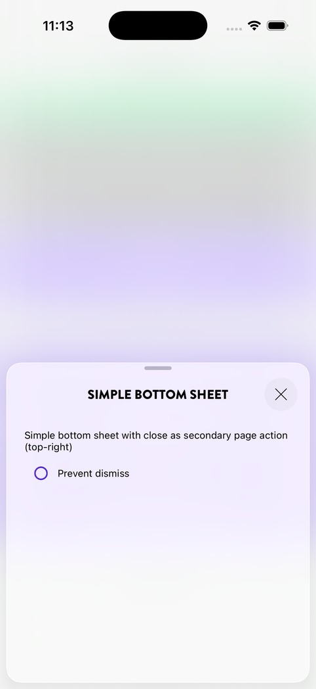
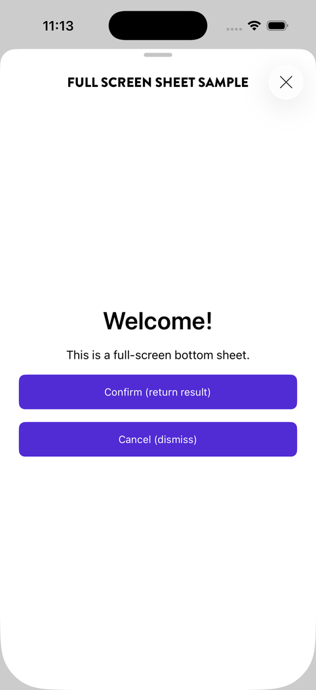
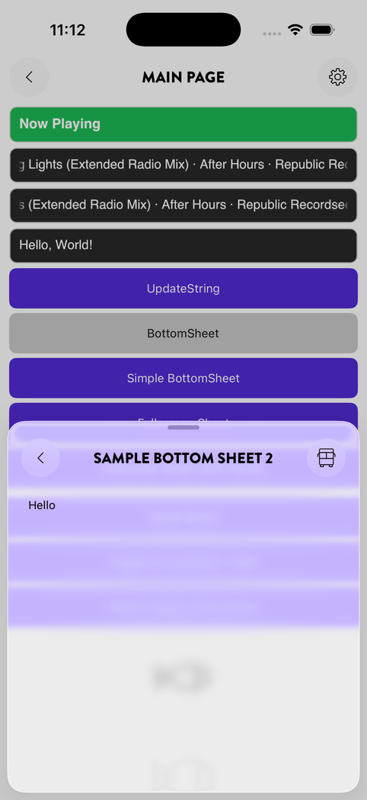

# Sheets (Bottom Sheets)

A **sheet** is a page presented as a bottom-sheet modal on top of the current content. Sheets support configurable snap points (detents), background overlays, dismiss guards, and their own navigation stack.

<p align="center">
  
  
  
</p>
<p align="center"><sub>Detents: medium, full screen, and a compact sheet, all from the sample app on iOS</sub></p>
<p align="center">
  
  
  
</p>
<p align="center"><sub>Blur overlay, a full-screen sheet, and a navigation stack inside a sheet</sub></p>

---

## Declaring a sheet page

Apply `[NavigableSheet]` to the code-behind class:

```csharp
namespace MyApp.Pages;

[NavigableSheet(
    Title = "Options",
    BackgroundPageOverlay = BackgroundPageOverlay.Dimmed,
    AllowedDetents = [SheetDetent.Medium, SheetDetent.FullScreen])]
public partial class OptionsPage { public OptionsPage() => InitializeComponent(); }
```

### Attribute properties

| Property | Type | Default | Description |
|---|---|---|---|
| `Title` | `string` | `""` | Text shown in the sheet's header bar |
| `Lifetime` | `ServiceLifetime` | `Transient` | `Transient` or `Singleton` |
| `BackgroundPageOverlay` | `BackgroundPageOverlay` | `Dimmed` | Visual treatment behind the open sheet |
| `AllowedDetents` | `string[]` | `[]` | Snap points the sheet can be dragged to |
| `InitialDetent` | `string` | first detent | Snap point the sheet opens at |
| `IsHeaderBarVisible` | `bool` | `true` | Show/hide the in-sheet header bar |
| `IsBackButtonVisible` | `bool` | `true` | Show/hide the back/close button |
| `TitleAlignment` | `TitleAlignment` | `Center` | `Left` or `Center` |
| `SafeAreaEdges` | `SafeAreaEdges` | `All` | Which edges Spine pads for system bars. Exclude an edge to render edge-to-edge behind it — use `ViewModelBase.SafeAreaInsets` to offset content manually |

---

## Background overlays

`BackgroundPageOverlay` controls what the user sees behind the open sheet:

| Value | Effect |
|---|---|
| `None` | The background page is fully visible, no treatment applied |
| `Dimmed` | A semi-transparent dark scrim covers the background page |
| `Blurred` | The background page is blurred (availability depends on platform) |

```csharp
[NavigableSheet(BackgroundPageOverlay = BackgroundPageOverlay.Blurred)]
public partial class QuickPickPage { public QuickPickPage() => InitializeComponent(); }
```

---

## Detents (snap points)

Detents define the heights the sheet can snap to. Use the named `SheetDetent` constants as string values in the attribute:

| Constant | Height |
|---|---|
| `SheetDetent.Compact` | ~25% of container |
| `SheetDetent.Medium` | ~50% of container |
| `SheetDetent.Expanded` | ~85% of container |
| `SheetDetent.FullScreen` | 100% of container |

You can also specify:
- A percentage string: `"75%"`
- An absolute pixel string: `"300px"`

### Examples

```csharp
// Single detent — sheet opens and stays at 50%
[NavigableSheet(AllowedDetents = [SheetDetent.Medium])]

// Two detents — user can drag between medium and fullscreen
[NavigableSheet(AllowedDetents = [SheetDetent.Medium, SheetDetent.FullScreen])]

// Custom percentage
[NavigableSheet(AllowedDetents = [SheetDetent.Medium, SheetDetent.FullScreen, "75%"])]

// Small sheet at 25%
[NavigableSheet(AllowedDetents = [SheetDetent.Compact])]

// Open at medium but allow dragging to fullscreen
[NavigableSheet(
    InitialDetent = SheetDetent.Medium,
    AllowedDetents = [SheetDetent.Medium, SheetDetent.FullScreen])]
```

---

## Opening a sheet

Use the same `NavigateToAsync` API as for region pages — Spine detects the `[NavigableSheet]` attribute and presents it as a sheet automatically:

```csharp
[RelayCommand]
private async Task ShowOptions() => await _navigation.NavigateToAsync<OptionsPage>();
```

---

## Nested sheets (navigation inside a sheet)

Sheets support their own navigation stack. You can push another sheet (or region page) on top:

```csharp
// Inside a sheet's ViewModel
[RelayCommand]
private async Task ShowNextStep() => await _navigation.NavigateToAsync<NextStepPage>();
```

---

## Dismiss guard

Override `OnCloseRequestedAsync` in the ViewModel to intercept or cancel sheet dismissal:

```csharp
public override async Task<bool> OnCloseRequestedAsync()
{
    if (_hasUnsavedChanges)
    {
        bool confirmed = await Shell.Current.DisplayAlert("Discard?", "Changes will be lost.", "Discard", "Keep");
        return confirmed;
    }
    return true;
}
```

Return `false` to prevent dismissal; `true` to allow it.

---

## Full lifecycle hooks

```csharp
public partial class OptionsPageViewModel : ViewModelBase
{
    public override Task OnAppearingAsync(NavigationDirection navigationDirection)
    {
        // Called when the sheet becomes visible
        return base.OnAppearingAsync(navigationDirection);
    }

    public override Task OnDisappearingAsync(NavigationDirection navigationDirection)
    {
        // Called just before the sheet closes
        return base.OnDisappearingAsync(navigationDirection);
    }

    public override Task OnDismissedAsync()
    {
        // Called when the sheet is dismissed without an explicit result
        return base.OnDismissedAsync();
    }

    public override Task OnResumedAsync()
    {
        // Called when the app comes back to the foreground while the sheet is open.
        // The page under the sheet is called too.
        return base.OnResumedAsync();
    }
}
```

---

## Singleton sheets

A singleton sheet retains its ViewModel state and XAML content between presentations:

```csharp
[NavigableSheet(
    Title = "Simple sheet",
    BackgroundPageOverlay = BackgroundPageOverlay.Blurred,
    Lifetime = ServiceLifetime.Singleton)]
public partial class SimpleBottomSheetPage { public SimpleBottomSheetPage() => InitializeComponent(); }
```
