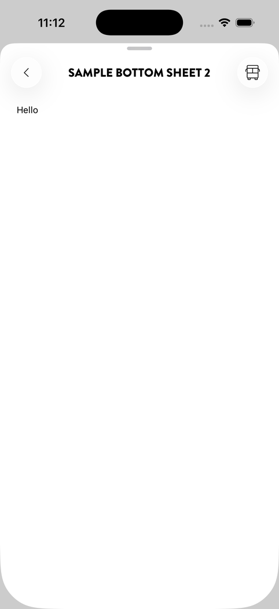
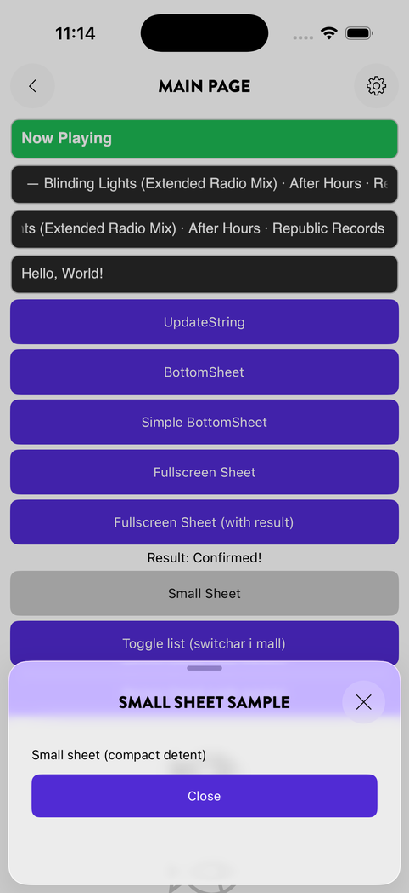
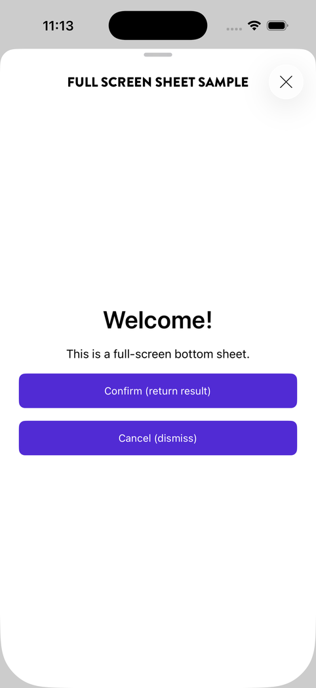
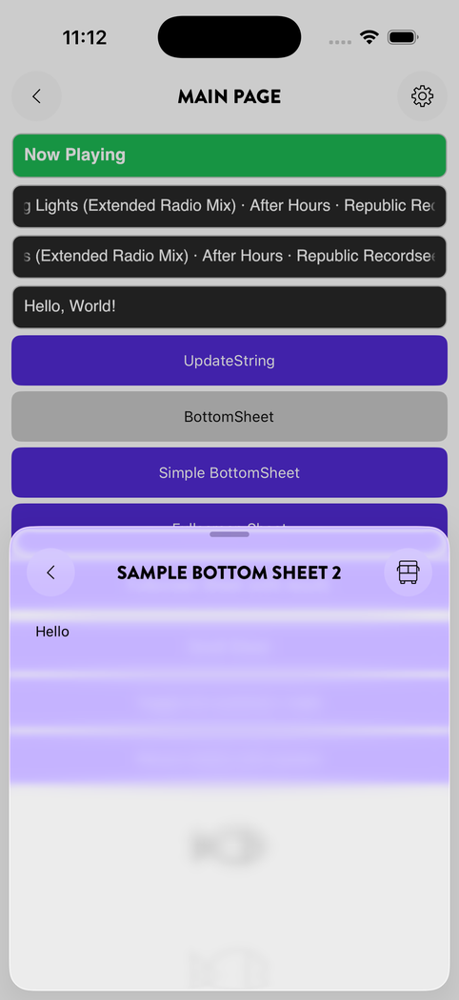

# Sheets (Bottom Sheets)

A **sheet** is a page presented as a bottom-sheet modal on top of the current content. Sheets support configurable snap points (detents), background overlays, dismiss guards, and their own navigation stack.

<p align="center">
  
  
  
</p>
<p align="center"><sub>Detents: medium, full screen, and a compact sheet, all from the sample app on iOS</sub></p>
<p align="center">
  
  
  
</p>
<p align="center"><sub>Blur overlay, a full-screen sheet, and a navigation stack inside a sheet</sub></p>

---

## Declaring a sheet page

Apply `[NavigableSheet]` to the code-behind class:

```csharp
namespace MyApp.Pages;

[NavigableSheet(
    Title = "Options",
    BackgroundPageOverlay = BackgroundPageOverlay.Dimmed,
    AllowedDetents = [SheetDetent.Medium, SheetDetent.FullScreen])]
public partial class OptionsPage { public OptionsPage() => InitializeComponent(); }
```

### Attribute properties

| Property | Type | Default | Description |
|---|---|---|---|
| `Title` | `string` | `""` | Text shown in the sheet's header bar |
| `Lifetime` | `ServiceLifetime` | `Transient` | `Transient` or `Singleton` |
| `BackgroundPageOverlay` | `BackgroundPageOverlay` | `Dimmed` | Visual treatment behind the open sheet |
| `AllowedDetents` | `string[]` | `[]` | Snap points the sheet can be dragged to |
| `InitialDetent` | `string` | first detent | Snap point the sheet opens at |
| `IsHeaderBarVisible` | `bool` | `true` | Show/hide the in-sheet header bar |
| `IsBackButtonVisible` | `bool` | `true` | Show/hide the back/close button |
| `TitleAlignment` | `TitleAlignment` | `Center` | `Left` or `Center` |
| `SafeAreaEdges` | `SafeAreaEdges` | `All` | Which edges Spine pads for system bars. Exclude an edge to render edge-to-edge behind it — use `ViewModelBase.SafeAreaInsets` to offset content manually |
| `KeyboardAvoidance` | `bool` | `true` | The content and footer end above the on-screen keyboard while it is up. Turn it off for a page that handles the keyboard itself. See [The on-screen keyboard](regions.md#the-on-screen-keyboard) |

---

## Background overlays

`BackgroundPageOverlay` controls what the user sees behind the open sheet:

| Value | Effect |
|---|---|
| `None` | The background page is fully visible, no treatment applied |
| `Dimmed` | A semi-transparent dark scrim covers the background page |
| `Blurred` | The background page is blurred with the [`BlurThin`](materials.md) material |

```csharp
[NavigableSheet(BackgroundPageOverlay = BackgroundPageOverlay.Blurred)]
public partial class QuickPickPage { public QuickPickPage() => InitializeComponent(); }
```

`Blurred` is the same material on every platform, drawn by the [Material](materials.md) implementation: a blur at intensity 0.55 with a little of the theme's surface over it. It follows the sheet. It fades in as the sheet slides up and out as it slides away. While the sheet is dragged down it weakens with it, and it comes back if the sheet is let go. It is equally strong at every detent.

| Platform | How |
|---|---|
| iOS / Mac Catalyst | A system material over the page, its strength following the sheet's position frame by frame |
| Android 12+ | Spine's GPU blur in the page's own window (the sheet's dialog is a window of its own), following the sheet's slide |
| Android before 12 | The material's stand-in: the theme's surface at 72 %, since nothing behind a view can be blurred there |
| Windows | Acrylic, faded in and out with the sheet; the opaque fallback where transparency effects are off |

With Reduce Transparency on (iOS, Mac Catalyst) the system material turns opaque by itself.

---

## Detents (snap points)

Detents define the heights the sheet can snap to. Use the named `SheetDetent` constants as string values in the attribute:

| Constant | Height |
|---|---|
| `SheetDetent.Compact` | ~25% of container |
| `SheetDetent.Medium` | ~50% of container |
| `SheetDetent.Expanded` | ~85% of container |
| `SheetDetent.FullScreen` | 100% of container |

You can also specify:
- A percentage string: `"75%"`
- An absolute pixel string: `"300px"`

`options.Haptics.SheetDetent = Haptic.Selection` plays a haptic when the user drags a sheet to another detent (iOS and Android); a sheet that springs back, or moves from code, stays silent. See [Haptics](haptics.md#tabs-and-sheets).

### Examples

```csharp
// Single detent — sheet opens and stays at 50%
[NavigableSheet(AllowedDetents = [SheetDetent.Medium])]

// Two detents — user can drag between medium and fullscreen
[NavigableSheet(AllowedDetents = [SheetDetent.Medium, SheetDetent.FullScreen])]

// Custom percentage
[NavigableSheet(AllowedDetents = [SheetDetent.Medium, SheetDetent.FullScreen, "75%"])]

// Small sheet at 25%
[NavigableSheet(AllowedDetents = [SheetDetent.Compact])]

// Open at medium but allow dragging to fullscreen
[NavigableSheet(
    InitialDetent = SheetDetent.Medium,
    AllowedDetents = [SheetDetent.Medium, SheetDetent.FullScreen])]
```

### Sizes chosen per navigation

The attribute fixes a sheet's sizes when the app is built. When the caller should choose them, for example a
picker that opens small for a few items and full screen for many, implement `ISheetDetentsProvider` on the
sheet's view model. Spine asks it after the view model has received its navigation parameter, so the choice can
come in with the parameter; `null` keeps the attribute's value.

```csharp
public partial class PickerSheetViewModel : ViewModelBase,
    IReceivesNavigationParameter<PickerOptions>, ISheetDetentsProvider
{
    public IReadOnlyList<string>? AllowedDetents { get; private set; }
    public string? InitialDetent => null;

    public Task OnNavigationParameterAsync(PickerOptions options)
    {
        AllowedDetents = options.Items.Count > 5
            ? [SheetDetent.FullScreen]
            : [SheetDetent.Medium, SheetDetent.FullScreen];
        return Task.CompletedTask;
    }
}
```

`Plugin.Maui.Spine.Scanner`'s scan sheet uses it for `BarcodeScanOptions.Detents`.

---

## Layout inside a sheet

### The top: the sheet's own buttons are already cleared

The sheet's grabber, its close/back button and its page actions sit in a row at the top of the sheet,
and Spine keeps the page out of it: the content starts below the drag handle
(`HeaderBarConstants.SheetTopPadding`) and below a title row the height of the header bar
(`HeaderBarConstants.BarHeight`, 54 points on iOS 26). Do not add
top padding to clear the close button (`Padding="16,36,16,16"` and the like) — padding you add is
spacing of your own, on top of that.

On Android a page with a floating header bar (`HeaderBar = HeaderBarMode.Overlay`) and `SafeAreaEdges = None`
runs to the sheet's edges, as a camera does: the drag handle is drawn over its top, and its bottom reaches the
screen's edge under the navigation bar. The header bar still sits below the handle. Every other page ends one
navigation bar above the screen's edge.

### Buttons: a checkmark and an X in the header, the footer for a primary action

- **Confirming or cancelling the sheet** (save, done, cancel) is a page action in the sheet's header bar,
  never a button stack at the bottom of the sheet, so it is in the same place at every detent. Give it a
  role rather than text: a sheet confirms with a **checkmark** and cancels with an **X**, as the iOS 26
  Human Interface Guidelines ask, and Spine draws the same on Android. The checkmark is prominent: glass tinted
  with the accent on iOS 26, a filled accent circle elsewhere. The text you pass is what a screen
  reader says; without one it says the localised Done or Cancel.

  ```csharp
  [PageAction("Cancel", Role = PageActionRole.Cancel)]   // an X on the left, in place of the close button
  [RelayCommand] private Task Cancel() => _navigation.CloseAsync();

  [PageAction("Save", Role = PageActionRole.Confirm)]    // a checkmark on the right
  [RelayCommand] private Task Save() => _navigation.ReturnAsync(_draft);
  ```

  A sheet with nothing to cancel needs no Cancel: Spine's own X closes it. Use a text button only for an
  action with no standard icon.

- **The sheet's own primary action** — *Log in* on a login sheet, *Continue* in a flow, *Pay* — goes in
  `SpinePage.Footer`:

  ```xml
  <SpinePage …>
      <ScrollView>
          <VerticalStackLayout Padding="20,0,20,16" Spacing="12">
              <Entry Text="{Binding Email}" Placeholder="Email" />
              <Entry Text="{Binding Password}" IsPassword="True" Placeholder="Password" />
          </VerticalStackLayout>
      </ScrollView>

      <SpinePage.Footer>
          <Button Text="Log in" Command="{Binding LogInCommand}" Margin="20,12" />
      </SpinePage.Footer>
  </SpinePage>
  ```

The footer is outside the page's scrolling content and pinned to the bottom of the *visible* sheet: at
Medium it sits at the Medium edge, and while the user drags between detents it follows the sheet
frame by frame. The content above it ends where the footer begins, so a scrolling page can reach its
last line at every detent. The footer gets the page's `BindingContext`.

How the visible height is found differs per platform, with the same result:

| Platform | How the sheet changes size | What Spine does |
|---|---|---|
| iOS | `UISheetPresentationController` resizes the sheet's view on every frame of a drag | Nothing: the page is laid out against the visible height |
| Android | `BottomSheetBehavior` keeps the sheet at full height and slides it down | Reads how far the sheet hangs below the screen in `onSlide` and lays the page out above that |
| Windows | The sheet host animates its own height | Nothing, as on iOS |

---

## Opening a sheet

Use the same `NavigateToAsync` API as for region pages — Spine detects the `[NavigableSheet]` attribute and presents it as a sheet automatically:

```csharp
[RelayCommand]
private async Task ShowOptions() => await _navigation.NavigateToAsync<OptionsPage>();
```

---

## Nested sheets (navigation inside a sheet)

Sheets support their own navigation stack. You can push another sheet (or region page) on top:

```csharp
// Inside a sheet's ViewModel
[RelayCommand]
private async Task ShowNextStep() => await _navigation.NavigateToAsync<NextStepPage>();
```

---

## Dismiss guard

Override `OnCloseRequestedAsync` in the ViewModel to intercept or cancel sheet dismissal:

```csharp
public override async Task<bool> OnCloseRequestedAsync()
{
    if (_hasUnsavedChanges)
    {
        bool confirmed = await Shell.Current.DisplayAlert("Discard?", "Changes will be lost.", "Discard", "Keep");
        return confirmed;
    }
    return true;
}
```

Return `false` to prevent dismissal; `true` to allow it.

With `options.Haptics.DismissBlocked = Haptic.Warning`, a guard that refuses at once (`Task.FromResult(false)`) plays a warning haptic on iOS and Android. A guard that awaits a prompt, like the one above, plays nothing. See [Haptics](haptics.md#tabs-and-sheets).

---

## Full lifecycle hooks

```csharp
public partial class OptionsPageViewModel : ViewModelBase
{
    public override Task OnAppearingAsync(NavigationDirection navigationDirection)
    {
        // Called when the sheet becomes visible
        return base.OnAppearingAsync(navigationDirection);
    }

    public override Task OnDisappearingAsync(NavigationDirection navigationDirection)
    {
        // Called just before the sheet closes
        return base.OnDisappearingAsync(navigationDirection);
    }

    public override Task OnDismissedAsync()
    {
        // Called when the sheet is dismissed without an explicit result
        return base.OnDismissedAsync();
    }

    public override Task OnResumedAsync()
    {
        // Called when the app comes back to the foreground while the sheet is open.
        // The page under the sheet is called too.
        return base.OnResumedAsync();
    }
}
```

---

## Singleton sheets

A singleton sheet retains its ViewModel state and XAML content between presentations:

```csharp
[NavigableSheet(
    Title = "Simple sheet",
    BackgroundPageOverlay = BackgroundPageOverlay.Blurred,
    Lifetime = ServiceLifetime.Singleton)]
public partial class SimpleBottomSheetPage { public SimpleBottomSheetPage() => InitializeComponent(); }
```
