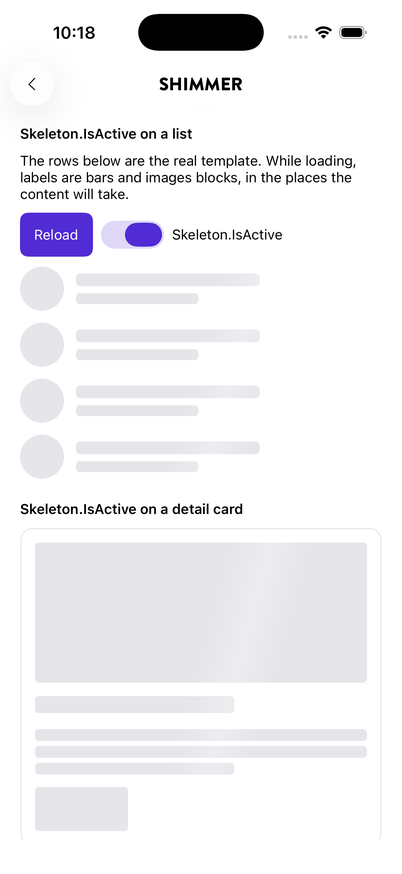
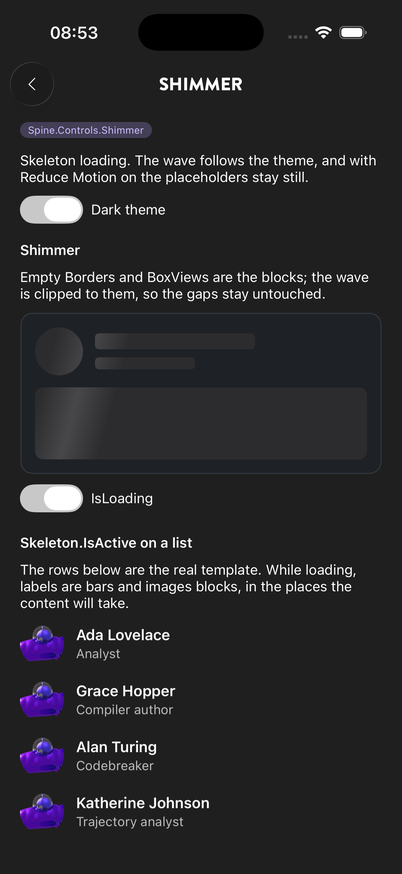

# Shimmer and Skeleton

```bash
dotnet add package Plugin.Maui.Spine.Controls.Shimmer
```

Skeleton loading for a page whose data is on its way. Two ways in, one drawing underneath:

- **`Shimmer`** shows a placeholder layout you draw yourself and sweeps a soft band across it.
- **`Skeleton.IsActive`** turns the real layout into its own skeleton: its labels become bars and its images blocks, in the places the content will take, so nothing jumps when the data arrives.

<p align="center">
  
  
</p>
<p align="center"><sub>Skeleton layouts in the light theme; a Shimmer card and a skeleton list in the dark theme</sub></p>

The band is clipped to the placeholder blocks, so only the blocks light up and the gaps stay untouched. Placeholder and band colours follow the light/dark theme and repaint on a runtime switch. With Reduce Motion on (iOS, Mac Catalyst), Remove animations (Android) or Animation effects off (Windows), the placeholders stay and the band does not run.

No registration is needed. The controls register their default text (the screen-reader announcement "Loading", key `Spine.Shimmer.Loading`) the first time they are used; an app overrides the key in its own strings (see [Strings](strings.md)).

---

## Platforms

| Platform | Status |
|---|---|
| iOS | ✅ Supported |
| Android | ✅ Supported |
| Mac Catalyst | ✅ Supported, built but exercised less than iOS |
| Windows (WinUI 3) | ✅ Compiles in CI; not run on a device yet |

Plain MAUI drawing (`GraphicsView`, the Animation API); no native views, no SkiaSharp.

---

## Shimmer

```xml
<Shimmer IsLoading="{Binding IsLoading}">
    <Grid ColumnDefinitions="48,*" RowDefinitions="Auto,Auto" ColumnSpacing="12" RowSpacing="8">
        <Border Grid.RowSpan="2" StrokeThickness="0" WidthRequest="48" HeightRequest="48" StrokeShape="Ellipse" />
        <Border Grid.Column="1" StrokeThickness="0" HeightRequest="16" WidthRequest="160" HorizontalOptions="Start" />
        <Border Grid.Column="1" Grid.Row="1" StrokeThickness="0" HeightRequest="12" WidthRequest="100" HorizontalOptions="Start" />
    </Grid>
</Shimmer>
```

| Member | Purpose |
|---|---|
| `SkeletonContent` | The placeholder layout (the XAML content) |
| `IsLoading` | Runs the band while true; the placeholders show either way |
| `WaveWidth`, `WaveOpacity` | The band's width and strength for this shimmer (see below) |
| `StyleOptions` | A `ShimmerStyleOptions` for this shimmer |
| `RefreshPlaceholders()` | Scans the placeholders again, after changing a block's colour or shape from code |

**The blocks** are every `BoxView`, every `Border` without content and every childless element with a visible background. A block with no colour of its own (a `Border` without `BackgroundColor`, as above) is filled with the theme's placeholder colour; one with a colour keeps it. Corner radii come from a `RoundRectangle` or `Ellipse` stroke shape and `BoxView.CornerRadius`, and a `ScrollView`'s offset is taken into account. A skeleton with no blocks at all gets the band over its whole area.

Size changes anywhere in the skeleton and views added or removed are noticed on their own; the scan runs after the layout pass has finished, so a block sized by its parent is measured at its final size.

The real content is usually a sibling toggled by the same flag, because the shimmer clips to its own bounds (a card's shadow inside it would be cut).

---

## Skeleton.IsActive

```xml
<VerticalStackLayout Spacing="10" Skeleton.IsActive="{Binding IsLoading}">
    <Image Source="{Binding Photo}" HeightRequest="140" Aspect="AspectFill" />
    <Label Text="{Binding Name}" FontSize="20" />
    <Label Text="{Binding Bio}" MaxLines="3" LineBreakMode="TailTruncation" Skeleton.Lines="3" />
    <Button Text="Plan a trip" HorizontalOptions="Start" />
</VerticalStackLayout>
```

Set it on a layout (`VerticalStackLayout`, `Grid`, `FlexLayout`, …); on anything else it throws. While it is true:

- **Containers keep drawing**: layouts, and borders or content views with content. A card's background and outline stay.
- **Every other view is hidden and drawn as a block** in its place: a label as one bar per line, an image, button or entry as a rounded block. A view that is a `Border`'s only content (an avatar in a circle) takes the border's shape.
- The hidden views are also hidden from screen readers; the layout announces "Loading" instead, and taps on it are not passed to the hidden views.
- A nested layout with its own `Skeleton.IsActive` draws itself.

Switching it off shows the views again at once, in the places they held, and the blocks fade out over them (instantly with Reduce Motion).

### Views without data have no size

A label whose binding has not produced text is empty, and an image without a source is often zero-sized, so the skeleton would have nothing to draw and the page would jump when the data arrives. While the layout is a skeleton, Spine gives such views a minimum size, and only where the app did not set one itself:

| View | Reserved while active | Block drawn |
|---|---|---|
| `Label` without text | `Skeleton.Lines` lines (default 1) of `FontSize × 1.2` (or × `LineHeight`) | One bar per line; the last one 60 % of the width the label could take |
| `Label` with text | nothing | Bars over the text's own width and lines |
| `Image` without a size | Its `WidthRequest`/`HeightRequest`, otherwise a square of its width (at most 192) or 48 | The image's frame |
| Any view with `Skeleton.Height` | That height | The view's frame |

Per-view overrides:

| Attached property | Meaning |
|---|---|
| `Skeleton.Lines` | Bars for a label, and the lines of height it keeps while empty. Pair it with `MaxLines` so the loaded text cannot take more. |
| `Skeleton.Width` | Width of the block (a label's last bar). 0–1 is a fraction of the width the view could take, above 1 device-independent units. |
| `Skeleton.Height` | Height a view keeps while the layout is a skeleton. |

The reserved line height matches the platform's text within about a device-independent pixel on iOS and Android, so a loaded label does not visibly move.

### Lists

For a first page of a list, put `Skeleton.IsActive` on the layout that holds the rows and fill the source with as many empty rows as a page usually has; replace them with the real rows when they arrive:

```xml
<VerticalStackLayout Spacing="12"
                     Skeleton.IsActive="{Binding IsLoading}"
                     BindableLayout.ItemsSource="{Binding People}">
    <BindableLayout.ItemTemplate>
        <DataTemplate x:DataType="PersonRow">
            <Grid ColumnDefinitions="44,*" ColumnSpacing="12">
                <Border StrokeShape="Ellipse" StrokeThickness="0" WidthRequest="44" HeightRequest="44">
                    <Image Source="{Binding Photo}" Aspect="AspectFill" />
                </Border>
                <VerticalStackLayout Grid.Column="1" Spacing="2">
                    <Label Text="{Binding Name}" FontAttributes="Bold" />
                    <Label Text="{Binding Role}" Skeleton.Width="0.4" />
                </VerticalStackLayout>
            </Grid>
        </DataTemplate>
    </BindableLayout.ItemTemplate>
</VerticalStackLayout>
```

In a `CollectionView` the same idea applies per row: put it on the item template's root layout, bound to a flag every placeholder item carries (the sample shows the `BindableLayout` case only). All skeletons on screen read one clock, so a list of them sweeps as one.

### How it sits in the layout

The skeleton is drawn by one extra child added to the layout while active and removed afterwards. It measures to nothing and covers the whole layout; in a stack it hands back the spacing the stack puts before it, so the layout is exactly as tall as without it. Code that counts the layout's `Children` while it is active sees one more. In a `FlexLayout` that distributes space (`JustifyContent="SpaceBetween"` and similar) the extra child takes a share; put the attached property on a layout inside instead.

---

## Look

### Wave width and strength

`WaveWidth` and `WaveOpacity` are properties on `Shimmer` and attached properties on a skeleton layout, so the common tuning needs no options object:

```xml
<Shimmer IsLoading="{Binding IsLoading}" WaveWidth="0.4" WaveOpacity="0.25"> … </Shimmer>

<VerticalStackLayout Skeleton.IsActive="{Binding IsLoading}" Skeleton.WaveWidth="0.4" Skeleton.WaveOpacity="0.25"> … </VerticalStackLayout>
```

- **`WaveWidth`**: the width of the band as a fraction of the shimmer's (or skeleton layout's) own width, 0–1; 1 is as wide as the control. The band travels from fully off the left edge to fully off the right in `WaveDuration`, so a wider band also keeps each spot lit for longer. Default 0.22.
- **`WaveOpacity`**: the peak alpha at the centre of the band's gradient, 0–1; the edges fade to 0. Default 0.3.

Changing either repaints at once.

### ShimmerStyleOptions

| Property | Default | Notes |
|---|---|---|
| `PlaceholderColor` | light `#E5E5EA`, dark `#2C2C2E` | Fill of blocks without a colour of their own |
| `WaveColor` | light white, dark `#8E8E93` | Band colour |
| `WaveOpacity` | 0.3 | Peak alpha at the band's centre |
| `WaveWidth` | 0.22 | Fraction of the control's width |
| `WaveAngle` | 15 | Tilt in degrees; 0 is vertical |
| `WaveDuration` | 1.1 s | One sweep, off-canvas left to off-canvas right |
| `CornerRadius` | 4 | Blocks of a skeleton layout (bars are capped at half their height) |

Each value is taken from the first of these that sets it:

1. `WaveWidth` / `WaveOpacity` on the shimmer or skeleton layout;
2. the `StyleOptions` on the shimmer (or `Skeleton.StyleOptions` on the layout);
3. an application resource keyed `DefaultShimmerStyleOptions`;
4. the code defaults above, colours per theme.

Colours are nullable: a colour left unset on an instance comes from the resource, and one unset there from the theme, so an instance that changes only `WaveDuration` stays themed.

```xml
<Application.Resources>
    <ShimmerStyleOptions x:Key="DefaultShimmerStyleOptions" WaveDuration="0:0:1.4" PlaceholderColor="#DDE3EA" />
</Application.Resources>
```

The options object is resolved once per theme change (a cached copy against `SpineTheme.Version`); changing an options object's properties from code after it has been used takes effect at the next theme change. Assign a new object instead.

---

## Behaviour notes

- **Only while it can be seen.** The band runs while the control is loaded, visible and loading; it stops on `Unloaded`, `IsVisible = false` and when the handler goes away (the only teardown an abandoned Android window gives), so nothing ticks in the background.
- **~40 fps.** The band is slow and soft-edged; 40 fps is smooth for it and halves the invalidations of 60 fps while pages build content under it.
- **Cached drawing.** The clip path, the fill path and the gradient are built once and kept until the blocks or the style change.
- **Shapes are skipped.** A `StrokeShape` set by a `Style` is one shared instance for every border using that style; a size-changed handler on it would keep the page alive for the life of the app. Shapes have no frame of their own, so nothing is lost.
- **No gradient-brush BoxView.** A `BoxView` with an animated `LinearGradientBrush` renders as a solid black box on Android; the band is drawn on a `GraphicsView`.

---

## With TaskState (#302)

`Skeleton.IsActive` takes a plain `bool`, so it binds to whatever says "loading": today a view model flag, and a `TaskState`'s loading status once that exists (`Skeleton.IsActive="{Binding Competitions.IsLoading}"`). A `StateView` is expected to use it for its default loading state by showing the content template under `Skeleton.IsActive` instead of a spinner; see the design note on #302.
