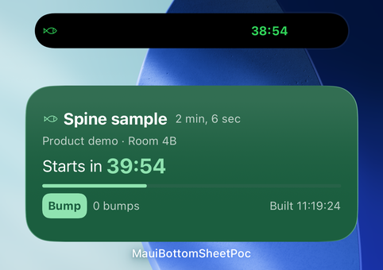
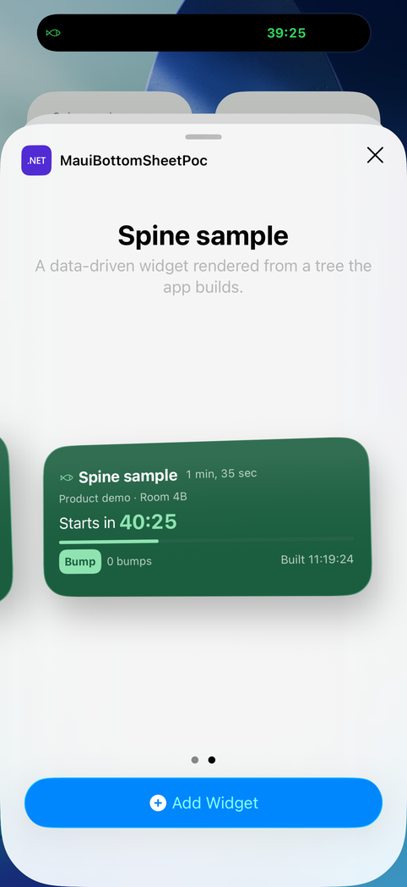
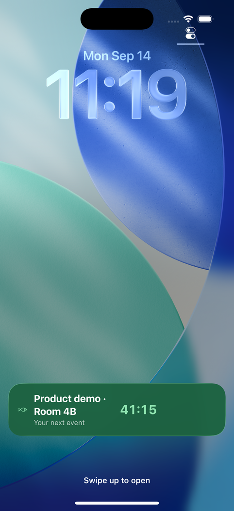
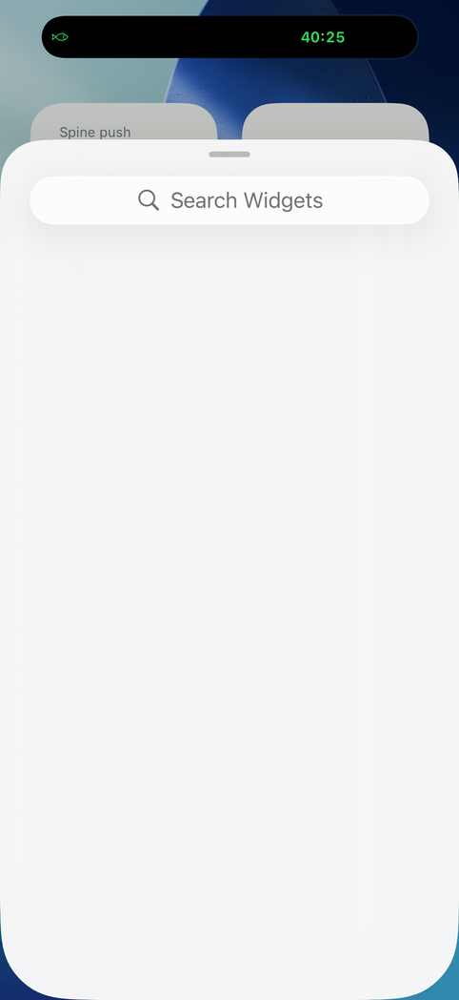

# Widgets and Live Activities

```bash
dotnet add package Plugin.Maui.Spine.Widgets
```

Spine widgets let an app build a **home-screen widget** and a **Live Activity** from C#, with no Xcode project, no app-specific Swift and no Android platform code. The app builds a small view tree, Spine serializes it, and a generic native renderer draws it — with SwiftUI in a widget extension on iOS, with `RemoteViews` in the app's own process on Android.

The reasoning behind the design — why C# cannot run inside a WidgetKit extension, and why a serialized tree is the answer — is in the [Spine.Widgets proposal](../proposals/spine-widgets.md).

<p align="center">
  
  
</p>
<p align="center"><sub>The sample widget, built from a C# tree: a timer, a progress bar and a button that runs without opening the app</sub></p>

---

## Platforms

| Platform | Home-screen widget | Live Activity |
|---|---|---|
| iOS 17+ | ✅ WidgetKit extension built at compile time | ✅ Lock Screen and Dynamic Island (all regions) |
| Mac Catalyst | ❌ Not built: the extension step runs for iOS only, and the services are no-ops | ⚠️ Nothing of its own; macOS 26 mirrors an iPhone activity by itself |
| Android 5+ | ✅ `AppWidgetProvider` receivers drawn from the tree with `RemoteViews`; size- and theme-adaptive from Android 12 | ✅ Android 16+ as a **Live Update** (promoted notification); `StartAsync` returns `null` below |
| Windows | ❌ Planned, MSIX-packaged apps only | — |

On every platform without an implementation the services are still injectable and every call is a no-op; `IWidgetService.IsSupported` says which you are on.

### What you can build

| Surface | Where it shows | Built from |
|---|---|---|
| **Home-screen widget** | iOS home screen and Today view; Android launcher | A [timeline](#the-timeline) of trees, one per family or one [adaptive](#adaptive-trees) tree |
| **Lock-screen accessory** | iOS Lock Screen: a circle, a rectangle, or the line above the clock | The same provider, with trees for the `Accessory…` families; see [Lock-screen widgets](#lock-screen-widgets) |
| **Live Activity** | iOS Lock Screen banner and the Dynamic Island (compact, expanded, minimal); Android 16 status-bar chip and promoted notification | A [`LiveActivityLayout`](#live-activities), updated by the app or by push |

What every one of them can show is the [tree vocabulary](#the-tree): stacks, text, system-drawn timers, SVG icons, stored pictures, a progress bar, and buttons that run C# without opening the app. What they cannot show — a chart, a custom font, a rotated or clipped shape — the app can still draw itself, as a picture; see [Pictures drawn by the app](#pictures-drawn-by-the-app).

### Families

`Families` on the `<SpineWidget>` item is what the widget offers in the gallery; `WidgetFamily` in C# is how a tree is picked for it.

| Family | iOS | Android |
|---|---|---|
| `Small` | Home screen, a square | 2×2 cells |
| `Medium` | Home screen, two squares wide | 4×2 cells |
| `Large` | Home screen, four squares | 4×4 cells |
| `ExtraLarge` | iPad only | 5×4 cells |
| `AccessoryCircular` | Lock Screen, a small circle | Ignored |
| `AccessoryRectangular` | Lock Screen, a two- or three-line rectangle | Ignored |
| `AccessoryInline` | Lock Screen, one line of text beside the date above the clock | Ignored |

On Android the smallest declared family is the widget's minimum size and the largest its maximum; from Android 12 the launcher picks the tree for the size the user resized to. A kind that declares **only** accessory families still appears in the Android picker, as a 2×2 widget drawing its first tree — so declare a lock-screen-only kind knowing that, or give it a home-screen tree too.

---

## Setup

### 1. Reference and register

```csharp
builder
    .UseSpine(options => options.AddAssembly(typeof(MauiProgram).Assembly))
    .UseSpineWidgets();
```

`UseSpineWidgets` registers `IWidgetService` and `ILiveActivityService`, discovers `[Widget]` providers in the assemblies `UseSpine` was given, and routes the widget's open URL back into the app. Call it after `UseSpine`.

### 2. Declare each widget to the build

The native side is generated from MSBuild items, not from the attribute — the attribute is C#, and the widget has to exist in the app's bundle or manifest before any C# runs:

```xml
<ItemGroup>
  <SpineWidget Include="next-start"
               DisplayName="Next start"
               Description="The countdown to your next start."
               Families="Small,Medium" />
</ItemGroup>
```

| Metadata | Meaning |
|---|---|
| `Include` | The kind. Must match `[Widget("…")]` exactly; Spine logs a warning at startup for a kind with no provider. |
| `DisplayName` | The name in the widget gallery. Defaults to the kind. |
| `Description` | The gallery's subtitle. |
| `Families` | `Small`, `Medium`, `Large`, `ExtraLarge`, `AccessoryCircular`, `AccessoryRectangular`, `AccessoryInline`, separated by commas or semicolons. Defaults to `Small`. See [Families](#families). |

A WidgetKit bundle holds at most ten widgets and Spine reserves one for Live Activities, so nine `<SpineWidget>` items is the limit. Android has the same cap: the package carries nine fixed receivers and the build wires the items to them in declaration order.

On iOS the items become the widget extension; on Android they become manifest entries and the picker's metadata (see [Android](#android)). The properties below are iOS-only except `SpineWidgetsLiveActivities`, `SpineWidgetsBackgroundRefresh` and `SpineWidgetsEnabled`.

| Property | Default | Meaning |
|---|---|---|
| `SpineWidgetsAppGroup` | `group.$(ApplicationId)` | The App Group the app and the extension share. |
| `SpineWidgetsLiveActivities` | `true` | Whether the bundle includes the Live Activity and the app declares `NSSupportsLiveActivities`. On Android: whether the manifest gets the notification permissions a Live Update needs. |
| `SpineWidgetsFrequentUpdates` | `false` | Declares `NSSupportsLiveActivitiesFrequentUpdates`, which raises the push budget of Live Activities. |
| `SpineWidgetsBackgroundRefresh` | `true` | Adds `UIBackgroundModes: fetch` and the task identifier for [background runs](#background-runs); on Android, the alarm receiver. |
| `SpineWidgetsMinimumOSVersion` | `17.0` | Deployment target of the extension. |
| `SpineWidgetsExtensionName` | `SpineWidgets` | Bundle name of the appex. |
| `SpineWidgetsCodesignProvision` | *(empty)* | Names the extension's own provisioning profile. Empty means the installed profile whose App ID matches is used. |
| `SpineWidgetsEnabled` | `true` | Set to `false` to build the app without the extension. |
| `SpineWidgetsPush` | `false` | iOS 26's widget push: a server reloads the widgets through APNs without waking the app. **Builds the extension for iOS 26**, so on older iOS the app has no widgets. See [Reloading by push](#reloading-by-push). |

### 3. Give the app the App Group entitlement

The app and the extension talk through an App Group container, so the **app** must carry the entitlement. The extension's own is generated.

```xml
<!-- Platforms/iOS/Entitlements.plist -->
<key>com.apple.security.application-groups</key>
<array><string>group.com.companyname.myapp</string></array>
```

```xml
<PropertyGroup Condition="$([MSBuild]::GetTargetPlatformIdentifier('$(TargetFramework)')) == 'ios'">
  <CodesignEntitlements>Platforms\iOS\Entitlements.plist</CodesignEntitlements>
</PropertyGroup>
```

The build fails with a named error if the group is missing from that file. With no `CodesignEntitlements` at all the build falls back to a generated one that carries only the group.

A sample that uses `<ProjectReference>` rather than the NuGet package also has to import the targets explicitly:

```xml
<Import Project="..\..\src\Plugin.Maui.Spine.Widgets\build\Plugin.Maui.Spine.Widgets.targets" />
```

### 4. Register the extension in the developer portal, for device builds

The extension is a bundle of its own, with its own bundle id — `$(ApplicationId).$(SpineWidgetsExtensionName)` — so Apple wants a separate App ID and a separate profile for it. A device build needs four things, not two:

| | |
|---|---|
| App ID | the app's, with the capabilities the app uses |
| App ID | the extension's, `com.example.myapp.SpineWidgets` |
| App Group | one group, **enabled and assigned on both App IDs** |
| Profiles | one per App ID, each including the device |

Both App IDs need the group. The app alone is not enough: the extension carries the App Group entitlement too, and signing rejects an entitlement the profile does not grant. For the same reason a wildcard App ID cannot be used — wildcards cannot enable App Groups.

Spine copies the extension's profile into the `.appex` before signing. The .NET iOS SDK does not: it embeds a profile in the app bundle only, and an extension contributed through `AdditionalAppExtensions` gets signed without one. Point `SpineWidgetsCodesignProvision` at a profile by name when several match; otherwise the build takes the installed profile whose App ID matches, preferring the one that expires last.

Changing capabilities on an App ID invalidates every profile that includes it — the portal says so when you save. Regenerate and download them again, or the build picks up an invalid one.

### Build requirements

- **macOS with Xcode for iOS.** The extension and the bridge are compiled with `swiftc` during the iOS build (a few seconds); everything else is untouched. The Android build needs nothing beyond the SDK and runs on any host.
- **A real App Group in the provisioning profile** for device and TestFlight builds, on both App IDs — see [above](#4-register-the-extension-in-the-developer-portal-for-device-builds). Simulator builds sign ad hoc and need no identity — the targets set `CodesignKey=-` themselves when none is configured.
- Only iOS **inner** builds (those with a `RuntimeIdentifier`) run the native step. Design-time builds, other platforms and Windows hosts skip it entirely.
- **Release builds carry the widgets' debug symbols.** The extension and the bridge are compiled with debug info, stripped, and their dSYMs — `SpineWidgets.appex.dSYM` and `SpineWidgetBridge.framework.dSYM` — land beside the app's in the archive, so a crash in a widget is symbolicated like one in the app.

---

## Building a widget

A provider is a class with `[Widget]`. It is constructed through DI on every refresh, so inject services the way a view model does.

```csharp
[Widget("next-start")]
public sealed class NextStartWidget(IRaceService _races, IWidgetService _widgets) : IWidgetProvider
{
    public async Task<WidgetTimeline> BuildTimelineAsync(WidgetContext context, CancellationToken cancellationToken)
    {
        var start = await _races.NextStartAsync(cancellationToken);

        return WidgetTimeline
            .Single(new Dictionary<WidgetFamily, WidgetNode>
            {
                [WidgetFamily.Small] = W.VStack(6,
                    W.Text("Next start").Caption().Secondary(),
                    W.Timer(start.Time).Title().Bold().Color(WidgetColor.Green)),

                [WidgetFamily.Medium] = W.VStack(6,
                    W.HStack(W.Icon("figure.run", WidgetColor.Green), W.Text(start.Event).Headline().Bold(), W.Spacer()),
                    W.Text(start.Class).Caption().Secondary(),
                    W.Timer(start.Time).Title().Bold()),
            })
            .Refresh(TimeSpan.FromMinutes(30))
            .OpenUrl(_widgets.LinkFor(context.Kind));
    }
}
```

### The tree

`W` builds every node; each call returns a node, so a tree reads the way it renders.

| Node | Renders as |
|---|---|
| `W.VStack` / `W.HStack` / `W.ZStack` | Stacks, with optional spacing in points |
| `W.Text(string)` | A run of text |
| `W.Timer(until)` | A countdown the **system** redraws every second |
| `W.Relative(date)` | Relative text ("3 min ago"), also system-drawn |
| `W.Icon(name, color)` | A monochrome SVG named after the symbol, tinted with the color (see [Icons](#icons)); an SF Symbol of that name is the fallback on iOS |
| `W.Image(assetId, height)` | A bitmap the app stored with `StoreAssetAsync` |
| `W.Progress(value, color)` | A linear bar, 0 to 1 |
| `W.Spacer()` / `W.Divider()` | Flexible space, separator |
| `W.Button(actionId, child)` | A tappable child that sends `actionId` to the provider (see [Buttons](#buttons)) |
| `W.Adaptive(fallback, trees)` | A different subtree per family inside one tree (see [Adaptive trees](#adaptive-trees)) |

Text-like nodes take fluent styling: `.Title()`, `.Headline()`, `.Body()`, `.Caption()`, `.Bold()`, `.Secondary()`, `.Color(…)`. Stacks take `.Padding(…)`, `.Background(…)` and `.CornerRadius(…)` (see [Backgrounds and boxes](#backgrounds-and-boxes)). Any node takes `.Pending()` (see [Buttons](#buttons)). Each call returns a new node, so a styled node can be reused.

`WidgetColor` is either one of the platform's semantic colors (`Primary`, `Secondary`, `Accent`, `Surface`, `OnAccent`, `Green`, `Red`, `Orange`, `Yellow`, `Blue`), which adapt to light and dark, or a fixed value from `WidgetColor.FromHex("#2E8B57")` (or `#AARRGGBB` with alpha) / `WidgetColor.From(mauiColor)`. Prefer semantic colors for anything but a brand accent — a fixed color is a fixed color in dark mode too.

How the renderers lay the tree out, so a design can be planned before it is run:

- **`VStack` aligns its children to the leading edge, `HStack` centers them vertically, `ZStack` centers them.** There is no alignment parameter; a `W.Spacer()` in a stack is how something is pushed to the far edge. The default spacing is 4 points; Android applies spacing from Android 12.
- **Text roles are the platform's type ramp**: `Title` is SwiftUI's `.title2` and 22 sp on Android, `Headline` `.headline` and 16 sp, `Body` `.body` and 14 sp, `Caption` `.caption` and 12 sp. Text follows the user's text size on both platforms; there is no point size and no custom font.
- **`W.Icon` has a fixed size**: 18 points square on iOS, 20 dp on Android, tinted with its color. For anything larger, use a picture.
- **`W.Image` keeps its aspect ratio.** With a `height` it is scaled to that height; without one it is scaled to fit the room it is offered. See [Images](#images).
- **The tree is the whole widget.** iOS gives it the system's content margins; Android pads it by 16 dp and centers it vertically. Nothing is drawn outside the tree except the [surface](#backgrounds-and-boxes).

### Backgrounds and boxes

A stack can carry a box — padding, a background color, rounded corners — which is what a card, a label or a rounded logo is built from. The sample widget's button is one:

```csharp
W.Button("bump", W.HStack(W.Text("Bump").Caption().Bold().Color(surface))
    .Background(mint).Padding(6).CornerRadius(8))
```

The surface under the whole tree is colored from the timeline, and for a Live Activity from the layout:

```csharp
WidgetTimeline.Single(tree).Background(WidgetColor.FromHex("#1B5E3F"));
new LiveActivityLayout { LockScreen = tree, Background = WidgetColor.FromHex("#1B5E3F") };
```

A widget's surface can also be a gradient, with a picture over it:

```csharp
WidgetTimeline.Single(tree)
    .Background(new WidgetGradient([green, mint], WidgetGradientDirection.Diagonal))
    .BackgroundImage("cover.png");   // stored with IWidgetService.StoreAssetAsync
```

The push sample's *Spine bild* widget is one, and its remote widget gets a gradient from the server.

An entry can carry a surface of its own, a `WidgetSurface`, which the platform switches to at the entry's date together with its tree — a holiday picture from midnight, another color once an event has started — without the app running:

```csharp
var timeline = new WidgetTimeline().Background(paper);             // every entry without its own
timeline.Add(today, Page(today));
timeline.Add(midsummerEve, Page(midsummerEve), new WidgetSurface(paper, "midsummer.png"));
timeline.Add(midsummerEve.AddDays(1), Page(midsummerEve.AddDays(1)));
```

`WidgetSurface` takes a color or a gradient, each with an optional picture, or a picture alone. The main sample's widget switches to a gradient of its own when its countdown reaches zero.

- **Only stacks take a box.** Put a text or an image in a `W.HStack` to give it one.
- **A stack with a background fills the width it is offered**, except inside a `W.HStack` or a button, where it wraps its content — the same on both platforms, so a label in a row stays a label.
- **A gradient replaces the color, and the other way round.** The picture goes over either, scaled to fill and cropped at the edges; the color or gradient shows through a transparent picture, and in its place until one is stored.
- **An entry's surface replaces the timeline's whole surface** — color, gradient and picture alike — for as long as the entry is shown. A `WidgetSurface` with only a picture draws it over the platform's widget background, not over the timeline's color, so repeat the color or gradient in it to keep them. An entry added without one, or with `null`, is drawn on the timeline's surface, so a timeline that never passes one looks as it always has. The entries of a remote source's document follow the same rule, over the surface that document's timeline gets.
- **Store an entry's picture before the timeline is written.** The platform switches to the entry while the app may not be running, so the picture has to be in the store already; until it is, the entry's color or gradient shows in its place, as for the timeline's own picture.
- **The switch is as punctual as the entry's.** iOS switches at the entry's date. Android redraws at an inexact alarm there, which Doze can hold back by some minutes, and the new surface arrives with it.
- **On Android the gradient and the picture are bitmaps** in views behind the tree, clipped to the rounded corners from Android 12. The picture is scaled to at most 1024 pixels on its long side, and semantic colors in a gradient are resolved once, in the app's theme.
- **Give text on a fixed surface fixed colors.** The surface stays the same in dark mode; `Primary` and `Secondary` do not, and turn dark on it in light mode.
- **A transparent widget works on Android only.** `WidgetColor.FromHex("#00000000")` lets the wallpaper through on Android. iOS ignores a clear container background and draws its own opaque one instead — white in light mode, so white text on it disappears. A material or SwiftUI's `glassEffect` as the background does not change that (tried on iOS 26.4), and `widgetTexture(.glass)` is visionOS only.
- **Liquid Glass on iOS is the user's choice.** In the *Clear* and *Tinted* Home Screen appearances iOS removes the widget's background and draws glass itself, as for its own widgets — a Spine widget included, with no code. Everything is then tinted alike, so a stack's box is drawn at a quarter of its strength there; at full strength it would swallow the text on it.
- **Tinted and Clear draw everything white.** In those Home Screen appearances iOS removes the surface — color, gradient and picture alike — and draws the content white. `.Accented()` puts a node in the accent group (`widgetAccentable`), but iOS 26 tints that group white too, so on iOS it groups rather than colors (verified on iOS 26.2, and what Apple documents). What does show is `.FullColor()` on a `W.Image`: without it the picture turns solid white, with it it keeps its colors (iOS 18). Android ignores both.
- **System colors follow the user's theme.** `WidgetColor.Surface` is the platform's widget surface and `WidgetColor.OnAccent` the color for text on an `Accent` fill. On Android 12 and later those two, `Accent` and `Primary` resolve in the launcher's theme — Material You, from the wallpaper; below that, in the app's theme. On iOS they are `systemBackground`, white, the app's accent color and the primary label color.
- **A Live Activity's `Background` colors the Lock Screen only.** It replaces the default translucent black, and an opaque color is drawn solid, not as Liquid Glass — only a faint glass rim remains at the edge (iOS 26.2). The Dynamic Island is always black.
- **`SystemBackground = true` asks for the system's own Lock Screen material** instead of Spine's translucent black, which stays the default so an activity that sets neither looks as before. The material follows the wallpaper and the appearance — dark glass on a dark wallpaper even in light mode, light on a light one — so give the tree semantic colors, `WidgetColor.Primary` and `Secondary`, rather than fixed ones. `Background` wins when both are set, and the extension logs it.
- **Choose it when the activity starts.** iOS holds on to a tint once it is set: a running activity that had a `Background` keeps that color when an update drops it for `SystemBackground` (iOS 26.2). One started with `SystemBackground` gets the material.
- **`ActionColor` colors the buttons iOS itself puts on the activity.**

| | iOS | Android |
|---|---|---|
| `WidgetTimeline.Background` | `containerBackground` | Tints the root's rounded background (API 31+); a flat, square color below |
| `WidgetTimeline.Background(gradient)` | A `LinearGradient` in `containerBackground` | A bitmap behind the tree, stretched to it |
| `WidgetTimeline.BackgroundImage` | The picture over the surface, `scaledToFill` | A bitmap behind the tree, cropped; at most 1024 px |
| `WidgetSurface` on an entry | The entry's own `containerBackground`, the same three layers; WidgetKit switches it with the entry | The entry drawn now decides the surface, the same three layers; the entry alarm redraws at the next date |
| `.Accented()` / `.FullColor()` | `widgetAccentable` / `widgetAccentedRenderingMode(.fullColor)` | Ignored |
| `WidgetColor.Surface` / `OnAccent` | `systemBackground` / white | `colorBackground` / `textColorPrimaryInverse`, in the launcher's theme from API 31 |
| `LiveActivityLayout.Background` | `activityBackgroundTint` | Ignored: Android does not promote a Live Update that asks for a color |
| `LiveActivityLayout.SystemBackground` | `activityBackgroundTint(nil)` | Ignored |
| `LiveActivityLayout.ActionColor` | `activitySystemActionForegroundColor` | Ignored |
| `.Padding` / `.Background` | `padding` / `background` | `setViewPadding` / `setBackgroundColor`; ignored in a Live Update |
| `.CornerRadius` | Clips the background and the children | The same from API 31; square below |

### The timeline

A widget is a series of snapshots, not a live view. `WidgetTimeline` can hold several dated entries, and the platform switches between them **without waking the app**:

```csharp
var timeline = new WidgetTimeline();
timeline.Add(now, Countdown(start));      // shown until the start
timeline.Add(start, Running(start));      // the platform switches here by itself
timeline.Refresh(TimeSpan.FromMinutes(30));
```

An entry can carry its own surface as well, switched with it; see [Backgrounds and boxes](#backgrounds-and-boxes). Pre-computing entries is nearly free; reloads are not (see below). `Refresh(after)` asks the platform to call the provider again that long after the last entry — a request, not a promise.

What to know about entries:

- **Start with an entry for now.** The platform shows the latest entry whose date has passed. With every entry in the future, iOS shows the first one at once and Android does the same, so a timeline that starts tomorrow shows tomorrow today.
- **`Refresh(after)` counts from the last entry, not from now.** A timeline that runs sixty days with `Refresh(TimeSpan.FromHours(1))` asks to be rebuilt sixty days and an hour from now. What keeps a long timeline fresh is the app itself — the rebuild at launch, at background and in [background runs](#background-runs) — and the timeline is written so that the widget is right even when none of them happens.
- **A per-family dictionary must cover every declared family.** iOS draws the family's own tree, then a shared one; a family with neither shows a dash. Android falls back to any tree it has, so the gap only shows on iOS. `W.Adaptive` inside one shared tree has no such gap: its fallback renders everywhere.
- **An empty timeline changes nothing.** A provider that returns no entries is logged (`built an empty timeline`) and the widget keeps what it showed.
- **Nothing in C# runs when an entry turns.** The extension on iOS and the receiver on Android draw the entry the app wrote. Anything an entry depends on — a picture, an icon — has to be in the store when the timeline is written, not when the entry is shown.

#### When the provider runs

The provider is C#, so it runs only in the app's process: at launch, when the app moves to the background, in a [background run](#background-runs), after a [button](#buttons) tap, on `RefreshAsync`, on Android at the `Refresh(after)` alarm, and on a [push](#reloading-by-push) that wakes the app. WidgetKit's own reloads on iOS — the budgeted ones — never reach it: they read the last document the app wrote, or fetch the [remote source](#remote-source).

#### A timeline that runs for weeks

Content that is known in advance — a calendar page per day, a schedule, the phases of the moon — belongs in one long timeline with an entry at each change, and the platform turns it without the app. An almanac widget writes one entry per local midnight for sixty days:

```csharp
var today = DateOnly.FromDateTime(DateTime.Now);
var timeline = new WidgetTimeline().Background(Paper);

for (var i = 0; i < 60; i++)
{
    var day = today.AddDays(i);
    var midnight = new DateTimeOffset(day.ToDateTime(TimeOnly.MinValue));   // local midnight
    timeline.Add(i == 0 ? DateTimeOffset.Now : midnight, Page(day), SurfaceFor(day));
}

return timeline.OpenUrl(_widgets.LinkFor(context.Kind));
```

`SurfaceFor` returns `null` for an ordinary day, so that entry is drawn on the timeline's surface, and a `WidgetSurface` for a holiday. Sixty days is a margin, not a requirement: every launch and every background rebuilds it from today, so in practice the widget never runs out. Leave out `Refresh(after)` — with a sixty-day timeline it would only ask for something sixty days away.

### Adaptive trees

A timeline can hold one tree per family, but often only a line or two differs. `W.Adaptive` puts that difference inside one tree: the fallback renders everywhere, a family with its own entry renders that instead. The sample's widget is a single tree where the medium size adds a subtitle and the build time:

```csharp
W.Adaptive(W.Text("Spine").Headline().Bold(), new Dictionary<WidgetFamily, WidgetNode>
{
    [WidgetFamily.Medium] = W.Text("Spine sample").Headline().Bold(),
})
```

Surfaces without a family — the regions of a Live Activity — render the fallback.

### Refreshing from the app

```csharp
await _widgets.RefreshAsync<NextStartWidget>();  // one widget
await _widgets.RefreshAsync("next-start");       // by kind
await _widgets.RefreshAllAsync();                // all of them
```

Every widget is also rebuilt automatically when the app launches and when it moves to the background, so the home screen shows the state the user just left. Turn that off with `UseSpineWidgets(o => o.RefreshOnBackground = false)`. On Android `Refresh(after)` is honoured by the app itself: an alarm wakes the widget receiver, which runs the provider in the background without any UI.

### Background runs

Beyond the reloads a widget asks for, the app books a **background run** of its own every `BackgroundRefreshInterval` (default 30 minutes) — a `BGAppRefreshTask` on iOS, an alarm on Android. Each run rebuilds every widget, and first runs the app's `IBackgroundRefreshHandler` if one is registered, so data can be synced before the trees are built:

```csharp
builder.UseSpineWidgets(o => o.UseBackgroundRefresh<SyncHandler>());

public sealed class SyncHandler(IRaceService _races) : IBackgroundRefreshHandler
{
    public Task RefreshAsync(CancellationToken cancellationToken) => _races.SyncAsync(cancellationToken);
}
```

The interval is a request: iOS decides when a task actually runs from how the app is used (typically a few times an hour, sometimes not for hours), Android batches alarms in Doze. `TimeSpan.Zero` turns the runs off. The build adds `UIBackgroundModes: fetch` and the task identifier to `Info.plist` (`SpineWidgetsBackgroundRefresh=false` to leave them out) and the alarm receiver to the Android manifest. On iOS the task cannot be exercised in the simulator; on a device, pause in the debugger and run `e -l objc -- (void)[[BGTaskScheduler sharedScheduler] _simulateLaunchForTaskWithIdentifier:@"<ApplicationId>.spine-widgets.refresh"]`.

### Remote source

A widget can fetch its own content while the app sleeps. Point the timeline at a URL that answers with a timeline document, and the platform GETs it at every reload — the widget extension on iOS, the widget receiver on Android — and shows that instead of the entries the app built, which remain the fallback while the fetch fails:

```csharp
return WidgetTimeline
    .Single(Placeholder())
    .RemoteSource(new Uri($"https://api.example.com/widgets/next-start?user={me.Id}"))
    .Refresh(TimeSpan.FromMinutes(15));
```

The server builds the document with the same types and `WidgetTimeline.ToJson()`; those types live in `Plugin.Maui.Spine.Common`, a plain `net10.0` library that never references MAUI, so a backend references it directly. `Refresh(after)` sets the pace and the platform's budget still applies (see [Update budgets](#update-budgets)); without a refresh the platform is asked every 15 minutes.

Three things to know before relying on it:

- **The app has to build the widget once.** The address travels in the document the app writes, so a widget added before the app has run has nothing to fetch from. After that the app can stay closed.
- **Let the fallback say so.** The entries the app built are shown whenever the fetch fails — a server that is down, a timeout after 15 seconds, an answer that is not a timeline document — and a fallback that looks like the real thing reads as a widget that works. The failure is logged: `[SpineWidgets] remote source for <kind> failed` in the device log on iOS, `SpineWidgets` in logcat on Android.
- **The platform does the fetching, not the app.** On iOS that is the widget extension, which on a physical device must reach the server over the network — `localhost` is the phone itself. On Android it is a receiver in the app's own process, so an emulator or a phone on a cable reaches a server on your machine through `adb reverse`.

`samples/MauiSpinePushNotificationsSampleApp` has a widget that does exactly this: `remote` fetches from the sample server's `/widget/remote`, which answers "Från servern" and its own clock, and falls back to "From the app" when the server is not running.

### Reloading by push

A server can reload the widgets through Spine.PushNotifications's `RefreshWidgetsAsync`. By default that is a silent push which wakes the app, and the app rebuilds — as long as iOS delivers it, which it throttles and stops doing after a force quit. iOS 26 has a road that skips the app: WidgetKit gives the extension a push token, and a push to it reloads the widgets. Turn it on in the project:

```xml
<SpineWidgetsPush>true</SpineWidgetsPush>
```

Nothing else changes in the app. Spine fetches the token at launch and whenever it rotates, and Spine.PushNotifications carries it in the installation as `WidgetToken`; the server then takes the widget road for that installation and the silent one for the rest. What to know:

- **The extension becomes iOS 26 only.** Swift cannot give a widget a push handler on iOS 26 and none before — neither the widget nor the bundle may branch on the OS version — so the extension is built for iOS 26. The app still runs on older iOS, without widgets. The build says so every time.
- **The token comes once a widget is on the home screen.** WidgetKit subscribes only for an extension with placed widgets that support push, so until the user adds one the installation has no `WidgetToken` and the server takes the silent road. The app picks the token up at its next launch, or at once if it is running.
- **A push reloads every widget.** The token belongs to the extension, not a kind, so `kind` only narrows the silent road.
- **It reloads, it does not carry content.** The timeline provider in the extension runs, which means the widget shows what the app last wrote — or what its [remote source](#remote-source) answers. With neither, write the new content first: a silent push, or the app itself.
- **Device builds need Push Notifications on the extension's App ID**, and a profile that includes it. The build writes `aps-environment` into the extension's entitlements, following `SpinePushNotificationsEnvironment`.

### Buttons

`W.Button(actionId, child)` makes its child tappable without opening the app. The tap reaches the provider's `IWidgetActionHandler` with the widget's kind, the action id and the time of the tap, and the widget is rebuilt when the handler returns, so what the tap changed shows:

```csharp
W.HStack(6, W.Button("bump", W.Text("Bump").Caption().Bold()), W.Text($"{bumps} bumps").Caption().Secondary())

public Task OnActionAsync(WidgetAction action)
{
    if (action.ActionId == "bump") Preferences.Default.Set("bumps", bumps + 1);
    return Task.CompletedTask;
}
```

The handler runs at once, in the app's process, on both platforms — with the app in the foreground, in the background, or not running at all. On Android the button's broadcast reaches the widget's receiver, which starts the process when it has to. On iOS the button runs an `AppIntent`, and iOS runs it in the app's process: the app is launched in the background when it is not running, the handler runs, and the intent returns once the widget has been rebuilt, so the effect is on the home screen when the tap's animation ends. That is what `LiveActivityIntent` asks for; Spine's intent conforms to it and is declared in both the extension and the app, which is the arrangement iOS requires, and the same route Flutter's `home_widget` takes.

To show that a tap is being worked on, mark the nodes it changes with `.Pending()`: iOS dims them from the tap until the reload that follows the handler (WidgetKit's `invalidatableContent`), and the sample marks its stamp line that way. The button itself cannot be dimmed — that modifier on or inside a button, even switched off, stops WidgetKit from routing the tap to the intent, and the tap opens the app instead; Spine never applies it there, and a `.Pending()` on a button or inside its child is ignored. The dimming is per widget, not per button: a tap on any button dims every marked node. Android shows nothing until the rebuild, which is usually too quick to notice. Apple gives the intent 30 seconds, launch included. A cold start of a .NET app takes a few of them, so a tap on an app that is not running shows its effect after a short pause rather than instantly; with the app suspended in the background it is immediate. Keep the handler's own work short.

`WidgetAction.At` is the tap's own time. It matters on iOS when the intent ran in the extension after all — an app bundle that lost its `Metadata.appintents`, say — since then the tap is recorded and handled the next time the app is active, hours later perhaps. Use it for anything the tap's time belongs to — a stamp, an ordering, an age — rather than `DateTimeOffset.Now`.

### Opening the app from the widget

`OpenUrl` sets the URL the widget is tapped with. `IWidgetService.LinkFor(kind)` gives the canonical one — `<ApplicationId>://widget/<kind>` — and the scheme is registered by the build (in `Info.plist` on iOS, as an intent filter on Android), so nothing has to be chosen or kept in sync. Add query values to carry what the tap should open:

```csharp
.OpenUrl(new Uri($"{_widgets.LinkFor(context.Kind)}?competition={competition.Id}"))
```

A provider that also implements `IWidgetLinkHandler` is called on the main thread when the app is opened that way, cold start included:

```csharp
public Task OnWidgetOpenedAsync(WidgetLink link) =>
    HttpUtility.ParseQueryString(link.Url.Query)["competition"] is { Length: > 0 } id
        ? _navigation.NavigateToAsync<ParticipantsPage, ParticipantsTarget>(new(CompetitionId.From(id)))
        : _navigation.SwitchToTabAsync<HomePage>();
```

### Icons

`W.Icon("fish")` is drawn from an **SVG named after the symbol, with dots as underscores** (`fish.svg`, `figure_run.svg` for `figure.run`), on every platform. The app rasterizes it once as a white mask beside the widget's data and the renderer tints it with the node's color, so one SVG serves light and dark. The SVGs are found through the same resource cache as `SvgImageSource`, and the icons that ship with `Plugin.Maui.Spine.Svg` are always in it — `fish`, `bell`, `clock`, `house` and the rest work with nothing to add; the samples use `fish`. For any other name, embed a matching SVG in an assembly `UseSpine` was given:

```xml
<EmbeddedResource Include="Resources\Svg\*.svg" />
```

Do not name a file `figure.run.svg`: the .NET SDK reads `.run` as a culture (Kirundi) and moves the file to a satellite assembly where nothing finds it. On iOS a name with no SVG falls back to the SF Symbol of the same name; on Android it is left out and a warning is logged under the `SpineWidgets` tag.

### Images

A bitmap has to be placed in the shared container first:

```csharp
await _widgets.StoreAssetAsync("arena", pngStream);
// …later, in a tree:
W.Image("arena", height: 64)
```

Keep them small. The extension is killed at roughly 30 MB.

How the store behaves:

- **The id is a file name.** The bytes are written as they are to `spine-widgets/assets/<assetId>` — in the App Group container on iOS, under the app's files on Android — and the same id overwrites the file. PNG and JPEG both decode; the parameter's name notwithstanding, nothing checks the format.
- **Nothing is ever deleted.** There is no call to remove an asset, so an id per day or per photo grows the container for as long as the app is installed. Use a **fixed set of ids** instead; see [rotating slots](#rotating-slots).
- **Store before you write the timeline.** A tree or a surface that names an id that is not stored yet draws nothing there (a picture), or its color or gradient (a surface), until a later rebuild.
- **Overwriting an id changes every entry that uses it.** An entry shown next week reads the file next week. Give pictures that differ per entry ids that differ per entry.
- **`W.Image` is drawn at its aspect ratio.** On iOS a picture is resizable and scaled to fit, to `height` points when one is given; on Android `height` scales the bitmap in dp, and without one it is drawn at its own pixel size. A surface picture (`BackgroundImage`, `WidgetSurface`) fills the widget and is cropped at the edges.
- **Size them for the widget, not for the screen.** Render at the widget's size in points times the display scale (3× on current iPhones): a small widget is 155–170 points square depending on the iPhone, so about 510 × 510 pixels covers them all. A decoded picture costs width × height × 4 bytes of the extension's 30 MB, whatever the file size. Android scales a surface picture to at most 1024 pixels on its long side, and a launcher refuses an update whose bitmaps are larger than about one and a half screens.

#### Rotating slots

A widget that shows a different picture per entry — a page per day, a cover per episode — needs as many pictures stored as the timeline has entries, and because assets are never deleted the ids have to repeat. Number the slots by something that moves with the entry and wrap it:

```csharp
private const int Slots = 64;                                        // more than the timeline's 60 days

static string LeafAsset(DateOnly day) => $"leaf-{day.DayNumber % Slots}.png";

foreach (var day in days)                                            // today and the next 59
{
    using var png = LeafPainter.Draw(day);                           // a Stream
    await _widgets.StoreAssetAsync(LeafAsset(day), png, cancellationToken);
}
// …then the timeline, whose entry for `day` shows W.Image(LeafAsset(day))
```

With more slots than entries, the sixty days in the timeline map to sixty different slots, and the day that a rebuild adds takes the slot of one that has already passed — so no entry the platform may still show is overwritten under it. The container holds 64 pictures for good, never more. The same arithmetic works for any key that increases: a week number, an episode index.

Rendering sixty pictures takes time. Skip a slot whose file is already current (keep the day it was drawn for in `Preferences`), and the daily rebuild draws one picture instead of sixty.

### Pictures drawn by the app

The tree vocabulary is small on purpose: every node has to mean the same thing to SwiftUI and to `RemoteViews`. A design that needs more — a typeface of its own, text set at an exact size, a shape, a shadow, a chart, a page that looks like paper — is drawn by the app into a PNG, stored, and shown with `W.Image` or as the surface. The app already has SkiaSharp: Spine's SVG pipeline brings it, and the icons of `W.Icon` are rasterized with it.

```csharp
static Stream DrawLeaf(DateOnly day, SKTypeface display)
{
    const float Points = 170;                                          // the widget's size in points
    const int Pixels = 510;                                            // times the display scale

    using var surface = SKSurface.Create(new SKImageInfo(Pixels, Pixels, SKColorType.Rgba8888, SKAlphaType.Premul));
    var canvas = surface.Canvas;
    canvas.Clear(SKColors.Transparent);
    canvas.Scale(Pixels / Points);                                     // draw in points from here on

    using var paper = new SKPaint { Color = SKColors.White, IsAntialias = true };
    canvas.DrawRoundRect(new SKRect(12, 8, Points - 12, Points - 8), 10, 10, paper);

    using var ink = new SKPaint { Color = new SKColor(0xFF1C1C1E), IsAntialias = true };
    using var date = new SKFont(display, 96);
    canvas.DrawText(day.Day.ToString(), Points / 2, 118, SKTextAlign.Center, date, ink);

    using var image = surface.Snapshot();
    return image.Encode(SKEncodedImageFormat.Png, 100).AsStream();
}
```

- **Draw in points, render in pixels.** Scale the canvas once, then lay out in the same units as the rest of the tree; three times the points is right for current iPhones and ample for Android.
- **Embed the typeface.** The widget cannot load a font, but the picture already contains the glyphs: load the font file from an embedded resource with `SKTypeface.FromStream` and draw with it.
- **Leave out what the platform draws better.** Anything that must tick stays a `W.Timer` or `W.Relative` beside or over the picture — a picture is a snapshot, like computed text. Text the user may want at a larger size is better as a `W.Text`, which follows the user's text size; a picture does not.
- **Keep the drawing code free of MAUI.** A painter that takes a date and returns a stream can run in a unit test or a console app, which is a much faster way to check a layout than placing a widget in the simulator.
- **Mind the rendering modes on iOS.** In the Tinted and Clear home-screen appearances iOS draws a picture solid white unless it is marked `.FullColor()`; on the Lock Screen it is drawn in one tint whatever it is marked. See below.

### Lock-screen widgets

The three accessory families put the same provider on the iOS Lock Screen. They are small, and **iOS draws them itself, in one tint** that follows the wallpaper — the *vibrant* rendering mode. That changes how they are designed:

- **Color is discarded.** Text, icons and pictures are desaturated and drawn in the system's tint; what remains is brightness and transparency. Semantic `Primary` and `Secondary` still read as full and dimmed.
- **The surface is not drawn.** The timeline's `Background`, gradient and picture belong to the home screen; on the Lock Screen the widget sits directly on the wallpaper.
- **Draw a picture for the Lock Screen as white on transparent.** White is drawn at full strength, transparency lets the wallpaper through, and grey is something between. Text meant to read as *cut out* of a shape is drawn with `SKBlendMode.Clear` over white, which leaves holes the wallpaper shows through:

```csharp
using var paper = new SKPaint { Color = SKColors.White, IsAntialias = true };
canvas.DrawRoundRect(new SKRect(6, 6, 70, 70), 8, 8, paper);          // the leaf

using var cut = new SKPaint { BlendMode = SKBlendMode.Clear, IsAntialias = true };
canvas.DrawText(day.Day.ToString(), 38, 52, SKTextAlign.Center, date, cut);   // the date, as a hole
```

- **`.FullColor()` does not help here.** It keeps a picture's colors in the *accented* home-screen appearances; the Lock Screen's vibrant mode is not one of them.
- **`AccessoryInline` is one line of text.** iOS draws it after its own date above the clock, in the system's font, and keeps only what fits a line — give it a `W.Text` (an icon before it is allowed) rather than a stack. Because the date comes first, a text that starts with a separator reads as one line: `W.Text($"· Week {week}")` shows as *Sat 19 · Week 38*.
- **`AccessoryRectangular` holds two or three lines** of `Headline`, `Body` or `Caption` text, and `W.Timer` and `W.Relative` tick there as on the home screen.
- **`AccessoryCircular` is about 70–76 points across.** A single value, a short timer, an icon or a picture; render a picture at about 228 pixels square.
- **Android has no lock-screen widgets.** The families are ignored there; see [Families](#families).

---

## Live Activities

A Live Activity is the same tree vocabulary in eight named regions. Unlike a widget it is updated **directly by the app**, with no budget while the app is running.

<p align="center">
  
  
</p>
<p align="center"><sub>The sample's Live Activity on the lock screen and, compact, in the Dynamic Island</sub></p>

```csharp
var layout = new LiveActivityLayout
{
    LockScreen       = W.HStack(8, W.Icon("figure.run"), W.Text(race.Name).Headline().Bold(), W.Spacer(), W.Timer(start).Title()),
    ExpandedLeading  = W.Icon("figure.run"),
    ExpandedTrailing = W.Timer(start).Headline(),
    ExpandedCenter   = W.Text(race.Name).Headline().Bold(),
    ExpandedBottom   = W.Text($"Your start {start:HH:mm} · {race.Place}").Caption().Secondary(),
    CompactLeading   = W.Icon("figure.run"),
    CompactTrailing  = W.Text($"{start:HH:mm}").Caption(),   // a clock here stretches the island; see below
    Minimal          = W.Icon("figure.run"),
};

var activity = await _liveActivities.StartAsync($"start:{race.Id}", layout, staleAt: race.LastFinish);

await activity!.UpdateAsync(layout with { ExpandedCenter = W.Text("Finished").Headline() });
await activity.EndAsync();
```

- `StartAsync` returns `null` when the platform refused — activities turned off in Settings, or the app not in the foreground. **iOS only starts an activity while the app is in the foreground**, so it belongs behind a button the user pressed, never in a page's build. On Android the same call asks for the notification permission the first time, which is another reason to keep it behind a button.
- `AreActivitiesEnabled` says whether the user allows them at all; hide the button when they do not. On Android it means "Android 16 or later" — the notification permission cannot be told apart from "not asked yet", so `StartAsync` asks.
- `Background` colors the Lock Screen presentation instead of the default translucent black; see [Backgrounds and boxes](#backgrounds-and-boxes). An update replaces the whole layout, so a server that updates the activity sets it too.
- `Active` lists the activities this app has running, **including any it started before it was last killed** — an activity outlives the process. Ask it rather than holding a handle in a view model. The `kind` is how you tell them apart — put whatever identifies the subject in it (`$"start:{competitionId}"`).
- `ActivitiesChanged` fires when `Active` changed, whoever changed it: the app, or the platform — the user swiped the activity off the Lock Screen, a push ended it, it aged past its stale date. The platform reports while the app runs, and at the next launch or foreground for anything that happened while it did not — Spine remembers which activities it knew about, so one that ended in between is noticed as missing; a handle you kept has `IsEnded` set by then. It is raised on the platform's thread, so dispatch before touching UI. A swipe on the **Dynamic Island** is not an end: it hides the island presentation, the activity stays on the Lock Screen and stays `.active`, and ActivityKit tells the app nothing — so `Active` still lists it, correctly.
- `ActivityEnded` says *which* one ended, for every end the app did not make itself — a swipe, a push, the stale date, or an end while the app was not running. `ActivitiesChanged` fires as well; the app's own `EndAsync` raises only that, since the caller already knows. To hear about the ones that ended while the app was not running, subscribe right after `builder.Build()` in `MauiProgram`: they are reported as the app launches, before any page exists.
- `staleAt` is when the content should be presented as out of date if no update arrived; the renderer dims it.
- An activity lives at most **8 hours**, then iOS ends it. Android has no such limit, but keeps one activity per kind: starting a second one with the same kind replaces the first.

### Regions

| Region | Shown | Room | Put there |
|---|---|---|---|
| `LockScreen` | The Lock Screen banner; also the notification-style banner on an iPhone without a Dynamic Island, and the Android notification | Full width, a few lines; padded by Spine | The whole story: what, where, and a `W.Timer` or `W.Relative` |
| `ExpandedLeading` / `ExpandedTrailing` | The Dynamic Island when the user long-presses it, either side of the camera | Narrow columns | An icon or a picture; the value that matters, a timer |
| `ExpandedCenter` | Below the camera, between the two | One line | The title |
| `ExpandedBottom` | Under all three, full width | A few lines | Details, a `W.Progress` |
| `CompactLeading` / `CompactTrailing` | Either side of the camera while the activity runs | About 44 points each | An icon; one short `W.Text` — not a clock (see [below](#why-a-dynamic-island-holding-one-clock-can-still-span-the-screen)) |
| `Minimal` | A small circle when another app's activity also runs | One glyph | An icon |

A region left `null` is empty. The Dynamic Island is always black, so fixed colors there are drawn on black whatever the appearance; the Lock Screen is drawn on `Background`, on the system material with `SystemBackground`, or on Spine's translucent black. A `W.Adaptive` node renders its fallback in every region.

### Lifecycle

1. **Start** — `StartAsync(kind, layout, staleAt, channel)` from a user's action while the app is in the foreground (iOS), or by a [push-to-start](#updating-by-push) from a server. The first start on Android asks for the notification permission.
2. **Update** — `activity.UpdateAsync(layout, staleAt)` from the app, as often as it likes while it runs; from the background or a server, by [push](#updating-by-push). Every update replaces the whole layout, so build it from one method rather than patching regions.
3. **Go stale** — past `staleAt` with no newer update the platform still shows the activity, drawn at half opacity on iOS, so an out-of-date value never looks current.
4. **End** — `activity.EndAsync()` or `EndAllAsync()` removes it at once. iOS ends it by itself after eight hours; the user can swipe it off the Lock Screen; a push can end it. The app hears about every end it did not make itself through `ActivityEnded`.

An activity outlives the process that started it, so the app's view of it is `Active`, not a field: after a relaunch the handle is new, but the activity is the same one.

### Buttons in a Live Activity

`W.Button` renders in a Live Activity on iOS and runs the same intent as in a widget, but the tap is delivered by **kind**: it reaches the `IWidgetActionHandler` of the `[Widget]` provider whose kind equals the activity's, and that widget is rebuilt afterwards. An activity whose kind is not a widget kind — `$"delivery:{id}"` — has nowhere to send the tap; it is logged as *no provider is registered* and dropped. Android's Live Update template has no buttons, so they are left out there. Keep an activity's controls to its tap, which opens the app through `Link`, unless the kind is a widget's.

### Updating by push

An activity can be updated — and, on iOS 17.2+, started — by a server through APNs. Turn tokens on with `UseSpineWidgets(o => o.LiveActivityPushTokens = true)`; it needs the push notification entitlement. Every activity then has a token, and there is a push-to-start token for the app as a whole:

```csharp
var activity = await _liveActivities.StartAsync($"start:{race.Id}", layout);
await _backend.RegisterAsync(await activity!.GetPushTokenAsync());
await _backend.RegisterStartTokenAsync(await _liveActivities.GetPushToStartTokenAsync());
```

Tokens rotate, so send them at every launch and foreground as well. The server pushes with `apns-push-type: liveactivity` and `apns-topic: <bundle-id>.push-type.liveactivity`; the content state is a single string holding the layout's JSON, which the server builds with the same types and `LiveActivityLayout.ToJson()`:

```json
{ "aps": {
    "timestamp": 1757236800,
    "event": "update",
    "content-state": { "json": "{\"lockScreen\":{\"type\":\"text\",\"text\":\"6,8 ↗\"}}" }
} }
```

`event: start` with `attributes-type: SpineActivityAttributes` and `attributes: { "kind": "…" }` starts an activity through the push-to-start token. Set `SpineWidgetsFrequentUpdates=true` in the project to declare `NSSupportsLiveActivitiesFrequentUpdates`, which raises the push budget. Android has no tokens: a server reaches a Live Update through the app's own push handler (FCM), which calls `UpdateAsync` or `RefreshAsync` like any other code.

To reach many activities with one push — everyone following the same competition — start them on a broadcast channel: `StartAsync(kind, layout, channel: id)`. iOS 18 follows the APNs channel and Android the channel's FCM topic; the server sends with `BroadcastLiveActivityAsync`. An activity on a channel has no token of its own. See [Broadcast channels](push-notifications-server.md#broadcast-channels).

### Keeping one on screen around the clock

Some subjects have no end: a glucose reading, a delivery being tracked overnight, a system being watched. The eight-hour limit means **no single activity covers a day**, and designing as though it does produces something that silently disappears while the user sleeps.

The shape that works is to stop thinking of the activity as long-lived, and treat the **push-to-start token** as the durable thing instead. Activities become disposable; the token outlives them.

| | Lives as long as | Used for |
|---|---|---|
| The activity's own push token | the activity — at most 8 hours | `event: update`, `event: end` |
| The push-to-start token | the installation | `event: start` |

The server then runs one loop, not two:

1. Push an `update` on whatever cadence the subject changes — every five minutes is well within budget for a `liveactivity` push, and `SpineWidgetsFrequentUpdates=true` raises the ceiling further.
2. When the activity is gone, push a `start` with the push-to-start token. A new activity appears without the app being opened.

The catch is step 2's trigger, because **a dead activity token does not report itself**. APNs accepts a push to an activity that has ended and answers `sent 1` like any other; nothing comes back to say the activity is not there. So a backend cannot learn the activity ended by watching for a failure. Three things that do work:

- **Start on a schedule.** The limit is known: start a fresh activity every eight hours, or at a natural boundary such as the top of the hour. The cheapest and most predictable option.
- **Start whenever a new push-to-start token arrives.** The app sends one at launch and foreground; a new one is a good moment to make sure something is on screen.
- **Let the device say so.** The app knows: `ILiveActivityService.Active` is empty, and `ActivityEnded` says which activity ended — while the app runs, or at the next launch for an end that happened while it was closed, since nothing runs then. That narrows the window rather than closing it.

Two more things worth designing in from the start:

- **`staleAt` is the honesty setting.** Set it a little past the expected update interval — five-minute updates, a ten-minute stale date. If the backend stops, the activity dims instead of showing a number that looks current. For anything a person acts on, that difference matters more than the number itself.
- **An activity is a display, not an alarm.** It can be quieted by budget, by Low Power Mode, or by simply having ended. Anything the user must not miss belongs in a real notification — and on iOS, health and safety apps can apply for critical alerts, which break through Focus and silent mode. A Live Activity is the glance; it is not the alert.

On Android there is no eight-hour limit and no tokens: a Live Update is reached through the app's own push handler, and one activity per kind is kept, so pushing a new one with the same kind replaces the old.

---

## Update budgets

Three separate mechanisms decide what the user actually sees, and only one of them is budgeted. Designing against the wrong one is the single most common way a widget ends up looking broken.

| Mechanism | Frequency | Costs budget? |
|---|---|---|
| **System-drawn time text** — `W.Timer`, `W.Relative` | Every second, drawn by the system without running the extension | No |
| **Timeline entries** — several `(date, tree)` pairs the app pre-computed | Exactly when the entry says, in practice no closer than ~5 min | No; the switch is free |
| **Reloads** — `RefreshAsync`, `Refresh(after)`, a remote source, background runs, push | The system grants roughly **40–70 per day** for a frequently seen widget, so every 15–60 min | Yes, except when the app comes to the foreground, the user interacts with the widget, or the widget was just added |

The consequence for Spine: **anything that must tick has to be a `W.Timer` or `W.Relative` node, never text the app computed.** A widget showing `$"Starts in {span:mm\\:ss}"` stands still until the next reload; the same value as a `W.Timer` ticks every second for free.

### Choosing a time node

Three forms of the same idea — text the system keeps current without the app running:

| Node | Shows | Counts |
|---|---|---|
| `W.Timer(until)` | `18:35` | down to a moment |
| `W.Relative(date)` | `18 min, 35 secs` | up from a moment |
| `W.Relative(date, compact: true)` | `18:35` | up from a moment |

Pick by the room the region has. **Lock screen and expanded** can carry a sentence, and "18 min, 35 secs" says what it means without the reader converting anything. **Compact and minimal** cannot: use `compact: true`, or `W.Timer` when there is an end to count down to.

#### Why a Dynamic Island holding one clock can still span the screen

Self-updating text takes every point offered to it inside a Live Activity. It is a SwiftUI bug of long standing — plain `Text` does not share it, and it applies to `.timer` and `.relative` alike, so shortening the string changes nothing. The island grows to the width the text claimed, and the other region is left with a gap that reads as a layout mistake. [Apple Developer Forums thread](https://developer.apple.com/forums/thread/723316)

There is no fix from inside the layout. `.fixedSize` was tried in Spine's renderer and made it worse: the text drew as nothing and the width stayed. The workaround the thread settles on is a hard-coded `.frame(width:)` wide enough for the longest value, which a framework cannot pick on an app's behalf.

**So put the ticking where there is room.** A `W.Timer` or `W.Relative` belongs on the lock screen or in the expanded presentation. Give the compact and minimal regions a plain `W.Text` — a value, a stamp, a symbol — and the island sizes to it. Apple's own guidance points the same way: keep each compact region to roughly 44 pt, which is a glance, not a sentence. See [Human Interface Guidelines: Live Activities](https://developer.apple.com/design/human-interface-guidelines/live-activities) for what each presentation is meant to carry.

`samples/MauiSpinePushNotificationsSampleApp` is laid out this way.

Live Activities have a different model: the app updates the content directly, as often as it likes while it runs, and timer text is system-drawn there too. That is why a countdown in the Dynamic Island never needs a reload.

One caveat when the app fakes its clock (a demo mode, a time machine): timer nodes are drawn against the **device** clock, so a simulated date renders as a countdown that has already expired. That is the platform, not Spine.

---

## Real-time data

Consider a widget showing a value a cloud API refreshes every five minutes. **The app alone cannot reach that interval on iOS**, for the widget or the activity. What works in this class of app is a **server** that polls and pushes; the app itself gets a handful of background runs per hour.

| Surface | App only | With server push |
|---|---|---|
| iOS widget | The extension could fetch in its timeline provider, but the system grants ~40–70 reloads a day — every 15–60 min | iOS 26 reloads by push with [`SpineWidgetsPush`](#reloading-by-push); as far as is known it still counts against the same budget |
| iOS Live Activity | Only updates while the app runs. `BGAppRefreshTask` gives a few runs an hour, irregularly, ~30 s at a time | An APNs `liveactivity` push every 5 min works. `NSSupportsLiveActivitiesFrequentUpdates` raises the budget. For a subject with no end, see [keeping one on screen around the clock](#keeping-one-on-screen-around-the-clock) |
| Android widget | `Refresh(after)` runs the provider from an inexact alarm, in practice every 15 min or so under Doze; a foreground service can update freely | An FCM data message every 5 min; the service updates widget and Live Update at once |

The plugin gives the app every piece of that: a [remote source](#remote-source) for the widget, [push tokens](#updating-by-push) for the activity, [background runs](#background-runs) to keep tokens fresh. What it cannot give is the server, and without one the honest options are a pre-computed timeline, the background runs, and system-drawn timers — which between them cover "next start", today's schedule, and a countdown, but not a live sensor reading.

---

## Android

The same C# tree renders on Android without changes; the difference is what the platform gives to draw with, and the section is here so nobody has to discover it in the emulator.

### How it maps

| Spine | Android |
|---|---|
| `<SpineWidget>` item | An `AppWidgetProvider` receiver in the manifest (one of nine the package carries), `appwidget-provider` metadata, and the picker's name and description — all generated into `obj/` by the build |
| `WidgetFamily` | Launcher cells: `Small` 2×2, `Medium` 4×2, `Large` 4×4, `ExtraLarge` 5×4. The smallest declared is the minimum size; from Android 12 the launcher picks the tree for the size the user resized to. Accessory families have no counterpart and are ignored |
| Stacks | `LinearLayout` / `FrameLayout`, nested with `RemoteViews.AddView` |
| `W.Text`, `W.Timer`, `W.Relative` | `TextView` and `Chronometer`; `Title` 22 sp, `Headline` 16 sp, `Body` 14 sp, `Caption` 12 sp |
| `W.Icon` | The rasterized SVG as an `ImageView`, tinted through `setColorFilter` (see [Icons](#icons)) |
| `WidgetColor` | Semantic colors resolve in the launcher's theme (light and dark) from Android 12; `Green` … `Blue` are the iOS system palette in both variants; hex is hex |
| `WidgetTimeline.Background` | The root's rounded background drawable tinted through `setBackgroundTintList` from Android 12; `setBackgroundColor` below, which loses the corners |
| `WidgetTimeline.Background(gradient)` / `BackgroundImage` | Bitmaps in views behind the tree, clipped by the root's outline from Android 12 |
| `WidgetSurface` on an entry | The same three, taken from the entry that applies now instead of the timeline |
| `.Padding` / `.Background` / `.CornerRadius` | `setViewPadding`, `setBackgroundColor`, and from Android 12 `setViewOutlinePreferredRadius` with `setClipToOutline` |
| `WidgetTimeline` entries | The entry that applies now is drawn, on its own surface when it has one; an inexact alarm redraws at the next entry's date, another runs the provider `Refresh(after)` the last one |
| `OpenUrl` | A `PendingIntent` to a small activity in the package that forwards the URL to the app's own main activity; the scheme is registered on it by the build |
| `W.Button` | A `PendingIntent` broadcast to the widget's receiver, which runs the handler in the app's process |
| `RemoteSource` | Fetched by the receiver at the refresh alarm and cached beside the app's document |
| Background runs | An alarm to a receiver of the package, booked when the app stops and after each run |
| `IWidgetLinkHandler` | Called from `OnCreate` (cold start) or `OnNewIntent` (warm), exactly as on iOS |

The receivers run in the app's own process, so there is no shared container and no separate memory budget; the timeline documents live under the app's files directory.

### Live Updates

A Live Activity on Android 16 is a **promoted ongoing notification**, and the layout's regions map onto the notification template rather than being drawn as a tree:

| Region | Becomes |
|---|---|
| `LockScreen` (and `ExpandedBottom`) | Title from the first headline or title text, content text from the next text; the first `W.Timer` or `W.Relative` becomes the header chronometer — counting down to `Until`, up from `Date` — and the first `W.Progress` the `ProgressStyle` bar in its color |
| `CompactLeading` / `Minimal` / `ExpandedLeading` | The first `W.Icon` is the notification's small icon (the rasterized SVG), its color the accent — see below for where that ends up |
| `CompactTrailing` | A `W.Text` there becomes the status-bar chip's text; a `W.Timer` leaves the chip to the system's chronometer |
| `Link` | The notification's tap, through the same activity as the widget |

`staleAt` is not visualised on Android, and neither is a stack's box. `Background` is left out on purpose: Android promotes a notification only when it does not ask to be colorized (`Notification.hasPromotableCharacteristics`), so a colored Live Update would fall back to a plain notification. Below Android 16 `AreActivitiesEnabled` is `false` and `StartAsync` returns `null`; a plain ongoing notification would not be a Live Activity, so Spine does not pretend.

**`CompactTrailing` is the one region that pulls in opposite directions.** On iOS it sits in the Dynamic Island, where a `W.Timer` or `W.Relative` claims every point offered and stretches the island — so a plain `W.Text` is the right answer there. On Android the same region becomes the status-bar chip, and a `W.Timer` is what hands the chip to the system's chronometer; a `W.Text` freezes it at whatever the app last wrote. One tree cannot be ideal for both. Use `W.Adaptive`, or build the two layouts separately, when the region matters on both platforms.

**An icon has no region of its own.** Android's promoted-ongoing template has no leading-image slot, so the notification row always shows the app icon; the tree's first `W.Icon` becomes the notification's *small icon*, and that surfaces in the status-bar chip, beside the `CompactTrailing` text. `ExpandedLeading` — a region you can draw into on iOS — therefore has no counterpart in the expanded notification. Anything that has to be legible there belongs in text.

The build adds `POST_NOTIFICATIONS` and `POST_PROMOTED_NOTIFICATIONS` to the manifest when `SpineWidgetsLiveActivities` is on; the first is requested at `StartAsync`, the second is granted by the user's per-app Live Updates setting.

### Known gaps

- `W.Relative` is a chronometer counting up (`03:12`), not "3 min ago" — `RemoteViews` has no system-drawn relative text, and a text the app computed would stand still.
- `W.Spacer` only stretches inside a stack that is wider than its content; stacks are full-width, so the usual `HStack(text, Spacer(), timer)` works, a spacer in a nested vertical stack does not.
- No custom fonts and no `ZStack` alignment beyond centered: `RemoteViews` cannot set a typeface.
- `.CornerRadius` needs Android 12; below it a stack's background is square, and so is a widget's own `Background` — `RemoteViews` can neither clip nor tint there.
- Stack spacing needs Android 12; below it children sit edge to edge.
- Nine widget kinds, as on iOS.

---

## Example: a tear-off calendar

An almanac app built on Spine shows today's page of a tear-off calendar — weekday, date, month, week number, name days, holidays — on the home screen and the Lock Screen, and turns the page at midnight with the app closed. It puts most of this page together:

| Piece | How |
|---|---|
| **The page** | Drawn with Skia by the same painter the app uses for its own page — its display typeface, the date at an exact size, rings at the top — because no `W.Text` can look like print. Rendered at the widget's proportions, stored with `StoreAssetAsync`, shown with `W.Image` in `Small`. |
| **Sixty days ahead** | One entry per local midnight, sixty of them, the first dated now. The platform turns the page; the app rebuilds the whole timeline at every launch and background. No `Refresh(after)`. See [A timeline that runs for weeks](#a-timeline-that-runs-for-weeks). |
| **64 slots** | Pictures are stored as `leaf-{day.DayNumber % 64}.png`. Sixty entries in sixty distinct slots, the container never holds more than 64 pictures, and a rebuild only overwrites slots of days already gone. See [Rotating slots](#rotating-slots). |
| **A theme per day** | Every entry carries `new WidgetSurface(sky, ThemeAsset(theme))` — a picture for the month, or for Midsummer, Lucia or Christmas — so the background changes at midnight with the page. The theme pictures are a fixed set, stored once. See [Backgrounds and boxes](#backgrounds-and-boxes). |
| **Lock Screen, circular** | A small white page with the date **cut out** of it (`SKBlendMode.Clear`), so the wallpaper shows through the digits in the Lock Screen's tint. See [Lock-screen widgets](#lock-screen-widgets). |
| **Lock Screen, rectangular and inline** | Plain `W.Text` in semantic colors. The inline text starts with `"· "` because iOS prints its own date before it. |
| **A second kind** | The same page on a quiet gradient instead of the season's picture, for users who want less color — a second `<SpineWidget>` item and a second `[Widget]` class sharing the painter and the timeline code. |

Nothing in it needs the app to run at midnight, and nothing in it needs a server.

---

## Best practice

**Design for the snapshot, not for the app.**

- Write everything the widget will need up front: every entry with its date, every picture stored, every surface named. The widget runs without the app; assume the app will not run again for days.
- Anything that counts is a `W.Timer` or `W.Relative`. Computed text such as `"in 12 min"` stands still until the next rebuild.
- Put known changes in the timeline, not in reloads. Entries are free; reloads are budgeted at 40–70 a day on iOS. See [Update budgets](#update-budgets).
- Start the timeline with an entry for now, and for per-family trees give every declared family a tree — or use one tree with `W.Adaptive`.

**Keep the tree small and the pictures few.**

- Prefer the vocabulary where it is enough: text follows the user's text size and the platform's typography, which a picture cannot.
- Draw a picture when the design needs it, at the widget's size in points × 3, and keep the drawing code free of MAUI so it can be tested outside the simulator.
- Never give assets an id per day or per item — they are never deleted. Use a fixed set of [rotating slots](#rotating-slots), more than the timeline has entries.
- Store pictures before writing the timeline that names them.

**Respect the user's appearance.**

- Use semantic colors (`Primary`, `Secondary`, `Accent`, `Surface`, `OnAccent`) unless the surface is fixed; on a fixed surface, give every text a fixed color.
- Expect Tinted and Clear on iOS: everything is drawn white there. Mark a picture `.FullColor()` only when its colors carry meaning, such as a logo or a photo.
- Design Lock Screen pictures as white and alpha, and let the wallpaper through the holes.

**Live Activities are a glance, not an alarm.**

- Start one only from a user's action, and hide the button when `AreActivitiesEnabled` is false.
- Put the subject in the kind (`$"delivery:{id}"`) and ask `Active` rather than keeping a handle.
- Put clocks on the Lock Screen and in the expanded island; give the compact and minimal regions a plain text or an icon.
- Always set `staleAt`, a little past the next expected update.
- Subscribe to `ActivityEnded` right after `builder.Build()` if a server needs to know an activity is gone.
- Anything the user must not miss is a notification, not an activity.

**Make failures visible.**

- A placeholder that looks like real data reads as a widget that works. Let a [remote source](#remote-source)'s fallback say it is a fallback, and show the age of data with `W.Relative`.
- Read the log: Spine names a kind without a provider, an empty timeline, a refused start, a remote fetch that failed, and a tap with nowhere to go.

---

## Limits

What Spine widgets cannot do, and what to do instead.

| Not possible | Why | Instead |
|---|---|---|
| Run C# when an entry turns, or when WidgetKit reloads | There is no .NET in the extension; iOS kills it at ~30 MB | Pre-compute entries; a [remote source](#remote-source) for content that changes while the app sleeps |
| Update a widget more often than the platform allows | iOS budgets reloads at roughly 40–70 a day; Android's alarms are inexact | `W.Timer` / `W.Relative` for time; entries for known changes; a Live Activity for live values |
| Delete a stored asset | No API for it | [Rotating slots](#rotating-slots) |
| Custom fonts, exact text sizes, shapes, shadows, charts | The vocabulary has to mean the same on SwiftUI and `RemoteViews` | [Pictures drawn by the app](#pictures-drawn-by-the-app) |
| Alignment, fixed widths or heights on stacks | Not in the vocabulary | `W.Spacer()`, nested stacks, a `height` on `W.Image`, a picture |
| More than nine widget kinds | WidgetKit holds ten per bundle and one is the Live Activity; Android carries nine receivers | One kind with several families, or `W.Adaptive` |
| A configurable widget (the user picks a city, an account) | Spine's widgets are static configurations; there are no App Intent parameters | Separate kinds, or a setting in the app the provider reads |
| A transparent widget on iOS | iOS draws its own opaque background under a clear one | Only on Android; on iOS the user's Clear appearance |
| Colors on the Lock Screen | iOS draws accessories in one tint | White and alpha |
| Lock-screen widgets on Android | Android has none | — |
| A button in a Live Activity whose kind is not a widget's | Taps are routed by kind to a `[Widget]` provider | Open the app with `Link` |
| Start a Live Activity from the background on iOS | ActivityKit starts one only in the foreground | Push-to-start from a server |
| Keep a Live Activity longer than eight hours on iOS | The system ends it | Start a new one; see [Keeping one on screen around the clock](#keeping-one-on-screen-around-the-clock) |
| Color a Live Update on Android | Android does not promote a colorized notification | Leave `Background` to iOS |
| Widgets on Mac Catalyst and Windows | Not implemented | The services are no-ops there; check `IsSupported` |

---

## Testing

- **Launch the app once after installing.** It writes the first timeline and, on iOS, registers the extension; a widget placed before that shows a dash until the app has run.
- **Widget gallery (iOS simulator).** Long-press the home screen → *Edit* → *Add Widget*, search for the app, and swipe through the families. While the gallery is open the Dynamic Island shows a running activity's compact presentation.
- **Lock-screen widgets (iOS simulator).** After *Lock* the simulated iPhone may sit in always-on and ignore touches: press *Home* to wake it, then long-press the wallpaper → *Customize*. Circular and rectangular go in the widget box below the clock; the inline one by tapping the date line. The dark square behind a widget while the gallery is open is the selection highlight, not the widget's background. After installing a new build, lock and wake to see the new timeline.
- **Timeline turns.** Write a test build whose entries are two minutes apart, terminate the app, and watch the widget change with only the extension running.
- **Live Activity on the Lock Screen.** Start it from the app, lock, and wait a few seconds. A **slow** swipe to the left on the activity dismisses it; a quick one unlocks the phone instead. The bridge logs every dismissal and end: `xcrun simctl spawn booted log show --last 3m --predicate 'eventMessage CONTAINS "SpineWidgetBridge"'`. The extension logs under `[SpineWidgets]`.
- **Pushes in the simulator.** `xcrun simctl push` hands the payload straight to SpringBoard: it never runs a notification service extension, so anything a service extension adds — an image, a mutated body — appears only with a real APNs push, which the simulator on Apple silicon can receive.
- **Background runs** cannot be exercised in the simulator. On a device, pause in the debugger and run the `_simulateLaunchForTaskWithIdentifier:` command in [Background runs](#background-runs).
- **Android.** Place the widget from the launcher's widget picker; logcat's `SpineWidgets` tag has the receiver's messages. An emulator reaches a server on your machine through `adb reverse`.
- **Pictures.** Render the painter from a unit test or a console app and look at the PNG before building for a device.

---

## Troubleshooting

| Symptom | Cause |
|---|---|
| The widget is not in the gallery | The kind has no `<SpineWidget>` item, or the app was never launched after install. |
| The widget renders but a node is missing | A tree the renderer does not understand, or an icon name with no matching SVG (and, on iOS, no SF Symbol of that name). |
| The widget shows only "—" (Android) | It was placed before the app ever built it; the receiver has asked the provider, and the next launch or background pass fills it. |
| The widget shows only "—" in one family (iOS) | The entry's per-family dictionary has no tree for that family, and there is no shared tree. Add one, or build a single tree with `W.Adaptive`. |
| A picture is missing | Its id was not stored, or was stored after the timeline was written; the id is a file name and must match exactly, extension included. |
| An icon inside a `W.Button` or a `W.Adaptive` is missing (Android) or shows an SF Symbol (iOS) | Icons are rasterized from the stacks of the tree, and a button's child or an adaptive node's subtrees are not searched. Until that is fixed, such an icon shows only once the same name has been used directly in a stack of some widget or Live Activity, since a rasterized icon stays stored; otherwise put a text or a stored picture in the button. |
| An earlier entry's picture changed | A later rebuild stored a different picture under the same id. Give entries that differ ids that differ; see [rotating slots](#rotating-slots). |
| A Lock Screen widget loses its colors | iOS draws accessories in one tint; see [Lock-screen widgets](#lock-screen-widgets). |
| The countdown stands still | Text the app computed instead of a `W.Timer` node. |
| A button changes the widget only after the app is opened (iOS) | The intent ran in the extension: the app bundle has no `Metadata.appintents` in its root, or the one there is stale. The build writes it from the bridge framework; `rm -rf obj/spinewidgets` and build again, and check the `.app` root. |
| `StartAsync` returns `null` | Live Activities are off in Settings, or the app was not in the foreground. On Android: the notification permission was denied, or the device is older than Android 16. |
| Build error about the App Group | The app's `CodesignEntitlements` does not list the group; see [setup](#3-give-the-app-the-app-group-entitlement). |
| `SIGKILL (Code Signature Invalid)` at launch | A stale app bundle. Delete `bin/…/<App>.app` and `obj/…/<rid>/codesign` and build again. |
| Build error naming the extension's App ID and App Group | No installed profile matches `$(ApplicationId).$(SpineWidgetsExtensionName)`; see [setup](#4-register-the-extension-in-the-developer-portal-for-device-builds). The build stops here rather than producing an app that cannot install. |
| `0xe8008015` — *A valid provisioning profile for this executable was not found* | An older build, from before Spine embedded the extension's profile. The message names the app, but the bundle without a profile is the `.appex` inside it. |
| `0xe8008014` — *The executable contains an invalid signature* | Usually a stale artefact from an interrupted or incremental build, often naming a framework such as `libSkiaSharp.framework`. `rm -rf bin obj` and build again. |

---

## Related

- [Human Interface Guidelines: Live Activities](https://developer.apple.com/design/human-interface-guidelines/live-activities) — what each presentation is for, and how much they can carry
- [Apple Developer Forums: `.timer` text expands too much in a Live Activity](https://developer.apple.com/forums/thread/723316) — the width behaviour described above
- [Spine.Widgets proposal](../proposals/spine-widgets.md) — the architecture, the platform survey, and the spike this grew out of
- Samples: `samples/MauiSpineSampleApp/Widgets/SampleWidget.cs` and `samples/MauiSpinePushNotificationsSampleApp/Widgets/`
